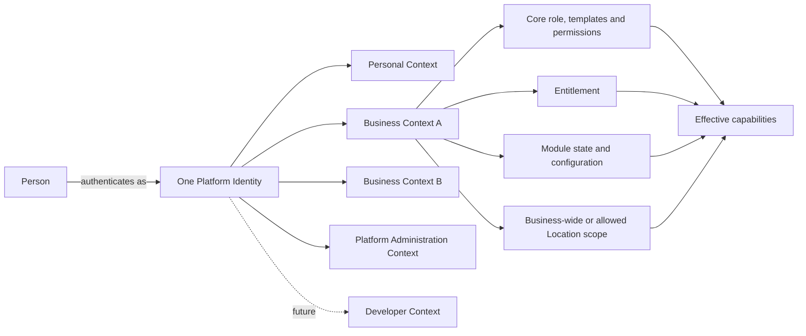
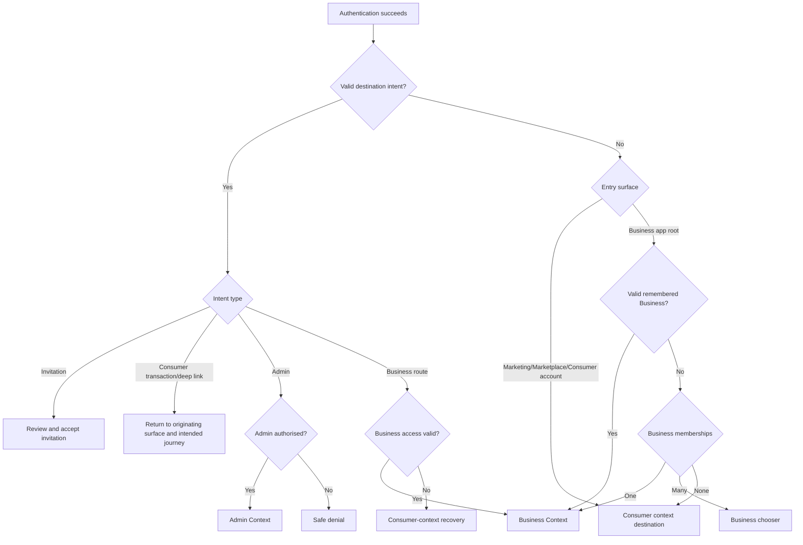

# Document 5 — User Context, Journey & Navigation Architecture Specification

**Document Status:** Canonical foundation  
**Version:** 1.1  
**Date:** July 2026  
**Authority:** Experience architecture spine  
**Depends On:** Document 1 — Vision · Document 2 — Product Experience Bible · Document 3 — Business Kernel Specification · Document 4 — Master Product Specification · ADR-01 through ADR-14  

---

# PART 0 — DOCUMENT PURPOSE, SCOPE AND AUTHORITY

## 0.1 Purpose

This document defines how a person enters the platform, authenticates when required, acquires an operating context, reaches the correct product surface, navigates within that surface, changes Business or Location scope, and moves safely between public, personal, Business, administration, and future developer experiences.

It is the canonical bridge between:

- the product inventory defined by the Master Product Specification; and
- the route-by-route, context-by-context experience a person actually encounters.

This document governs:

1. Human identity and operating-context semantics.
2. Surface boundaries and application shells.
3. Entry-point, authentication, redirect, and context-acquisition behavior.
4. Top-level journey and navigation architecture.
5. Business and Location switching.
6. Module-, entitlement-, permission-, and state-sensitive navigation.
7. Cross-surface handoffs and deep-link behavior.
8. Architecture-level recovery from empty, restricted, expired, and ambiguous states.
9. Stable journey and route-family catalogues.
10. The contract future page-by-page specifications must use.

## 0.2 Out of scope

This document does not:

- redefine the company vision, product horizons, or implementation sequence;
- recreate the visual design system, component system, motion system, or copy system;
- reproduce the complete feature, page, module, role, event, state, settings, or notification inventories;
- define physical database tables, API payloads, event envelopes, queues, or infrastructure;
- specify every field or component on every page;
- define a partner organisation, agency workspace, or reseller portal;
- fully define the future developer platform;
- define exact retention periods, commercial plan prices, or provider-specific integrations.

Page-level behavior belongs in later Public/Customer, Merchant, and Admin page-by-page specifications. Technical realization belongs in later data, system, API, event, integration, security, and implementation specifications.

## 0.3 Relationship to the four canonical documents

| Source | Authority used here | This document must not duplicate |
|---|---|---|
| Document 1 — Vision | Strategic intent, product horizons, one Business identity with many renderings | Vision narrative, market thesis, horizon roadmap |
| Document 2 — Product Experience Bible | Progressive Complexity, surface experience principles, responsive and interaction constraints | Design tokens, components, visual rules, motion rules, writing system |
| Document 3 — Business Kernel Specification | Business, Identity, membership, role, permission, module, capability, renderer, event, and tenant concepts | Kernel implementation, physical data model, module manifest, event transport |
| Document 4 — Master Product Specification | Canonical product inventory, pages, modules, workflows, states, settings, and existing route proposals | Feature lists, detailed page definitions, module descriptions |

## 0.4 Conflict resolution order

When sources disagree, the following order applies:

1. Approved ADR-01 through ADR-14 and approved post-review decisions KIR-001 through KIR-006 and OD-001 through OD-004.
2. This document for experience context, journey, route, and navigation behavior.
3. Business Kernel Specification for foundational domain and enforcement concepts.
4. Master Product Specification for product inventory.
5. Product Experience Bible for experience constraints.
6. Vision Document for strategic direction and horizons.

Within item 1, the approved post-review decisions supersede any conflicting wording in ADR-01 through ADR-14. In particular, the current owner-created Business model supersedes any earlier allowance for third-party-created listing ownership acquisition.

This ordering does not authorize this document to silently change the Kernel or Master Product Specification. Every detected conflict is recorded in Part 21. Any required kernel change is separately marked `KERNEL IMPACT / ADR REQUIRED`.

## 0.5 Normative language

- **MUST / MUST NOT:** mandatory canonical rule.
- **SHOULD / SHOULD NOT:** expected default; deviation requires a documented reason.
- **MAY:** permitted variation.
- **OPEN DECISION:** unresolved choice with downstream impact.
- **Deferred:** intentionally outside the current horizon or document boundary.

## 0.6 Core terminology

| Term | Canonical meaning |
|---|---|
| **Person** | A human, whether anonymous, a guest, or represented by a Platform Identity. |
| **Platform Identity** | One global authenticated identity for one person. It is not a permanent user type. |
| **Authentication Session** | Time-bounded proof that the current client acts as a Platform Identity. |
| **Operating Context** | The bounded perspective in which the identity is currently acting: Personal, Business, Platform Administration, or future Developer. |
| **Personal Context** | The identity’s consumer-facing commerce, discovery, service-booking, and account context across Businesses. It is not a Business tenant, and its detailed homepage/navigation composition is deferred. |
| **Business Context** | Operation within one authorised Business tenant. |
| **Platform Administration Context** | Explicit elevated platform-operations context available only to authorised internal identities. |
| **Future Developer Context** | Separate future context for developer applications and module publishing. |
| **Active Context** | The context governing the current shell, route, data scope, and effective authority. |
| **Active Business** | The Business selected within a Business Context. Exactly one is active for a Business-scoped route. |
| **Active Location** | Optional subordinate Location scope selected or inferred for a location-sensitive operation, constrained to the member’s allowed Location scope. |
| **Location Scope** | The Business-wide or selected-Location boundary within which a Business membership and its permissions may operate. |
| **Role** | One of the invariant Business membership roles: Primary Owner, Manager, or Member. A fundamentally different assignment-scoped mode, such as Delivery Partner, may be modeled separately. |
| **Permission Template** | A configurable preset of permissions and optional terminology for a Business job such as Accountant, Receptionist, Doctor, Trainer, or Cashier. It is not a foundational role. |
| **Permission** | Exact action authority within a context. |
| **Entitlement** | A first-class Business-scoped commercial grant defining permitted plans, modules, capabilities, quotas, and usage rights. It is separate from permission, module state/configuration, and Location availability. |
| **Module State** | Whether a module is enabled, awaiting setup, active, suspended, or deactivated for a Business. Operational removal normally means deactivation, not historical-data deletion. |
| **Capability** | A computed ability available after entitlement, module state/configuration, Business status, scope, and other rules are evaluated. |
| **Destination Intent** | A validated record of the route and context a person intended to reach before authentication or another gate interrupted them. |
| **Surface** | A coherent user-facing product area with its own purpose and navigation shell. |
| **Shell** | Persistent navigation and context chrome surrounding routes in a surface. |

## 0.7 Traceability conventions

| Prefix | Meaning | Example |
|---|---|---|
| `CTX` | Context rule | `CTX-004` |
| `SUR` | Surface rule | `SUR-003` |
| `ENT` | Entry-point rule | `ENT-006` |
| `AUTH` | Authentication/routing rule | `AUTH-009` |
| `NAV` | Navigation rule | `NAV-012` |
| `LOC` | Location rule | `LOC-007` |
| `MOD` | Module-navigation rule | `MOD-005` |
| `HOF` | Cross-surface handoff | `HOF-008` |
| `DLK` | Deep-link rule | `DLK-004` |
| `ADM` | Administration-context rule | `ADM-006` |
| `JRN` | Canonical journey | `JRN-BIZ-003` |
| `RT` | Route family | `RT-BIZ-004` |
| `GAP` | Product-specification gap | `GAP-007` |
| `CONFLICT` | Cross-document conflict | `CONFLICT-003` |
| `KIR` | Kernel impact / ADR required | `KIR-001` |

Later specifications MUST cite the relevant Journey IDs, Route Family IDs, canonical Master Product page/module references, and applicable rules from this document.

---

# PART 1 — HUMAN IDENTITY AND OPERATING CONTEXT MODEL

## 1.1 Foundational model

Authentication answers **“Who are you?”** It does not answer where the person should go.

Operating context answers **“Where are you acting now?”**

Role answers **“Which invariant membership authority do you have here?”**

Permission template answers **“Which reusable job preset helped configure your permissions?”**

Permission answers **“May you perform this exact action here?”**

Entitlement answers **“Has this Business commercially acquired this capability?”**

Module state/configuration answers **“Has this Business enabled and made the capability operational?”**

Location scope answers **“Is the capability available for this Location or Business-wide view?”**

The effective user experience is derived in order from commercial entitlement, module enabled/configured state, Location/context availability, and user authorization. None is a substitute for another.



## 1.2 Normative context rules

**CTX-001 — One identity:** A person MUST NOT need separate accounts to act as a consumer, Primary Owner, Manager, Member using one or more operational permission templates, Delivery Partner, external collaborator, Platform Super Admin, or future developer.

**CTX-002 — No permanent classification:** Sign-up and sign-in MUST NOT permanently classify an identity as “customer” or “merchant.” These are contexts and relationships.

**CTX-003 — Explicit shell:** Every authenticated route MUST resolve to exactly one shell: Personal, Business, Platform Administration, future Developer, or a bounded purpose-specific shell such as Delivery.

**CTX-004 — Route-scoped Business:** Every Business route MUST identify the Business explicitly. The canonical Business route namespace is `app.platform.com/b/{businessId}/…`. Existing unscoped `app.platform.com/...` routes in the Master Product Specification become compatibility aliases that resolve against a valid active Business and redirect to the canonical scoped route.

**CTX-005 — Stable internal key:** `{businessId}` uses the stable, URL-safe Business identifier defined by the Kernel. Mutable public slugs are not used as the sole identifier for internal Business routes.

**CTX-006 — Optional Location:** A Business Context always has an Active Business. It has an Active Location only when the current operation requires or allows Location scope.

**CTX-007 — Context visible:** The shell MUST make the active context understandable. Business surfaces show Business identity; location-sensitive surfaces show Business-wide or selected Location scope; admin surfaces show persistent elevated-context treatment.

**CTX-008 — Context is not role:** Switching from Owner to customer activity means switching from Business Context to Personal Context. Changing a role inside the same Business is not context switching.

**CTX-009 — Per-route authority:** A remembered context never grants authority. Membership, status, permissions, entitlement, module state, and scope MUST be re-evaluated server-side when a route is entered or an action is attempted.

**CTX-010 — Tab-local operation:** Active Business and Active Location SHOULD be encoded in the route and treated as tab-local. Changing Business in one browser tab MUST NOT unexpectedly redirect another tab.

**CTX-011 — Core roles and templates:** Primary Owner, Manager, and Member are the invariant Business roles. Accountant, Receptionist, Doctor, Trainer, Cashier, Inventory Manager, and similar job labels are configurable permission templates or presets, not foundational roles.

**CTX-012 — Location-constrained authority:** A Business membership is either Business-wide or restricted to selected Locations. Permissions and capabilities are evaluated only inside that allowed Location scope.

**CTX-013 — Contextual authentication:** Authentication uses one shared Platform Identity foundation, but its presentation and post-authentication interpretation MUST preserve the originating surface, intended destination, relevant Business, relevant resource/action, and safe context information.

## 1.3 Context acquisition modes

| Mode | Meaning | Example | Rule |
|---|---|---|---|
| Explicit selection | Person chooses a context | Account menu → Business B | Highest non-link user preference |
| Route-defined | Destination identifies context | `/b/{businessId}/orders/…` | Route context is authoritative if authorised |
| Link-defined temporary entry | Signed or scoped link identifies a bounded destination | Member invitation, order tracking | Link scope applies only to the target journey |
| Restored | A valid prior context is restored | Returning to `app.platform.com` | Used only when no stronger intent exists |
| Inferred | System derives context from unambiguous state | One authorised Business from merchant entry | Allowed only under deterministic rules |
| Neutral fallback | Personal Context or context chooser | Multiple Businesses and no remembered choice | Never arbitrarily selects a Business |

## 1.4 Context-resolution precedence

For each navigation, the router MUST apply this order:

1. Validate the requested destination as an allowed internal destination.
2. Apply a valid invitation, transaction-management, password/auth, admin, or notification intent.
3. Use explicit context encoded in the requested route.
4. Use the context explicitly selected during the current interaction.
5. Restore the last valid context for the same surface and device.
6. If the entry surface itself is Business-specific and exactly one Business is authorised, enter it.
7. If multiple Businesses are possible and none is selected, show the Business chooser.
8. Otherwise enter Personal Context.

Deep-link context overrides remembered context for that navigation only. It does not silently replace the person’s general default after the journey ends unless the person explicitly chooses to remain there.

## 1.5 Precedence example: invitation to Business B while active in Business A

1. The invitation URL identifies Business B and invitation ID.
2. The platform validates the link without exposing private Business data.
3. If authentication is required, the destination intent is preserved.
4. After authentication, the platform checks whether the signed-in identity matches the invitation target or is permitted to accept it.
5. The person sees Business B’s identity, proposed role/access, inviter, and expiry before acceptance.
6. Acceptance creates or activates the Business B membership.
7. The shell changes explicitly from Business A to Business B.
8. The person lands at the permission- and Location-scope-appropriate Business B destination.
9. Back navigation returns to the invitation outcome, not into Business A with a Business B route.
10. Business A remains available in the context switcher.

If the invitation is expired, revoked, for another identity, or the Business is unavailable, the person receives a safe recovery route to Personal Context and may request a new invitation where appropriate.

## 1.6 Actor-to-context coverage

| Actor | Authentication | Available context | Default destination principle |
|---|---|---|---|
| Anonymous visitor | No | Public only | Requested public page |
| Anonymous discovery user | No | Public Marketplace | Requested search/profile |
| Guest customer | Usually no | Bounded public transaction | Checkout, booking, tracking, or management link |
| Registered customer | Yes | Personal | Intended consumer destination; otherwise the commerce/discovery-oriented consumer entry defined by the later page specification |
| First-time identity with no Business | Yes | Personal | Consumer context; Business creation remains an additional contextual pathway |
| Business creator | Yes | New Business | Contextual onboarding |
| Primary Owner | Yes | Personal + one or more Businesses | Intended/remembered valid context |
| Multi-Business Owner | Yes | Personal + multiple Businesses | Intended Business, remembered Business, or chooser |
| Manager | Yes | Personal + authorised Businesses | Role-appropriate Business Home |
| Member | Yes | Personal + authorised Businesses and allowed Locations | Permission-derived operational home |
| Member using Accountant template | Yes | Personal + authorised Businesses/Locations | Permission-derived financial work destination |
| Member using Receptionist template | Yes | Personal + authorised Businesses/Locations | Permission-derived bookings/queue destination |
| Delivery Partner | Yes | Personal + bounded Delivery scope | Assigned deliveries |
| External collaborator | Yes | Personal + explicitly invited Business | Permission-derived Business home |
| Platform Super Admin | Yes + internal authorisation | Personal, Businesses they normally belong to, Admin | Admin only through explicit admin entry |
| Future developer | Yes | Personal + Developer | Developer home after explicit switch |

---

# PART 2 — PLATFORM SURFACE MAP

## 2.1 Surface architecture

| Surface | Purpose | Primary audiences | Authentication | Required context | Shell | Relationship to other surfaces |
|---|---|---|---|---|---|---|
| Main company/marketing website | Explain platform and enable discovery, sign-in, and Business creation | Anonymous visitors, prospective owners, returning users | No | None | Marketing shell | Links to Marketplace, auth, create, and help |
| Marketplace/discovery | Cross-Business discovery | Anonymous and registered customers | No for browse; action-dependent | None or Personal | Marketplace shell | Opens Marketplace Business profiles and transaction journeys |
| Public Business website/storefront | Present and transact with one Business | Customers and prospects | No for public content; action-dependent | Public Business scope, not Business operating context | Business-branded storefront shell | Derives from canonical Business; links to Personal account and transaction flows |
| Consumer account/experience | Commerce, discovery, service-booking, and authorised personal activity across Businesses | Registered consumers and any identity acting personally | Mixed by capability | Personal where authenticated | Consumer shell; exact homepage/navigation deferred | Links among Marketplace, Business storefronts/profiles, transactions, and personal records |
| Business workspace | Run one Business | Primary Owner, Manager, Members using configured permission templates, invited collaborators | Yes | Business | Business workspace shell | Links to public previews, account, other Businesses, modules |
| Delivery work surface | Complete assigned deliveries with minimum necessary data | Delivery Partner | Yes | Business + assignment scope | Purpose-specific minimal shell | Entered from assignment links/notifications; not full dashboard |
| Platform administration | Operate the platform and investigate issues | Platform Super Admin initially; future internal roles | Yes + internal authorisation | Platform Administration | Distinct admin shell | May open audited Business investigation views |
| Future developer surface | Build and operate future modules/apps | Future developers | Yes | Developer | Developer shell | Separate from Personal and Business contexts |

## 2.2 Surface rules

**SUR-001:** Public surfaces MUST remain usable without sign-in unless an action genuinely requires identity, saved data, payment assurance, regulated consent, or access to private data.

**SUR-002:** The marketing website MUST serve both prospective Business operators and general visitors. Its global navigation MUST provide a route to discover Businesses and must not assume ownership.

**SUR-003:** Marketplace Business profile and Business storefront are distinct renderings of the same canonical Business. The Marketplace profile uses platform formatting; the storefront may use Business branding and custom domain.

**SUR-004:** Personal Context MUST be available to any authenticated identity, including owners, managers, and members. It is commerce/discovery-oriented by default; a Business relationship does not remove consumer capabilities.

**SUR-005:** Business workspace routes MUST never render data from a remembered Business unless the canonical route identifies that Business and current membership is valid.

**SUR-006:** Delivery Partner experience MUST be purpose-specific and assignment-scoped. It MUST NOT expose the full Business dashboard.

**SUR-007:** Platform Administration MUST be visually and navigationally distinct from normal Business operation.

**SUR-008:** Future Developer Context MUST not be introduced into current primary navigation before the developer platform exists.

**SUR-009:** Only owner-created Businesses that have joined the platform may produce current Marketplace presence. The current architecture contains no pre-populated, imported, ownerless, or third-party-created Business listings.

## 2.3 Shell boundaries

### Marketing shell

Persistent destinations: Company/Platform, Capabilities, Discover Businesses, Help, Sign In, and Create a Business.

### Marketplace shell

Persistent destinations: Discover/Home, Search, Location, Favourites when available, and Account/Sign In. On mobile, the highest-frequency customer destinations use a bottom navigation consistent with the Product Experience Bible.

### Storefront shell

Owned visually by the Business. It contains Business navigation and transaction CTA. Platform account access is subordinate and MUST not make the storefront feel like a generic directory.

### Consumer/Personal shell

The shell supports commerce, discovery, service booking, Business/product/service exploration, orders, tracking, bookings, favourites, addresses, reviews, notifications, profile, payment-related customer capabilities, and communication preferences as those capabilities exist. This is an architectural capability boundary, not a fixed navigation tree. The exact consumer homepage, sections, recommendations, personalization, navigation labels, content hierarchy, and mobile composition are deferred to the Public Platform & Customer Page-by-Page Experience Specification. Business-creation calls to action may appear contextually but MUST not dominate the consumer experience.

### Business workspace shell

Contains Business identity and context switcher, optional Location switcher, Home, capability-derived primary navigation, Business presence, Modules, Settings, Help, notifications, and global search/command access where supported.

### Administration shell

Contains persistent admin-context indicator, operational overview, Businesses, users/customers where applicable, verification, Marketplace, Trust & Safety, financial operations, support, AI monitoring, platform configuration, system health, and audit.

---

# PART 3 — ENTRY POINT ARCHITECTURE

## 3.1 Universal entry rules

**ENT-001:** Public content MUST render before authentication is considered.

**ENT-002:** Every private or identity-enhanced entry MUST produce a Destination Intent before redirecting to authentication.

**ENT-003:** Destination Intent MUST include only a validated internal route family, required context hint, and bounded journey data. Arbitrary external redirect URLs are forbidden.

**ENT-004:** Authentication failure MUST preserve the safe destination until expiry or explicit cancellation.

**ENT-005:** Link failure MUST not expose whether a private resource exists when the viewer is unauthorised.

**ENT-006:** Expired actionable links MUST explain expiration and provide the smallest valid recovery: resend, request new link, sign in to view status, or return to a safe home.

**ENT-007:** Authentication presentation MAY reflect the originating Marketplace, Business website, Business workspace, invitation, or Admin surface, but every presentation uses the same Platform Identity foundation and preserves a safe Destination Intent.

## 3.2 Entry-point matrix

| Entry point | Anonymous behavior | Authenticated behavior | Context acquisition | Failure/expiry behavior |
|---|---|---|---|---|
| Direct company homepage | Render marketing home | Render marketing home; account CTA reflects session | None | Standard public error handling |
| Search → marketing page | Render indexed page | Same | None | Preserve requested content route |
| Direct Marketplace | Browse/search without sign-in | Browse with Personal enhancements | None until account action | Location unavailable → manual selection |
| Search/shared link → storefront | Render published Business page | Same, with Personal enhancements if appropriate | Public Business scope | Unpublished/closed → status-safe fallback |
| Search/shared link → Marketplace profile | Render discoverable profile | Same | Public Business scope | Not discoverable → 404 or direct storefront if valid |
| Shared product/service | Open product/service in Business rendering | Same | Public Business + optional Location | Unavailable → Business page with explanation |
| Order tracking link | Show token-authorised bounded tracking, or request verification | Open authorised order | Link-defined Business/order scope | Expired/revoked → verify identity or contact Business |
| Booking management link | Show bounded manage journey after required verification | Open authorised booking | Link-defined Business/booking scope | Expired → account or Business contact recovery |
| Invitation link | Preview minimal invitation, then authenticate | Validate identity and show acceptance | Target Business after acceptance | Expired/revoked/mismatch → safe explanation and resend/request route |
| Password/auth link | Complete auth ceremony | Validate or warn already signed in | Return to preserved intent | Expired → restart auth |
| Notification deep link | Authenticate if private | Open intended resource if still authorised | Route/link-defined | Resource unavailable → context home with explanation |
| Direct Business workspace URL | Authenticate and preserve route | Open if authorised | Route-defined Business | No access → consumer destination or accessible Business chooser |
| Legacy unscoped app URL | Authenticate if needed | Resolve remembered/single Business, then canonical redirect | Restored/inferred | Multiple ambiguous Businesses → chooser |
| Direct admin URL | Authenticate; do not reveal admin data | Open only with internal authorisation | Explicit Admin | Unauthorised → neutral denial outside admin shell |

## 3.3 Entry from external channels

Links from WhatsApp, SMS, email, push, QR, search, and social sharing MUST resolve through the same validated Destination Intent model. Channel does not change authority. A link may carry a signed bounded access token for a specific guest transaction, but that token does not create Personal or Business membership.

---

# PART 4 — AUTHENTICATION AND POST-AUTHENTICATION ROUTING

## 4.1 Authentication architecture

Authentication is a reusable shared Platform Identity ceremony, not a merchant-only page and not a set of independent identity stores per Business website. Its presentation MAY be contextual to the originating surface. The canonical logical route family is:

- `platform.com/auth/sign-in`
- `platform.com/auth/sign-up`
- `platform.com/auth/verify`
- `platform.com/auth/recovery`
- `platform.com/auth/callback`

Existing `app.platform.com/sign-in` and `app.platform.com/sign-up` URLs MUST remain as compatibility entry points but redirect to canonical authentication while preserving source surface and Destination Intent.

Sign-up creates a Platform Identity. Business creation is a separate continuation. A person MAY sign up without creating a Business.

## 4.2 Deterministic routing rules

**AUTH-001 — Intent first:** After successful authentication, a valid Destination Intent has priority over all default homes.

**AUTH-002 — Invitation:** If the intent is an invitation, route to invitation review/acceptance before entering the Business.

**AUTH-003 — Contextual interpretation:** Authentication preserves and restores the originating surface, intended destination, relevant Business, relevant resource/action, and safe context information. There is no universal post-login destination.

**AUTH-004 — Transaction:** If the intent is checkout, booking, tracking, review, or transaction management, return to that journey without forcing a dashboard.

**AUTH-005 — Admin:** If the source is the admin route and the identity is authorised, enter Platform Administration. Otherwise deny safely.

**AUTH-006 — Business route:** If the requested route identifies a Business and membership is valid, enter that Business.

**AUTH-007 — Business surface root:** At `app.platform.com`, restore the last valid Business context on that device. If none exists and exactly one Business is authorised, select it. If multiple are authorised, show the Business chooser. If none are authorised, route to the consumer context with a contextual create-Business pathway.

**AUTH-008 — Consumer-surface sign-in:** Marketplace sign-in returns to the Marketplace/customer experience; Business-website sign-in returns to that Business website and exact intended order, booking, or action; marketing or account sign-in returns to the appropriate consumer destination. The detailed default consumer homepage is deferred.

**AUTH-009 — First-time identity:** A first-time identity with no invitation, transaction intent, or Business enters the commerce/discovery-oriented consumer context. The platform MUST NOT ask “What type of Business do you own?” as a mandatory first step.

**AUTH-010 — Returning identity:** A valid returning session stays on the requested route. Session restoration MUST NOT redirect merely because another context was used previously.

**AUTH-011 — Sign-out:** Sign-out ends authenticated access across contexts on that session, returns to the current surface’s safe public equivalent where possible, and never exposes private content through browser history.

## 4.3 Routing decision tree



## 4.4 Authentication state considerations

- OTP, passkey, password, OAuth, or future SSO methods may vary without changing routing semantics.
- A different signed-in identity opening an invitation or transaction link MUST be told that the link is associated with another identity only when this can be disclosed safely.
- Account creation during guest checkout MUST not discard cart, selected Location, service slot, price quote, or return path.
- Step-up authentication MAY be required for ownership transfer, billing changes, security changes, sensitive admin actions, and other high-risk actions.

---

# PART 5 — CONTEXT SELECTION AND SWITCHING

## 5.1 Global context switcher

The authenticated account control MUST provide:

1. Personal Context.
2. Every active Business membership the identity may enter.
3. “Create a Business.”
4. Platform Administration only when authorised.
5. Future Developer Context only when available and authorised.
6. Account settings and sign-out.

The switcher MUST show the person’s relationship to each Business without treating that relationship as a separate account.

## 5.2 Business switching

**NAV-001:** Business switching changes the tenant scope, shell identity, permissions, modules, capabilities, notifications, and available routes.

**NAV-002:** Selecting another Business routes to that Business’s permission- and Location-scope-appropriate destination, unless an equivalent target is valid and intentionally preserved.

**NAV-003:** A route may offer “open the same area in Business B” only if that area exists and the identity is authorised there. It MUST NOT assume module parity.

**NAV-004:** Unsaved changes MUST be resolved before switching: save, discard, or cancel switch.

**NAV-005:** The switcher MUST distinguish Businesses with identical display names using safe secondary information such as location summary or ownership relationship.

## 5.3 Location switching

Business switching and Location switching are different:

- Business switching changes tenant and membership authority.
- Location switching changes an operational filter or assignment inside the same Business.

The Location switcher appears only when:

- the Business has multiple relevant Locations; and
- the current module/page supports Business-wide or Location-specific scope.

It MUST include “All Locations” only when aggregation is meaningful and the member has Business-wide access or access to every Location included by that aggregate. A Location-restricted member can select only allowed Locations. The switcher MUST not appear for online-only, home-based, service-area, or single-location Businesses unless needed for configuration.

## 5.4 Remembered context

- The platform MAY remember the last valid Business used on a device for the Business app root.
- It MAY remember the last valid Location per Business and module where useful.
- Remembered values are navigation convenience, not authorization.
- A remembered context that is no longer valid is cleared and replaced by a deterministic recovery destination.
- Explicit deep links override remembered context for that journey.

## 5.5 Unauthorized context handling

If a person requests a context they cannot enter:

1. Do not reveal private context data beyond safe identity cues.
2. Explain that access is unavailable or has changed.
3. Do not silently substitute another Business while retaining the requested route.
4. Offer the consumer context, another authorised Business, request-access/help where supported, or sign in as another identity.

---

# PART 6 — PUBLIC PLATFORM JOURNEY ARCHITECTURE

## 6.1 General visitor

The main company website supports four non-exclusive intents:

1. Understand the platform.
2. Explore capabilities and business outcomes.
3. Discover Businesses.
4. Start Business creation or sign-in.

A visitor may move between these without declaring a user type.

### General visitor flow

`Marketing entry → understand problem/outcome → explore relevant capability or proof → choose Discover / Sign In / Create Business → preserve source intent`

The marketing navigation MUST include a clear “Discover Businesses” path so a customer is not forced through merchant messaging.

## 6.2 Marketplace/discovery user

`Marketplace Home → location/category/search → results → Marketplace Business profile → choose Order / Book / Contact / Storefront → continue as guest or authenticate only when necessary`

Rules:

- Search and public profile viewing require no authentication.
- Only canonical owner-created Businesses that joined the platform and enabled the relevant public presence may appear; there are no pre-populated, imported, ownerless, or third-party-created listings.
- Location may be granted, searched, or selected manually.
- Filters emerge progressively rather than blocking initial discovery.
- A Business card may expose direct Order/Book actions only when current Business capability and Location availability permit.
- Authentication is deferred until the chosen action needs identity or saved data.

## 6.3 Prospective Business owner

`Marketing/Create entry → authenticate or create identity → create Business → choose Business type as recommendation seed → provide operating requirements → receive module and website recommendations → explicitly choose optional modules → complete required setup → enter Business workspace`

Business type MUST not silently lock the Business into a separate product or force operational modules. Platform baseline capabilities may be provisioned as required infrastructure; recommended operational modules require explicit Business choice or a clearly reversible trial choice. Dependencies are enforced only for genuine functional requirements.

## 6.4 Consumer-first public architecture

The default public/customer experience is commerce, discovery, and service-booking oriented. Business ownership is an additional pathway, not the assumed identity of a normal visitor or authenticated consumer.

Consumer-facing surfaces MAY include contextual “Own a business?”, “Start your business”, or “List your business” calls to action. They MUST not dominate discovery, search, Business, product, service, transaction, booking, or account journeys. The detailed consumer homepage layout, sections, recommendations, personalization, content hierarchy, and navigation composition are deferred to the Public Platform & Customer Page-by-Page Experience Specification.

---

# PART 7 — CUSTOMER JOURNEY & NAVIGATION ARCHITECTURE

## 7.1 Guest experience

A guest may, subject to Business configuration and applicable regulation:

- browse public Businesses, products, services, hours, Locations, and reviews;
- maintain a temporary cart;
- start an order, booking, queue, inquiry, contact, or payment journey;
- provide transaction contact details;
- receive a signed tracking or booking-management link.

Guest identity is bounded to the transaction and does not automatically become a global Platform Identity.

## 7.2 Registered consumer/Personal Context

Personal Context provides authorised cross-Business consumer capabilities such as:

- upcoming bookings and active orders;
- recent cross-Business activity that the identity is authorised and consented to see;
- favourites/followed Businesses;
- applicable loyalty summaries;
- account, address, review, communication, privacy, and security destinations.

This list defines capability scope, not a fixed homepage or navigation hierarchy. The experience MUST not expose a merchant-owned Customer Record from one Business to another Business.

## 7.3 Global identity and merchant records

**CUS-001:** Platform Identity and merchant-owned Customer Record are separate.

**CUS-002:** A guest transaction may link to a Platform Identity only when a reliable verified identity mechanism—such as verified phone, verified email, or another sufficiently reliable method—establishes the connection and applicable privacy/business-specific rules permit it.

**CUS-003:** Personal order/booking history is a permitted cross-Business projection for that identity; it does not merge the underlying merchant records.

**CUS-004:** Business Members see only the Customer Record and activity belonging to their Business, allowed Location scope, and permissions.

**CUS-005:** Guest-to-identity linking MUST preserve the original merchant record and provenance. It MUST not expose unrelated cross-Business activity.

**CUS-006:** Historical guest activity MUST NOT be linked based only on name, weak similarity, or unverified contact information. Eligible verified activity may include orders, bookings, and other appropriate customer transactions.

## 7.4 Consumer navigation boundary

Consumer navigation MAY provide access to Marketplace/discovery, search, categories, Businesses, products, services, orders, tracking, bookings, favourites, addresses, reviews, notifications, profile, payment-related customer capabilities, and communication preferences.

This document does not fix which destination is “Home,” which items are top-level, how recommendations or personalization appear, or how desktop/mobile navigation is composed. Those decisions belong to the Public Platform & Customer Page-by-Page Experience Specification. Saved payment methods appear only when supported securely; their presence is not assumed.

## 7.5 From customer to Business creator

“Create a Business” is always an additive transition:

1. The identity remains the same.
2. Personal Context remains available.
3. The created Business receives a new Business Context.
4. The creator normally becomes Primary Owner.
5. The person may switch between Personal and Business contexts.

The platform MUST NOT create a second identity or migrate Personal activity into the Business tenant.

## 7.6 Communication preferences

Personal settings MUST distinguish:

- transactional communication from a specific Business;
- marketing communication from a specific Business;
- platform transactional/security communication; and
- platform marketing communication.

Opting out of marketing MUST NOT disable essential transactional messages. Channel preferences are applied within purpose and sender constraints.

---

# PART 8 — BUSINESS CREATION, ONBOARDING AND WORKSPACE ENTRY

## 8.1 Entry points

Business creation may begin from:

- the marketing website;
- Personal Context;
- Business context switcher (“Create another Business”);
- Marketplace “List your Business”;
- contextual platform guidance.

Authentication is required before the Business entity is committed.

## 8.2 Creation sequence

1. Establish or restore Platform Identity.
2. Collect minimum Business identity needed to create a draft Business.
3. Create the Business and assign the creator as Primary Owner.
4. Establish Business Context.
5. Select Business type/category as a recommendation seed.
6. Collect requirements that affect recommended capabilities, public presence, Locations, and setup.
7. Generate a proposed setup: baseline core capabilities, recommended modules, terminology, website sections, and onboarding path.
8. Explain platform-core, recommended, optional, incompatible, dependency-gated, and commercially gated choices.
9. Owner confirms optional module choices.
10. Provision enabled modules in the appropriate setup state.
11. Enter progressive onboarding inside the Business Context.

## 8.3 Adaptive onboarding

Onboarding is generated from:

- selected Business type recommendations;
- whether the Business is product-, service-, appointment-, queue-, inquiry-, subscription-, or hybrid-oriented;
- online-only, home-based, service-area, single-Location, or multi-Location operation;
- selected modules;
- module dependencies and setup requirements;
- entitlement;
- information already supplied;
- owner choices.

It MUST NOT require irrelevant steps. A home-based online seller is not forced to add a customer-facing branch. A Clinic and a Gym do not receive identical setup.

Business type recommendations MUST NOT create mandatory operational modules. Real module dependencies are based on functional requirements. For example, Website checkout payments require the relevant website/commerce capabilities, while invoice payments or standalone payment links may have different dependencies; Payments does not universally require Website.

Where the owner selects AI assistance, the platform MAY draft Business profile content, website structure, copy, catalog/service setup, and module configuration from the supplied requirements. Every AI-generated result remains a proposal: the owner can review, edit, accept, regenerate, or skip it. AI assistance MUST NOT silently publish a public surface, purchase entitlement, activate a consequential module, or invent regulated Business facts.

## 8.4 Required versus optional setup

| Setup class | Behavior |
|---|---|
| Business minimum | Required to establish usable Business identity and owner relationship |
| Module activation requirement | Required before that module becomes active |
| Publication requirement | Required before a public rendering is published |
| Transaction requirement | Required before orders/bookings/payments can be accepted |
| Recommended enrichment | Improves quality but can be deferred |
| Optional customization | Can be skipped without blocking operation |

Skipped optional work becomes a contextual checklist, not a permanent onboarding wall.

## 8.5 First workspace entry

The first Business Home prioritizes:

1. Current setup state.
2. The next highest-value required action.
3. Preview of what is already available.
4. A short path to publish or transact.
5. Safe deferral.

The full mature navigation MUST not be shown immediately. Navigation expands as enabled modules become active, data appears, and the user has permission.

## 8.6 Returning to incomplete onboarding

- Returning owners land on Business Home, with the incomplete setup clearly represented.
- A blocking module step routes directly to that module’s setup.
- Managers or Members without setup authority see operationally relevant available areas, not owner-only setup forms.
- Owners may resume, defer optional items, change module choices, or seek help.

---

# PART 9 — BUSINESS WORKSPACE NAVIGATION ARCHITECTURE

## 9.1 Navigation generation model

Visible navigation is a projection, not a static tree:

`Navigation = platform-core shell + commercial entitlement + enabled/configured module contributions + Business/Location availability + member Location scope + effective permissions + progressive-complexity policy`

Business type recommendations influence setup and discovery. They do not directly hard-code permanent navigation.

The platform-core shell exists for every Business independently of optional operational modules. It includes the workspace foundation, Business identity/profile, settings, team/access management, module management, basic platform notifications, and other essential infrastructure.

## 9.2 Workspace shell

The Business workspace shell contains:

1. Business identity and Business switcher.
2. Optional Location switcher.
3. Home.
4. Capability-grouped primary navigation.
5. Business Presence.
6. Modules.
7. Settings.
8. Help/Support.
9. Notifications.
10. Personal/account entry.
11. Search/command access where available.

## 9.3 Canonical navigation groups

The Master Product Specification’s detailed navigation remains the inventory source. This architecture normalizes it into adaptive groups:

| Group | Purpose | Examples of contributed destinations |
|---|---|---|
| Home | What needs attention now | Action queue, today, setup, summaries |
| Sell / Serve / Operate | Daily transactions | Orders, Bookings, Appointments, Queue, Delivery |
| Offerings | What the Business sells or provides | Products, Services, Plans, Availability |
| Customers | Business-owned relationships | CRM, Reviews, Loyalty, Segments |
| Money | Operational finance | Payments, Invoices, Settlements, permitted reports |
| Team | People and work assignment | Members, permission templates, access, schedules |
| Reach | Customer acquisition and communication | Marketing, Campaigns, Offers |
| Insights | Performance and recommendations | Analytics, Health/Trust, AI insights |
| Business Presence | Canonical Business identity and public renderings | Profile, Website, Marketplace preview, Locations |
| AI Employees | Installed AI operational surfaces | Roster, activity, escalations |
| Modules | Discover, enable, set up, disable | Module Manager |
| Settings | Business, module, billing, security, integrations | Permission-sensitive settings |
| Help | Self-service and support | Help Center, tickets |

Labels MAY adapt to configured vocabulary, but route identity and capability semantics remain stable.

## 9.4 Navigation rules

**NAV-006:** Home is always present for full Business workspace users. Purpose-specific Delivery users are exempt.

**NAV-007:** A module’s operational navigation appears only when commercial entitlement permits it, the module is enabled/configured for the Business and current Location, and the user has route-level permission within their allowed Location scope.

**NAV-008:** A module awaiting setup appears to users who can complete or understand setup, marked as setup-required; it is not presented as operational.

**NAV-009:** A user without permission MUST NOT see routine navigation to inaccessible private data.

**NAV-010:** Primary Owners and other explicitly authorised users may discover unavailable modules from Modules and contextual recommendations. Routine Members MUST not see commercial upsell navigation they cannot act on.

**NAV-011:** Entitlement loss or suspension removes operational entry but preserves owner access to status, billing/recovery, export, and retained history as policy allows.

**NAV-012:** Secondary pages inherit their module/group navigation and MUST provide a clear route back to the parent area.

**NAV-013:** Mobile primary navigation contains at most five high-frequency destinations chosen deterministically from role, active modules, and activity. Remaining authorised areas use a stable “More” or equivalent secondary surface; core destinations MUST not reorder unpredictably day to day.

**NAV-014:** Desktop uses persistent primary navigation consistent with the Product Experience Bible. Navigation density grows progressively.

**NAV-015:** Public preview actions open the relevant rendering in a new tab or explicit preview mode; they do not replace the Business editing context without warning.

## 9.5 Home selection

| User state | Business Home emphasis |
|---|---|
| New Primary Owner | Setup progress and next required action |
| Active Primary Owner | Cross-module action queue, operational and financial summary |
| Manager | Operational queue and team exceptions, excluding owner-only billing |
| Member | Assigned or permitted tasks within allowed Locations |
| Member using Accountant template | Permission-derived financial overview and actions |
| Member using Receptionist template | Permission-derived bookings, queue, arrivals, and collection actions |
| External collaborator | Tasks and areas explicitly granted |

---

# PART 10 — ROLE-BASED WORKSPACE EXPERIENCE

## 10.1 Core roles and permission-template projection

The invariant Business roles are Primary Owner, Manager, and Member. Roles establish durable authority boundaries; effective route and action access still depends on Location scope, permissions, entitlement, module state/configuration, and current context.

| Core role / mode | Landing destination | Navigation projection | Restricted behavior |
|---|---|---|---|
| Primary Owner | Business Home | All entitled/configurable areas and owner-only settings, progressively revealed | Missing entitlement/configuration shown with owner recovery |
| Manager | Operational Business Home | Broad delegated operation within allowed Locations | Ownership and non-delegated commercial/danger actions absent |
| Member | Best permitted operational destination | Only explicitly granted capabilities within allowed Locations | No authority implied by job title or template name |
| Delivery Partner operating mode | Assigned Deliveries | Purpose-built assignment-scoped destinations only | No general Business shell or unrelated customer PII |

Business job labels such as Accountant, Receptionist, Doctor, Trainer, Cashier, Inventory Manager, and similar functions are configurable permission templates/presets applied to a Member. A Business may customize these presets. A template can influence initial permissions, landing destination, vocabulary, and task emphasis, but it does not create a new foundational role or bypass permission evaluation.

Examples:

| Permission template | Typical experience projection |
|---|---|
| Accountant | Permitted invoices, payments, financial reports, and exports; operational/customer PII minimized |
| Receptionist | Permitted bookings, appointments, queue, customer contact, and collection actions |
| Doctor / Trainer | Assigned schedule, customer/patient/member records permitted for service delivery, and relevant notes |
| Cashier | Permitted checkout, order, payment-collection, and receipt actions |
| Inventory Manager | Permitted stock, supplier, adjustment, and replenishment actions |

## 10.2 Hidden, disabled, and explained

- **Hide** routine navigation and actions the user can never perform in the current context.
- **Disable with explanation** when the user understands the action but a temporary state blocks it, such as setup incomplete, Location closed, pending verification, or prerequisite missing.
- **Show request/ask Primary Owner or authorised Manager** when access can legitimately be granted and the product supports the request path.
- **Show commercial/setup CTA** only to users authorised to purchase or configure.
- **Deny safely** on direct URL or stale link, with a recovery destination.

## 10.3 Multiple job functions and templates

One invariant role applies per Business membership. One or more permission templates may seed that membership’s grants, and authorised users may customize the result.

Where a person performs multiple functions:

- one invariant role applies;
- template presets may be combined only through a deterministic grant/deny policy;
- permission grants are combined;
- explicit denials and scope restrictions take precedence over grants;
- sensitive data minimization still applies;
- the shell chooses one deterministic landing destination from effective permitted work.

The Business Kernel requires the amendment recorded in `KIR-001` to replace its current fixed role vocabulary with this invariant-role and configurable-template model.

## 10.4 Access changes during a session

If role, permissions, membership, entitlement, Business status, or assignment changes:

1. Re-evaluate before the next protected read/write.
2. Remove invalid navigation without requiring sign-out.
3. If the current route is no longer valid, route to the nearest authorised parent or consumer destination.
4. Explain that access changed.
5. Preserve no private cached content beyond security policy.

---

# PART 11 — MULTI-LOCATION EXPERIENCE

## 11.1 Public-side principles

One Business may have zero, one, or many Locations. The Business retains one canonical identity and may have one unified website.

Location may affect:

- hours and temporary closures;
- staff/doctors/trainers;
- menu, products, services, and prices;
- inventory and availability;
- booking slots and queues;
- delivery/pickup areas and fees;
- contact details and directions.

## 11.2 Public Location selection

**LOC-001:** Do not ask for Location until it changes the availability, price, fulfillment, or meaning of the requested action.

**LOC-002:** Location may be suggested from device location, delivery address, prior choice, route, or Business primary Location, but inferred Location MUST be visible and changeable before commitment.

**LOC-003:** Explicit user selection overrides inference.

**LOC-004:** If an item/service is available across all Locations with no relevant difference, Location selection is deferred.

**LOC-005:** Delivery address may resolve eligible Locations; the person chooses when multiple valid fulfillment Locations materially differ.

**LOC-006:** Booking requires Location before staff/slot availability is finalized when availability is Location-specific.

**LOC-007:** Online-only and service-area Businesses use fulfillment/service area rather than a fake physical branch.

## 11.3 Public Location URLs

Canonical patterns:

- Storefront Location page: `{business-domain}/locations/{locationSlug}`
- Marketplace profile Location view: `platform.com/b/{businessSlug}?location={locationId}`
- Transaction route preserves Location: route path or validated query state as defined by the page specification.

Location slugs may be human-readable. Internal actions still resolve to stable Location identity.

## 11.4 Business-side Location scope

A Business membership MUST declare one of:

- **Business-wide access:** permissions may operate across all current Locations, subject to capability and module rules.
- **Selected-Location access:** permissions may operate only in explicitly allowed Locations.

The workspace then supports:

- **All Locations / All allowed Locations:** aggregate view when meaningful and permitted by membership scope.
- **One Location:** filtered operations/configuration.
- **Assigned Locations:** only Locations included in the member’s allowed scope.

Permissions operate inside the allowed Location scope. A permission grant never expands that scope. Dashboards MUST label whether metrics are Business-wide, aggregated across allowed Locations, or filtered to one Location. Actions that create or change operational data MUST resolve to an explicit allowed Location when the domain requires one.

**LOC-008:** The Location switcher lists only Locations the membership may access.

**LOC-009:** “All Locations” means all Locations within the member’s allowed scope, not automatic access to the whole Business.

**LOC-010:** Direct links to a disallowed Location resolve to a restricted state and MUST NOT silently substitute another Location while preserving the same resource/action.

**LOC-011:** Effective access is evaluated from Business membership, allowed Location scope, permission/capability, module state, commercial entitlement, and current operating context.

## 11.5 Location-specific module behavior

A module remains primarily a Business-level capability but may explicitly support Location-specific:

- active for all Locations;
- activation at selected Locations;
- configured differently per Location;
- available only at selected Locations;
- temporarily unavailable at a closed/suspended Location.

Business-level state is the default. Location activation, availability, or configuration acts as a module-declared override and cannot exceed Business entitlement. Location-specific unavailability changes capability at that Location; it does not imply the module is deactivated for the Business.

---

# PART 12 — MODULE DISCOVERY, ENABLEMENT AND NAVIGATION CHANGE

## 12.1 Commercial Entitlement and effective capability layers

Commercial Entitlement is a first-class Business-scoped architectural concept. It defines which plans, modules, capabilities, quotas, and usage rights the Business is commercially allowed to access. This document does not define pricing, invoices, metering implementation, or the complete billing system.

For a user to act:

1. Commercial entitlement permits the plan/module/capability/quota/usage.
2. The module is enabled, compatible, and configured.
3. The module and capability are available in the current Business/Location context.
4. The membership’s allowed Location scope includes the operation.
5. The user’s role and exact permissions authorize the action.

Failure at one layer MUST be represented as that layer’s problem, not a generic “no access.”

## 12.2 Lifecycle experience

| State/transition | Primary Owner/authorised commercial user experience | Navigation behavior | Other member experience |
|---|---|---|---|
| Recommended | Explain relevance and why recommended | Not in operational nav; visible in Modules/recommendations | Usually hidden |
| Discovered, no entitlement | Show value, compatibility, price/trial if applicable | No operational nav | Hidden or informational only if appropriate |
| Entitlement acquired | Offer enable/setup | Setup destination may appear | Hidden until useful/authorised |
| Enabled, setup incomplete | Guided checklist, prerequisites, safe exit | Marked setup-required for setup-authorised users | Hidden or “not ready” where their work depends on it |
| Active | Normal operational use | Contributes permitted destinations/widgets/actions | Visible according to permission |
| Suspended | Explain cause, effect, and recovery | Operational routes replaced by status/recovery | Read/history only if policy permits |
| Deactivated (operational removal) | Confirm effect; stop new operations; preserve historical records under lifecycle policy | Removed from normal active nav; retained history/status accessible where authorised | Removed from routine nav; retained records remain permission-controlled |
| Re-enabled | Validate compatibility/config and resume setup if required | Returns after active | Returns according to permission |

## 12.3 Module navigation rules

**MOD-001:** Recommendation does not equal installation.

**MOD-002:** Entitlement does not equal activation.

**MOD-003:** Activation does not grant user permission.

**MOD-004:** Business activation does not guarantee availability at every Location or permission for every member.

**MOD-005:** Operational module removal means deactivation: stop new operations and remove routine active navigation where appropriate. It MUST NOT automatically destroy historical data. Permanent deletion is a separate controlled data-lifecycle process.

**MOD-006:** Direct navigation to an unavailable module resolves to a layer-specific page:

- Primary Owner/authorised user with no entitlement → entitlement/discovery;
- setup-authorised user with setup incomplete → setup;
- authorised user with temporary suspension → status;
- unauthorised user → permission denial;
- incompatible scope → scope explanation;
- retired/unavailable module → retained history or safe parent.

**MOD-007:** A module may contribute primary navigation, secondary navigation, widgets, settings, public sections, and actions only through its declared UI contract and computed capabilities.

**MOD-008:** Business type may recommend modules, terminology, setup, workflows, and AI capabilities but MUST NOT force operational modules. Dependencies are enforced only when one capability functionally requires another.

**MOD-009:** Payment dependencies are use-case specific. Website checkout requires the applicable commerce/website capability; invoice payments or payment links may not. Payments MUST NOT be modeled as universally dependent on Website merely because of Business type.

---

# PART 13 — CROSS-SURFACE HANDOFFS

## 13.1 Handoff catalogue

| ID | Source → destination | Trigger | Auth requirement | Context change | Back-navigation expectation |
|---|---|---|---|---|---|
| `HOF-001` | Marketing → Marketplace | Discover Businesses | None | None | Back returns to source marketing page |
| `HOF-002` | Marketing → Create Business | Create CTA | Required before commit | Public → new Business | Back before commit returns to marketing; after creation uses onboarding exits |
| `HOF-003` | Marketplace → Marketplace Business profile | Select result | None | Public Business scope | Back restores search/filter/scroll |
| `HOF-004` | Marketplace profile → Storefront | Visit website/full Business experience | None | Same public Business, different rendering | Back returns to profile when browser-originated |
| `HOF-005` | Business profile/storefront → Order | Order CTA | Guest allowed if configured; otherwise auth at required gate | Public Business + optional Location | Back returns to preserved product/cart state |
| `HOF-006` | Business profile/storefront → Booking | Book CTA | Guest allowed if configured; otherwise auth at required gate | Public Business + Location/service | Back returns to profile without losing selection |
| `HOF-007` | Guest checkout → Authentication | Save account, identity-required payment/action | Conditional | Guest → Personal, transaction remains Business-scoped; history links only after reliable verification | Return to exact checkout step |
| `HOF-008` | Customer account → Business storefront | Business/order link | Already authenticated | Personal → public Business rendering | Back returns to personal activity item |
| `HOF-009` | Business workspace → Website preview | Preview/live-site action | Auth for preview; live site public if published | Business → preview/public | Workspace remains available in originating tab |
| `HOF-010` | Business workspace → Marketplace listing | View listing | Auth not required for public listing; preview may require | Business → public/preview | Return to Business Presence area |
| `HOF-011` | Business workspace → another Business | Context switcher | Authenticated | Business A → Business B | Do not use browser Back as primary switch mechanism |
| `HOF-012` | Personal → Create Business | Create Business | Authenticated | Personal → new Business | Personal remains available after creation |
| `HOF-013` | Invitation → Business workspace | Accept invitation | Required | Public/Personal → target Business | Back does not reopen acceptance as pending |
| `HOF-014` | Business workspace → Consumer/Personal context | Account/context switch | Authenticated | Business → Personal | Business remains in switcher |
| `HOF-015` | Admin entry → Platform administration | Explicit admin action/URL | Auth + internal authorisation | Any normal context → Admin | Exit returns to prior normal context or Personal |
| `HOF-016` | Admin → Business investigation/customization | Select Business issue or request | Admin authorised | Admin remains active; target Business becomes administrative work scope | Back returns to admin issue/list |

## 13.2 Handoff rules

- Context change MUST be visible.
- Search/filter/cart/form state SHOULD be preserved when the user is expected to return.
- A public rendering opened from Business workspace SHOULD open in a new tab or explicit preview frame.
- Admin investigation MUST not look like ordinary owner operation.
- Browser Back MUST restore the source’s meaningful state where technically safe; context switchers remain the primary cross-context mechanism.

---

# PART 14 — DEEP LINKS AND DESTINATION PRESERVATION

## 14.1 Destination Intent contract

At experience level, a Destination Intent contains:

- route family and route parameters;
- source surface/channel;
- required authentication state;
- expected operating-context type;
- optional Business and Location hints;
- bounded action intent;
- creation time and expiry where applicable;
- integrity protection for signed links;
- safe fallback.

It MUST NOT contain unrestricted redirect URLs, client-trusted permissions, or secrets exposed in page content.

## 14.2 Link behavior

**DLK-001:** Public links open directly.

**DLK-002:** Private links capture intent, authenticate, revalidate, then continue.

**DLK-003:** Authentication MUST not discard cart, selected Location, selected service/slot, invitation, or intended admin work item.

**DLK-004:** A link’s Business/Location hint overrides remembered context only for that link journey.

**DLK-005:** After completion, the user remains in the context logically produced by the action: accepted invitation → Business; completed guest order → confirmation/tracking; consumer sign-in → originating consumer surface and intended destination.

**DLK-006:** Unauthorized destinations do not redirect to a similarly named resource in another Business.

**DLK-007:** Expired links distinguish, where safe, between expired, already used, revoked, and unavailable.

**DLK-008:** Password/auth links restore only validated internal destinations.

## 14.3 Link-class rules

| Link class | Typical authority | Expiry behavior | Recovery |
|---|---|---|---|
| Notification | Existing identity permission | Resource may outlive link | Sign in, then nearest authorised parent |
| Invitation | Signed invitation + matching identity/verification | Expires/revocable | Resend/request new invite |
| Tracking | Bounded transaction token or authenticated ownership | Time-bounded/revocable | Verify contact or enter Personal account |
| Booking management | Bounded booking token or authenticated ownership | Policy/time bounded | Request new link or contact Business |
| Password/auth | One-time security token | Short expiry, single-use | Restart auth |
| Shared public | Public visibility | No secret authority | Business/profile fallback |

---

# PART 15 — EMPTY, RESTRICTED AND AMBIGUOUS CONTEXT STATES

## 15.1 Recovery matrix

| State | Destination behavior | Recovery |
|---|---|---|
| Identity has no Business | Commerce/discovery-oriented consumer context | Discover/transact with Businesses; contextual Create Business pathway |
| Identity has one Business | General sign-in → Personal; Business app root → that Business | Context switcher retains Personal |
| Identity has many Businesses | Intended/remembered Business; otherwise chooser | Search/select Business |
| Business has no active operational modules | Business Home setup state | Choose/enable modules, complete baseline setup |
| Module setup incomplete | Setup-authorised user → setup; others → not-ready parent | Complete setup or contact Primary Owner/authorised Manager |
| Insufficient permission | Nearest authorised parent or restricted page | Ask Owner/request access if supported |
| Membership removed | Exit Business context immediately | Consumer context/other Businesses |
| Business suspended | Owner/manager status and appeal/recovery; public surfaces restricted per policy | Resolve issue, appeal, export where allowed |
| Location closed temporarily | Public shows closed/next availability; Business retains history/config | Choose another Location or later time |
| Location permanently closed | Remove from active selection; retain history | Other Location or Business-wide view |
| Business closed | Public unpublishes or closure notice; members lose normal operation | Owner data/status route if policy permits |
| Resource unavailable | Do not leak existence | Parent list/context home |
| Multiple possible contexts | Never choose arbitrarily | Context chooser |
| Remembered context invalid | Clear remembered context | Re-run deterministic fallback |
| Entitlement missing | Primary Owner/authorised commercial user sees recovery; others see unavailable | Authorised commercial action |
| Module deactivated | Routine active nav removed; authorised users can inspect retained status/history | Re-enable if compatible |

## 15.2 Ambiguity rules

- Ambiguity is resolved before entering a tenant route.
- The platform MUST not infer from a person’s most powerful role that they want that context.
- Identical Business names require disambiguating secondary information.
- A route with a stable Business ID is not ambiguous even if another context was remembered.
- A Personal route never inherits an Active Business merely because the person owns one.

---

# PART 16 — PLATFORM SUPER ADMIN EXPERIENCE ARCHITECTURE

## 16.1 Initial-stage model

The initial platform has one founder-level Platform Super Admin with broad legitimate operational and customization authority. The architecture MUST support future least-privilege roles but MUST not require a large internal workforce model now.

## 16.2 Admin entry and exit

**ADM-001:** Admin Context is entered only through `admin.platform.com` or an explicit “Platform Administration” switcher action.

**ADM-002:** Normal sign-in does not automatically enter Admin Context merely because the identity is authorised.

**ADM-003:** Admin shell has persistent visual indication of elevated context.

**ADM-004:** Exiting Admin returns to the prior valid normal context or Personal Context.

## 16.3 Admin home and areas

Admin Home prioritizes operational attention:

- Business/account issues;
- verification;
- support and escalations;
- Marketplace/trust/safety exceptions;
- subscription/payment/reconciliation issues;
- module/system failures and dead letters;
- AI monitoring when applicable;
- system health and recent high-impact actions.

The detailed inventory remains in the Master Product Specification.

## 16.4 Business investigation

The canonical pattern is:

`Admin queue/search/request → Business administrative work view → evidence and context → investigate, configure, customize, or correct → provide reason where appropriate → apply as Platform Super Admin → audit result → return to work item`

**ADM-005:** Opening a Business from Admin does not switch into normal Business membership context.

**ADM-006:** Investigation mode labels the target Business and maintains the admin shell.

**ADM-007:** Admin actions are attributed to the admin identity and admin authority, never to the Primary Owner.

**ADM-008:** The Super Admin MAY directly fix Business configuration, configure modules, modify Business settings, customize websites, change colours/layouts/content/configuration, perform custom website work not yet available through self-service, and make legitimate backend/platform corrections. These changes remain Platform Super Admin actions.

**ADM-009:** Sensitive credentials and unnecessary secrets remain redacted even from Super Admin.

**ADM-010:** Important actions record actor, target, reason, before/after, timestamp, source case/ticket where applicable, and outcome.

**ADM-011:** The platform MUST NOT silently impersonate the Primary Owner. Where Business-rendered context is needed, the interface remains visibly administrative and attributable to “Platform Super Admin,” even when the resulting Business content or configuration is the same kind an Owner could edit.

**ADM-012:** Broad Super Admin authority may include module activation/configuration and controlled commercial or capability corrections. It does not erase the architectural separation among entitlement, module state, Location availability, and user permission; each change MUST update the correct layer and be attributable.

## 16.5 Future internal roles

Future Support, Operations, Finance, Moderation, and Security roles use the same Admin Context with least-privilege area/action grants, case-scoped access, and audit. This is an extension of admin authorization, not a new Platform Identity.

---

# PART 17 — FUTURE DEVELOPER CONTEXT

## 17.1 Boundary

A future developer uses the same Platform Identity and explicitly enters a separate Developer Context.

Developer Context:

- does not inherit Business membership data by default;
- does not expose Personal customer activity;
- contains future developer applications/modules, sandbox, credentials, publishing, analytics, and support;
- accesses Business data only through Business-approved installation scopes and future contracts;
- remains architecturally separate from Business Context even when a person is both a Business owner and developer.

## 17.2 Deferred detail

Developer organisations, publishing workflow, module review, API keys, sandboxing, monetization, and developer navigation are deferred to the Developer & Module Ecosystem Specification. No current navigation should imply these capabilities exist before their horizon.

---

# PART 18 — CANONICAL JOURNEY CATALOGUE

Referenced pages/modules use the names defined in the Master Product Specification. Route families refer to Part 19.

## 18.1 Public and authentication journeys

| ID | Actor / starting state / entry | Major steps and auth transition | Context after / final destination | Important branches / references |
|---|---|---|---|
| `JRN-PUB-001` | Anonymous visitor; company homepage/search | Understand platform → explore capabilities → choose Discover, Sign In, or Create Business | Public surface selected | Marketing Home; `RT-PUB-001`; no assumed owner type |
| `JRN-PUB-002` | Anonymous discovery user; Marketplace | Select/search location/category → filter → open Business | Public Business scope; Marketplace profile | Marketplace Home/Search; `RT-MKT-*` |
| `JRN-PUB-003` | Anonymous visitor; shared Business link | Open published storefront/profile → review trust/offerings → choose action | Public Business rendering | Website, Business Profile; closed/unpublished branch |
| `JRN-AUTH-001` | Any anonymous person; Sign In | Authenticate → evaluate Destination Intent → route by `AUTH-*` | Intended context or Personal | Auth routes; invalid intent branch |
| `JRN-AUTH-002` | First-time identity, no Business/intents | Sign up → verify → create Platform Identity | Commerce/discovery-oriented consumer context | Detailed entry layout deferred; Create Business is optional |
| `JRN-AUTH-003` | Returning identity; Business app root | Restore valid Business; one Business infer; many choose; none Personal | Business Home/chooser/Personal | Dashboard Home; `RT-BIZ-001` |
| `JRN-AUTH-004` | Authenticated identity; sign out | Confirm if unsaved sensitive work → end session → safe public equivalent | Public surface | Browser history privacy |

## 18.2 Customer journeys

| ID | Actor / starting state / entry | Major steps and auth transition | Context after / final destination | Important branches / references |
|---|---|---|---|
| `JRN-CUS-001` | Guest customer; Business menu/product | Choose Location if needed → add items → checkout → identify/contact → pay/confirm | Bounded guest transaction; confirmation | Catalog/Orders, Payments; guest policy |
| `JRN-CUS-002` | Guest at identity-required checkout | Capture intent/cart → authenticate/sign up → restore checkout | Personal identity + Business transaction; same checkout step | Failed/abandoned auth preserves safe cart |
| `JRN-CUS-003` | Guest customer; Book CTA | Choose Location/service/staff/slot → details → deposit if needed → confirm | Booking confirmation/management | Booking module, Payments |
| `JRN-CUS-004` | Guest; tracking/management link | Validate token/contact or authenticate → show bounded record | Tracking or Booking Management | Expired/revoked link recovery |
| `JRN-CUS-005` | Registered customer; consumer entry/account | Continue discovery or review authorised activity → open Business/resource | Personal or public Business handoff | Exact homepage/navigation deferred; Orders and Bookings may be available |
| `JRN-CUS-006` | Registered customer; order history | Select order → details → track/reorder/review | Personal detail or storefront transaction | Customer Order History, Reviews |
| `JRN-CUS-007` | Registered customer; preferences | Choose sender/purpose/channel → update marketing/transaction settings | Personal Settings | ADR-12 |
| `JRN-CUS-008` | Registered customer; Personal Context | Choose Create Business → complete Business creation | New Business onboarding | Identity remains unchanged |
| `JRN-CUS-009` | Customer; storefront/Marketplace | Favourite/follow Business → sign in if required → return | Personal enhancement on public Business | Favourites |
| `JRN-CUS-010` | Verified identity; eligible prior guest activity exists | Establish reliable verified phone/email/identity → evaluate privacy and Business rules → link eligible orders/bookings | Personal activity projection plus unchanged merchant records | Never match by name, weak similarity, or unverified contact |

## 18.3 Business creation and ownership journeys

| ID | Actor / starting state / entry | Major steps and auth transition | Context after / final destination | Important branches / references |
|---|---|---|---|
| `JRN-BIZ-001` | Anonymous prospective owner; Create CTA | Authenticate → minimum Business details → create → assign Primary Owner | New Business; onboarding | Business Profile, Website, modules |
| `JRN-BIZ-002` | Existing customer; Personal Context | Create Business → recommendations → confirm modules → onboarding | Personal + new Business contexts | No new identity |
| `JRN-BIZ-003` | Primary Owner with multiple Businesses | Open switcher → select Business B → resolve unsaved work → enter B | Business B Home | Module parity not assumed |
| `JRN-BIZ-004` | Primary Owner; incomplete onboarding | Enter Business → see next required setup → resume/defer | Business Home or module setup | Contextual onboarding |
| `JRN-BIZ-005` | Existing owner; switcher | Create another Business → create and assign owner → onboard | New Business | Existing Businesses unchanged |
| `JRN-OWN-001` | Current Primary Owner | Initiate transfer → step-up auth → target accepts → role transition | Same Business; new owner | Expiry/rejection; subscriptions persist |

## 18.4 Member, permission-template, and assignment journeys

| ID | Actor / starting state / entry | Major steps and auth transition | Context after / final destination | Important branches / references |
|---|---|---|---|
| `JRN-MEM-001` | Invited new Member; invitation link | Preview safe invite → authenticate/create identity → review core role, Location scope, and grants → accept | Target Business; permission-derived home | Expiry, mismatch, revoked |
| `JRN-MEM-002` | Existing owner/member elsewhere; invite to Business B | Authenticate if needed → accept → explicit switch to B | Business B; permission-derived home | Existing contexts retained |
| `JRN-MEM-003` | Manager/Primary Owner; Business workspace | Invite contact → choose core role, Location scope, templates, and grants → send | Same Business; invitation pending | Manager cannot exceed delegated authority |
| `JRN-MEM-004` | Member; Business entry | Resolve Business and allowed Location scope → permitted operational destination | Business; restricted shell | No grants → access explanation |
| `JRN-MEM-005` | Member using Accountant template | Resolve Business/allowed Locations → financial destination → inspect/export permitted data | Business financial scope | Template is customizable; PII minimized |
| `JRN-MEM-006` | Member using Receptionist template | Resolve Business/allowed Location → bookings/queue destination | Business operational scope | Template is customizable; Payments requires entitlement/config/permission |
| `JRN-DEL-001` | Delivery Partner; assignment notification | Authenticate → open assigned order → pickup/navigation/deliver | Purpose-specific Delivery surface | Assignment revoked/completed |
| `JRN-MEM-007` | External collaborator; explicit invite | Authenticate → accept Member relationship, Location scope, and grants | Permission-derived Business home | No agency/partner workspace |
| `JRN-MEM-008` | Member whose access is removed | Next request revalidates → exit Business → explain | Consumer context/other Business | Historical actions retained |

## 18.5 Location and module journeys

| ID | Actor / starting state / entry | Major steps and auth transition | Context after / final destination | Important branches / references |
|---|---|---|---|
| `JRN-LOC-001` | Customer; multi-Location Business | Infer/suggest or ask → user confirms Location → show scoped offer/availability | Public Business + Location | Change Location resets incompatible selections |
| `JRN-LOC-002` | Primary Owner/Manager; Business Home | Select All Locations or one Location → dashboard filters/aggregates | Same Business, changed Location scope | Permission/location availability |
| `JRN-LOC-003` | Location-restricted Member; multi-Location Business | Enter allowed/default Location → switch only among allowed Locations | Business + allowed Location | “All Locations” means all allowed Locations and may be unavailable |
| `JRN-MOD-001` | Primary Owner; recommended module | Review why, entitlement, dependencies, permissions → acquire/enable | Setup-required module | Dismiss recommendation |
| `JRN-MOD-002` | Primary Owner/setup-authorised user; enabled module incomplete | Complete prerequisites/config → validate → activate | Active module route | External verification pending |
| `JRN-MOD-003` | Primary Owner/authorised user; active module | Deactivate → understand stopped operations/data retention → confirm | Business Home/Modules | Functional dependents may block deactivation |
| `JRN-MOD-004` | Primary Owner/authorised user; deactivated module | Re-enable → entitlement/compatibility/config validation → activate or setup | Module route | Historical data retained |
| `JRN-MOD-005` | Member; stale module deep link | Revalidate entitlement, module/Location availability, Location scope, and permission → deny/not-ready | Nearest authorised parent | No upsell if Member cannot act |

## 18.6 Public-rendering and admin journeys

| ID | Actor / starting state / entry | Major steps and auth transition | Context after / final destination | Important branches / references |
|---|---|---|---|
| `JRN-REN-001` | Primary Owner/Manager; Website area | Edit canonical/public content → preview → publish → view live | Business then public preview | First-publish experience governed by Bible |
| `JRN-REN-002` | Primary Owner/Manager; Marketplace Presence | Preview platform-formatted listing → improve source data → opt in where applicable | Business; Marketplace preview/live | Same canonical Business data |
| `JRN-ADM-001` | Platform Super Admin; direct admin URL | Authenticate → verify admin authority → enter admin home | Admin Context | Unauthorised safe denial |
| `JRN-ADM-002` | Super Admin; issue/alert | Open queue → Business investigation → inspect evidence → act with reason → audit | Admin case outcome | No normal owner attribution |
| `JRN-ADM-003` | Super Admin; Business search | Select Business → open investigation view → optional diagnostic rendering | Admin remains active | Redaction and audit |
| `JRN-ADM-004` | Super Admin; exit admin | Use explicit exit/context switch → return to prior normal context | Personal/Business | Admin elevation ends |
| `JRN-ADM-005` | Super Admin; Business customization/support request | Open Business in explicit admin work mode → change settings/modules/website/content/configuration → record attribution and outcome | Admin remains active; Business rendering updates | Action attributed to Platform Super Admin, not Primary Owner |
| `JRN-DEV-001` | Future authorised developer | Explicitly enter Developer Context | Developer Home | High-level only; H4 |

---

# PART 19 — ROUTE AND NAVIGATION CATALOGUE

## 19.1 Route principles

1. These are user-facing route families, not API routes.
2. Exact child routes defined in the Master Product Specification remain valid unless superseded here for context safety.
3. Business workspace routes are scoped by stable Business ID.
4. Public Business URLs use Business slug/custom domain and redirect history.
5. Location and intended destination must be shareable where safe.
6. Legacy routes redirect to canonical scoped routes.

## 19.2 Canonical route families

| ID | Namespace/pattern | Surface | Auth | Required context | Primary audience | Parent shell |
|---|---|---|---|---|---|---|
| `RT-PUB-001` | `platform.com/` | Marketing | No | None | All visitors | Marketing |
| `RT-PUB-002` | `platform.com/platform/*` or canonical marketing content paths | Marketing | No | None | Prospective users | Marketing |
| `RT-AUTH-001` | `platform.com/auth/*` | Authentication | No/session-aware | Destination-derived | All identities | Standalone auth |
| `RT-MKT-001` | `platform.com/discover` | Marketplace | No | None/Personal enhancement | Discovery users | Marketplace |
| `RT-MKT-002` | `platform.com/discover/{category}` | Marketplace | No | None | Discovery users | Marketplace |
| `RT-MKT-003` | `platform.com/discover/search` | Marketplace | No | None | Discovery users | Marketplace |
| `RT-MKT-004` | `platform.com/discover/map` | Marketplace | No | None | Discovery users | Marketplace |
| `RT-MKT-005` | `platform.com/b/{businessSlug}` | Marketplace profile | No | Public Business scope | Customers | Marketplace |
| `RT-STR-001` | `{businessSlug}.platform.com/*` | Storefront | No/action-dependent | Public Business scope | Customers | Storefront |
| `RT-STR-002` | `{customBusinessDomain}/*` | Storefront | No/action-dependent | Public Business scope | Customers | Storefront |
| `RT-STR-003` | `{businessDomain}/locations/{locationSlug}` | Storefront Location | No | Public Business + Location | Customers | Storefront |
| `RT-TRX-001` | `{businessDomain}/order/*` | Public transaction | Conditional | Public Business + optional Location | Guest/customer | Storefront transaction |
| `RT-TRX-002` | `{businessDomain}/book/*` | Public transaction | Conditional | Public Business + Location if needed | Guest/customer | Storefront transaction |
| `RT-TRX-003` | `{businessDomain}/track/{opaqueRef}` | Tracking | Token/auth | Bounded transaction | Guest/customer | Minimal transaction |
| `RT-TRX-004` | `platform.com/manage/booking/{opaqueRef}` | Booking management | Token/auth | Bounded transaction | Guest/customer | Minimal transaction |
| `RT-ACC-001` | `platform.com/account` | Customer account | Yes | Personal | Authenticated identity | Personal |
| `RT-ACC-002` | `platform.com/account/orders/*` | Customer account | Yes | Personal | Customer | Personal |
| `RT-ACC-003` | `platform.com/account/bookings/*` | Customer account | Yes | Personal | Customer | Personal |
| `RT-ACC-004` | `platform.com/account/{favourites|loyalty|reviews|addresses|payments|notifications|profile|settings}/*` | Customer account | Yes | Personal | Customer | Personal |
| `RT-BIZ-001` | `app.platform.com/` | Business resolver | Yes | To be resolved | Business members | Resolver/chooser |
| `RT-BIZ-002` | `app.platform.com/b/{businessId}` | Business Home | Yes | Business | Business members | Business |
| `RT-BIZ-003` | `app.platform.com/b/{businessId}/onboarding/*` | Business onboarding | Yes | Business | Setup-authorised members | Business |
| `RT-BIZ-004` | `app.platform.com/b/{businessId}/{moduleRoute}/*` | Business module | Yes | Business + optional Location | Permitted members | Business |
| `RT-BIZ-005` | `app.platform.com/b/{businessId}/presence/*` | Business Presence | Yes | Business | Primary Owner/Manager | Business |
| `RT-BIZ-006` | `app.platform.com/b/{businessId}/modules/*` | Module management | Yes | Business | Primary Owner/authorised | Business |
| `RT-BIZ-007` | `app.platform.com/b/{businessId}/settings/*` | Business settings | Yes | Business | Permission-dependent | Business |
| `RT-BIZ-008` | `app.platform.com/b/{businessId}/support/*` | Business support | Yes | Business | Business members | Business |
| `RT-BIZ-009` | `app.platform.com/create-business` | Business creation | Yes | Personal → Business | Authenticated identity | Transitional |
| `RT-INV-001` | `platform.com/invitations/{opaqueToken}` | Invitation | Conditional | Target Business after acceptance | Invitee | Standalone → Business |
| `RT-DEL-001` | `app.platform.com/b/{businessId}/delivery/assigned/*` | Delivery | Yes | Business + assignment | Delivery Partner | Delivery |
| `RT-ADM-001` | `admin.platform.com/` | Admin Home | Yes + admin | Admin | Super Admin | Admin |
| `RT-ADM-002` | `admin.platform.com/businesses/*` | Admin Business operations | Yes + admin | Admin | Super Admin | Admin |
| `RT-ADM-003` | `admin.platform.com/{verification|marketplace|financials|trust-safety|support|ai|settings|health|audit}/*` | Admin operations | Yes + admin | Admin | Super Admin/future roles | Admin |
| `RT-DEV-001` | `developers.platform.com/*` | Future Developer | Yes + developer | Developer | Future developers | Developer |

## 19.3 Legacy route compatibility

The following Master Product Specification patterns require canonical redirects:

- `app.platform.com/dashboard` → `app.platform.com/b/{resolvedBusinessId}`
- `app.platform.com/products` → `app.platform.com/b/{resolvedBusinessId}/products`
- all other unscoped merchant module/settings routes → Business-scoped equivalent
- `app.platform.com/sign-in` and `/sign-up` → `platform.com/auth/*` with source intent

Resolution is allowed only when one valid Business is deterministically available. Otherwise route to Business chooser rather than guessing.

---

# PART 20 — PAGE CONTRACT TEMPLATE FOR FUTURE PAGE-BY-PAGE SPECIFICATIONS

## 20.1 Required fields for every page

| Field | Requirement |
|---|---|
| Page ID | Stable ID owned by the canonical page specification |
| Page name | Canonical human-readable name |
| Surface | Marketing, Marketplace, Storefront, Personal, Business, Delivery, Admin, Developer |
| Route | Canonical route pattern and parameters |
| Purpose | The user decision or job the page enables |
| Primary users | Actors for whom the page is designed |
| Entry points | Routes, journeys, notifications, and parent navigation |
| Exit points | Expected next routes and completion destinations |
| Authentication | None, optional, required, step-up |
| Required operating context | None, Personal, Business, Admin, Developer, bounded transaction |
| Navigation shell/parent | Parent shell and navigation group |
| What the user sees | Information hierarchy, not component styling |
| Primary actions | Highest-priority actions |
| Action outcomes | State/route/context result for each primary action |
| Navigation relationships | Parent, siblings, children, handoffs |
| Loading state | Architecture-level behavior |
| Empty state | Meaning and recovery action |
| Error state | Failure classes and recovery |
| Restricted state | Permission/context/status behavior |
| Desktop behavior | Information/navigation adaptation |
| Mobile behavior | Information/navigation adaptation |
| Accessibility requirements | Keyboard, focus, semantics, announcements, contrast references |
| Security/privacy considerations | Sensitive data, redaction, disclosure, confirmation |
| Acceptance criteria | Testable experience outcomes |
| Traceability | Journey IDs, route ID, Master Product page/module, ADR/rule references |

## 20.2 Conditional UX fields

Include when relevant:

- required entitlement;
- required module and accepted module states;
- required capability/permission;
- Active Location behavior and “All Locations” support;
- secondary actions;
- business-type terminology/recommendation variation;
- module variation;
- role variation;
- offline/degraded state;
- notification/deep-link behavior;
- analytics/measurement hooks;
- public/private/preview rendering mode;
- unsaved-change and back-navigation behavior;
- guest/authenticated variation;
- invitation/admin work mode.

## 20.3 Technical traceability fields

Future page specifications MUST identify technical dependencies without designing them:

- domain data read, stated conceptually;
- domain data written, stated conceptually;
- backend capability/command involved;
- meaningful events expected;
- integration dependency;
- consistency or freshness expectation;
- audit requirement.

Exact tables, columns, API schemas, event payloads, transaction boundaries, retry rules, and implementation classes belong in later technical specifications.

## 20.4 Canonical page template

```markdown
## [PAGE-ID] — [Page Name]

### Identity
- Surface:
- Route:
- Purpose:
- Primary users:
- Parent shell/navigation:
- Traceability:

### Access contract
- Authentication:
- Operating context:
- Entitlement:
- Module/state:
- Capability/permission:
- Location behavior:

### Journey position
- Entry points:
- Exit points:
- Cross-surface handoffs:
- Back-navigation:

### Experience contract
- What the user sees:
- What the user must understand:
- Primary actions and outcomes:
- Secondary actions and outcomes:

### Variations
- Core role:
- Permission template/preset:
- Module:
- Business type:
- Guest/authenticated:
- Desktop/mobile:

### States and recovery
- Loading:
- Empty:
- Error:
- Restricted:
- Offline/degraded:

### Conceptual system touchpoints
- Data read:
- Data written:
- Backend capability:
- Events:
- Integrations:
- Audit:

### Quality requirements
- Analytics/measurement:
- Accessibility:
- Security/privacy:
- Acceptance criteria:
```

---

# PART 21 — GAP, CONFLICT AND ADR REGISTER

## 21.A Product Specification gaps

These items are required by this experience architecture and are not sufficiently defined in the Master Product Specification.

| ID | Genuine gap | Required follow-up | Blocks |
|---|---|---|---|
| `GAP-001` | No explicit main company/marketing surface in the six-portal map or route catalogue, despite the Experience Bible defining it | Add canonical marketing surface/page inventory references | Public page specification |
| `GAP-002` | Authentication is defined as merchant-dashboard sign-in/sign-up and assumes Business creation | Add shared Platform Identity auth pages with surface-aware presentation and Destination Intent routing | Public/Customer page specification |
| `GAP-003` | No active-context model or global context switcher | Add context switcher/account entry and context rules | Merchant page specification |
| `GAP-004` | Merchant routes are not Business-scoped, so multi-Business deep links are ambiguous | Update canonical page routes to `/b/{businessId}/...` aliases | Merchant page and technical routing |
| `GAP-005` | No Business chooser or deterministic multi-Business app-root behavior | Add chooser/resolver experience | Merchant page specification |
| `GAP-007` | Invitation workflow exists but lacks canonical invitation routes, safe preview, identity mismatch, revoke, and post-auth context behavior | Add invitation acceptance/status pages | Merchant/Public page specifications |
| `GAP-008` | No generalized deep-link/Destination Intent architecture | Add auth-return and link recovery concepts | All page specifications |
| `GAP-009` | Multi-Location settings exist, but public and Business Location selection/scope navigation are not defined | Add Location selection and scope pages/states where required | Public and Merchant page specifications |
| `GAP-010` | Delivery Partner has a purpose-built interface but no canonical portal/shell/route family | Add Delivery surface page inventory | Merchant/Delivery page specification |
| `GAP-011` | Consumer routing and account capabilities exist, but no commerce/discovery-first consumer destination architecture is defined independently of the merchant dashboard | Define detailed consumer homepage, navigation, content hierarchy, and personalization in the dedicated page-by-page specification | Public/Customer page specification |
| `GAP-012` | Admin Business detail lists impersonation but lacks the approved broad, directly attributed founder-level investigation, configuration, and customization model | Add explicit Super Admin work mode and audited action contracts | Admin Operations specification |
| `GAP-014` | Location-scoped member access and resource assignment are not defined despite multi-Location operation | Resolve in Role & Permission Experience and data semantics documents | Multi-Location merchant pages/data design |
| `GAP-015` | Guest-to-Platform-Identity linking, verification evidence, duplicate handling, and provenance are not defined | Apply the verified-identity rule in Customer page and data-ownership specifications | Data model; not basic journey routing |
| `GAP-016` | Commercial entitlement is implied by plans and module pricing but is not defined as a canonical layer separate from installation, configuration, capability, and permission | Define entitlement scope, state, evaluation, and recovery in the billing/entitlement and kernel contract documents | Module, permission, data, and API design |
| `GAP-017` | The boundary between kernel-owned canonical Business identity and the `business-profile` module’s described ownership of “foundational identity” is ambiguous | Assign canonical identity fields and invariants to the Kernel; define the module as the management/public-profile capability over that data | Data ownership and module contract design |

## 21.B Cross-document conflicts

| ID | Conflict | Governing resolution in this document | Canonical follow-up |
|---|---|---|---|
| `CONFLICT-001` | Master Product Sign In always exits to Merchant Dashboard and Sign Up always creates a Business, conflicting with one identity and contextual authentication | Authentication returns to the originating consumer, Business, invitation, or Admin destination; Business creation is separate | Update Master Product auth pages/workflows |
| `CONFLICT-002` | Master Product unscoped `app.platform.com/...` routes cannot deterministically support one identity across multiple Businesses | Business workspace canonical routes include stable `businessId`; old routes are aliases | Update page route references |
| `CONFLICT-003` | Business Kernel enum has owner/manager/staff/delivery partner, while Master Product treats accountant and receptionist as fixed Business roles and also describes specialized staff templates | Primary Owner, Manager, and Member are invariant roles; job-specific functions are configurable permission templates; Delivery Partner may remain assignment-scoped | Amend Business Kernel and Master Product roles before data design |
| `CONFLICT-004` | Vision, Kernel, and Master Product business types are described as bundles that auto-provision default/required operational modules | Business type recommends modules and setup; only platform-core capabilities are universal; functional dependencies are capability-based | Amend BusinessType semantics and type bundles in the earlier canonical documents |
| `CONFLICT-005` | Master Product module uninstall says data is hard-deleted after 30 days | Operational removal means deactivation with retained history; permanent deletion is a separate controlled lifecycle | Update module states, settings warning, and lifecycle workflow |
| `CONFLICT-006` | Master Product notification rule says opted-out customers may receive no order confirmations; ADR-12 separates essential transactional from marketing opt-out | Marketing opt-out never suppresses essential transactional communication | Update notification behavior rule |
| `CONFLICT-007` | Master Product “Default View” can open Dashboard/Operations on login without specifying Business scope or Destination Intent | Preference applies only after Business Context is resolved and no stronger intent exists | Clarify User Settings |
| `CONFLICT-008` | Master Product “all navigation” for Owner conflicts with Progressive Complexity and module-driven visibility | Owner has authority to all eligible areas, but routine navigation remains module/state/relevance-sensitive | Clarify role navigation wording |
| `CONFLICT-009` | Master Product combines Marketplace profile and storefront using `platform.com/b/{slug}` “or” `{slug}.platform.com`, obscuring two renderings | Marketplace profile and storefront are distinct routes/renderings of one Business | Update route/page references |
| `CONFLICT-010` | Kernel requires explicit elevated admin authority while Master Product lists “Impersonate” without sufficient attribution safeguards | Super Admin works through explicit administrative mode; broad changes are attributed to Platform Super Admin, never silently to the Primary Owner | Admin Operations and Security specifications |
| `CONFLICT-011` | Master Product allows Admin module installation while elsewhere describing Owner as sole installation/billing authority | Super Admin may configure/activate modules and make legitimate corrections, but each action must update the correct entitlement/module layer and remain admin-attributed | Clarify Admin, entitlement, and module-management specifications |

## 21.C Required Business Kernel amendments/addenda

### `KIR-001` — Business role representation and permission templates

**Issue:** The Kernel defines a closed coarse role enum (`owner`, `manager`, `staff`, `delivery_partner`), while the Master Product Specification treats `accountant` and `receptionist` as roles and also defines specialized Staff labels/templates. This document additionally requires invited collaborators with custom grants.

**Approved amendment:** Formalize Primary Owner, Manager, and Member as invariant Business roles. Add configurable/customizable permission templates or presets for Accountant, Receptionist, Doctor, Trainer, Cashier, Inventory Manager, and similar jobs. Preserve a separate assignment-scoped Delivery Partner mode where its experience is fundamentally different.

**Still required:** Amend the Kernel’s role types, membership contract, and permission-template extension point. This blocks final physical membership/permission design but not the next experience specification.

### `KIR-002` — BusinessType manifest semantics

**Issue:** Kernel `BusinessType` defines `defaultModules` provisioned at signup and `requiredModules` that cannot be uninstalled. ADR-06 makes Business type a recommendation profile, not a restriction.

**Approved amendment:** Separate universal platform-core capabilities from type-recommended operational modules. Business type supplies recommendations, terminology, onboarding, suggested workflows, and recommended AI capabilities; the Business chooses operational modules. Dependencies are enforced only for genuine functional requirements.

**Still required:** Amend `BusinessType.defaultModules`, `requiredModules`, module dependency examples, and capability calculation semantics. This blocks final Business-Type Configuration and module contracts, not the next page specification.

### `KIR-003` — Module disabled/removal lifecycle

**Issue:** Kernel and Master Product use `uninstalled` with a grace period, while approved ADRs require disabled/removal not to auto-delete historical data.

**Approved amendment:** Operational module removal is deactivation: stop new operations, remove routine active navigation, and retain historical records under lifecycle policy. Re-enablement is allowed where compatible. Permanent deletion is a separate controlled process.

**Still required:** Amend the Kernel module lifecycle terminology and removal contract. This blocks final data-lifecycle and module contract design, not navigation.

### `KIR-004` — Location-scoped authorization

**Issue:** ADR-02 and ADR-07 permit Location-specific operations, resource assignments, module availability, and configuration, but the current Kernel permission and `InstalledModule` models are Business-scoped and do not define member-to-Location scope or Location-level module overrides.

**Approved amendment:** A membership is Business-wide or restricted to selected Locations. Permissions operate only within that scope. Modules remain Business-level but may declare Location activation, availability, and configuration overrides.

**Still required:** Add membership Location scope and module Location-override contracts while preserving Business as tenant boundary. This blocks final multi-Location permission/data design, not page architecture.

### `KIR-005` — Commercial entitlement as a foundational evaluation layer

**Issue:** ADR-08 requires commercial entitlement to be evaluated separately from module configuration, permission, and operating scope. The current Kernel computes capability from installed modules, configuration, and Business status without a canonical entitlement input.

**Approved amendment:** Add Business-scoped Commercial Entitlement as a first-class kernel-consumed concept covering plans, modules, capabilities, quotas, and usage rights. Keep it separate from module state/configuration, Location availability, and permission.

**Still required:** Define the Kernel entitlement contract and its input to capability evaluation. Complete billing, pricing, and metering remain outside this document. This blocks final billing/data/API contracts, not the next page specification.

### `KIR-006` — Owner-created Marketplace Businesses only

**Applied decision:** The current platform does not ingest third-party Business listings. Every Marketplace Business originates from a user-created canonical Business with a Primary Owner from creation.

**Kernel impact:** No new Kernel entity or ownership state is required. Preserve the invariant that every Business has exactly one Primary Owner. This decision removes, rather than adds, architecture.

## 21.D Resolved post-review decisions

| ID | Applied resolution |
|---|---|
| `OD-001` | One shared Platform Identity foundation; authentication is interpreted contextually and returns to the originating surface, intended destination, Business, resource/action, and safe context. The physical auth host is a later technical deployment choice, not an experience blocker. |
| `OD-002` | Eligible guest history may link only after reliable verified identity, subject to privacy and Business rules; weak or unverified matching is prohibited. |
| `OD-003` | Founder-level Super Admin has broad direct operational and customization authority; actions remain visibly and audibly attributed to Platform Super Admin rather than silently impersonating the Owner. |
| `OD-004` | Consumer context is commerce/discovery/service-booking first. Exact homepage, navigation, recommendations, personalization, and content hierarchy are deferred to the Public Platform & Customer Page-by-Page Experience Specification. |

**Unresolved blocking decisions:** None within this document’s scope.

---

# DOCUMENT COMPLETION CRITERIA

This document is complete when later page specifications can determine, without inventing foundational behavior:

1. which surface and shell a person occupies;
2. whether authentication is required;
3. how intended destinations survive authentication;
4. how active Personal, Business, Location, Admin, and future Developer contexts are resolved;
5. how one identity moves among multiple authorised contexts;
6. how module, entitlement, configuration, permission, status, and Location affect navigation;
7. how public, customer, merchant, delivery, and admin surfaces hand off;
8. how deep-link, empty, restricted, expired, and ambiguous states recover;
9. how core roles, permission templates, and Location scope shape the workspace;
10. why deactivation preserves history and entitlement remains separate from activation and permission;
11. which Journey and Route Family IDs each page implements; and
12. which genuine gaps, conflicts, and Kernel amendments remain external to this document.

---

**End of Document 5 — User Context, Journey & Navigation Architecture Specification**

**Document Control**

| Version | Date | Change |
|---|---|---|
| 1.0 | July 2026 | Initial canonical experience architecture |
| 1.1 | July 2026 | Applied approved post-review role, module, Location, entitlement, authentication, guest-linking, Super Admin, consumer-context, and Business-listing decisions |
