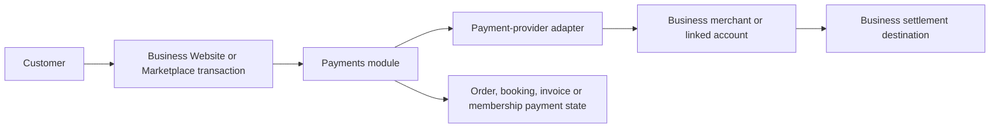
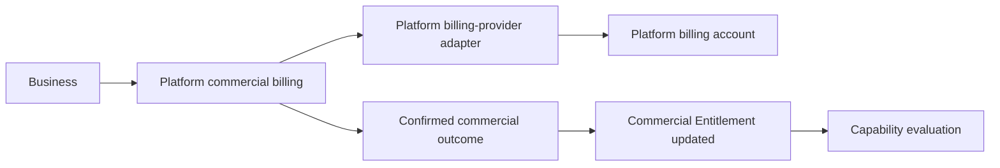

# Plans, Modules & Entitlement Model

**Document:** 08  
**Document Status:** Canonical foundation  
**Version:** 1.1  
**Date:** July 2026 (Version 1.1 amendment: September 1, 2026)  
**Authority:** Platform Core, module classification, plans, Commercial Entitlement, commercial availability, trials, limits, and module commercial lifecycle  
**Depends On:** `01-vision-document.md` · `02-product-experience-bible.md` · `03-business-kernel-specification.md` · `04-master-product-specification.md` · `05-user-context-journey-navigation-architecture-specification.md` · `06-role-permission-access-experience-matrix.md` · `07-business-type-configuration-profile-specification.md`  
**Working Input:** `module-capability-registry-audit.md` — temporary audit; approved normalization incorporated here

**Document Control**

| Version | Date | Change |
|---|---|---|
| 1.0 | July 2026 | Canonical commercial and capability-availability model. |
| 1.1 | September 1, 2026 | Additive amendment (Website Generation Overhaul work order), recorded per §25.3 discipline — decision made now. Adds anti-pattern §24.13 (AI generation authors platform mechanics). No change to Platform Core, the module registry, plans, or entitlement semantics. |

---

# 1. Purpose, Scope and Non-Goals

## 1.1 Purpose

This document defines the platform's canonical commercial and capability-availability model.

Its governing question is:

> What is this Business commercially allowed to use, what has it chosen to enable, what is actually configured and available, and how does that differ from what a particular user is authorized to do?

This document converts the first-class Commercial Entitlement concept required by Document 05 `KIR-005` and Document 06 `RPA-CONFLICT-005` into a stable product model.

## 1.2 Governing layer model

Availability is evaluated through distinct layers:

```text
Platform Core
→ Commercial Plan / Commercial Relationship
→ Commercial Entitlement
→ Module availability
→ Module activation state
→ Configuration readiness
→ Business/Location applicability
→ User permission and scope
→ Workflow/resource policy
→ Actual available action
```

No single `has_access` boolean may replace this model.

## 1.3 This document governs

- the approved Platform Core inventory;
- the canonical optional Business module registry;
- the canonical AI employee module registry;
- plan and add-on semantics;
- Commercial Entitlement and entitlement sources;
- module commercial availability and operational lifecycle;
- trials, usage allowances, upgrades, downgrades, suspension, and cancellation;
- capability/use-case dependency semantics;
- Business-wide and Location-aware commercial applicability;
- commercial packaging principles;
- merchant payment collection versus platform billing;
- payment-provider abstraction principles;
- Super Admin commercial corrections;
- entitlement-to-access interaction; and
- legacy module-name normalization.

## 1.4 This document does not govern

It does not:

- set exact public prices or final plan names;
- decide free-versus-paid launch strategy;
- permanently choose Razorpay or another payment provider;
- define tax, legal-retention, accounting, or settlement implementation;
- design database tables, API payloads, webhooks, or provider adapters;
- define every permission or AI action authority;
- design billing, module, or checkout page layouts;
- reproduce the full feature inventory from Document 04; or
- create an implementation roadmap.

## 1.5 Authority and conflict handling

Where Documents 01–04 conflict with the approved decisions in Documents 05–07 and this document, this document governs commercial/module classification.

The temporary registry audit is not canonical after this document. Its approved normalization is incorporated here; unresolved audit proposals are either resolved here or explicitly deferred.

---

# 2. Canonical Commercial Concepts

| Concept | Canonical definition | Explicitly not |
|---|---|---|
| **Platform Core** | Universal foundation every Business receives automatically | An optional installable module |
| **Plan** | A configurable commercial package or relationship that grants a set of Entitlements and allowances | A fixed industry bundle or one permanent pricing strategy |
| **Commercial Entitlement** | The authoritative Business-scoped commercial right to use a named module, capability, tier, quantity, or allowance during a defined period/state | User permission, module activation, configuration, or recommendation |
| **Module** | A substantial optional Business capability with coherent configuration, workflows, state, and lifecycle | A page, label, renderer, Business type, or every small feature |
| **Capability** | A function inside Platform Core or a module that may be independently available, configured, permissioned, or commercially tiered | Automatically a top-level module |
| **Add-on** | A separately granted commercial entitlement outside or on top of a base plan | Automatic activation |
| **Usage allowance** | An included measurable quantity associated with an Entitlement | The same thing as operational telemetry |
| **Usage overage** | Usage beyond an included allowance when a future commercial policy explicitly supports it | Automatically billable merely because it was measured |
| **Trial** | A temporary Entitlement to a defined module, capability, tier, or allowance | Permanent access or automatic user authority |
| **Module activation** | The Business's explicit operational choice to enable an entitled module | Commercial purchase or readiness |
| **Configuration readiness** | Whether an enabled module has the required Business, Location, provider, policy, or workflow configuration to operate | Entitlement or permission |
| **Recommendation** | Advisory guidance derived from Business type, characteristics, activity, or goals | Entitlement, dependency, activation, or authority |
| **Commercial relationship** | The Business's overall arrangement with the platform, including plan, billing state, grants, and possible custom terms | Merchant customer payment processing |

## 2.1 Separation rules

1. Entitlement limits what the Business may use; permission limits what a person may do.
2. A plan grants Entitlements; it does not automatically activate every included module.
3. Activation records Business choice; it does not prove configuration readiness.
4. Configuration readiness does not grant a user permission.
5. Business type recommends modules; it never grants or requires commercial access.
6. Location configuration may narrow availability; it cannot expand beyond Business Entitlement.
7. Platform enforcement or Business status may suppress an otherwise entitled capability.

---

# 3. Commercial Entitlement Model

## 3.1 Entitlement scope

An Entitlement may conceptually express:

| Entitlement dimension | Example | Notes |
|---|---|---|
| Module access | `orders` | Makes the module commercially available to the Business |
| Capability access | `analytics.advanced` | Allows tiering inside one module |
| Quantity allowance | 10 team seats | Exact quantities remain commercial configuration |
| Location allowance | Up to a configured number of Locations | Does not make every module separately purchased per Location |
| Usage allowance | Included messages or transactions | Measurement does not imply billing |
| AI allowance | AI messages, minutes, actions, or runs | Exact unit differs by AI employee and remains deferred |
| Feature tier | Standard versus advanced capability family | Tier is not automatically another module |
| Trial access | Temporary `bookings` access | Time- or usage-bounded |
| Add-on access | `ai-receptionist` | Separate from base-plan inclusion |
| Custom grant | Negotiated or Super Admin correction | Must be attributable and bounded |

## 3.2 Conceptual Entitlement properties

Without defining a physical schema, an Entitlement needs enough semantics to identify:

- the Business receiving the grant;
- the canonical subject: Core capability, module, sub-capability, tier, or allowance;
- the source of the grant;
- the effective start and optional expiration;
- whether it is active, suspended, expired, or revoked;
- any quantity or usage ceiling;
- any commercial conditions;
- the administrative or commercial actor responsible for a manual change; and
- the reason/provenance needed for support and audit.

## 3.3 Effective Entitlement

Effective Entitlement is the union of all active, non-expired grants for the same Business, constrained by explicit commercial suspension or restriction.

Expiration or revocation of one source ends only that source. For example, an expired trial does not remove an active paid add-on for the same module.

Conceptually:

```text
Effective Entitlement
= Platform Core grants
  + active base-plan grants
  + active add-on grants
  + active trial grants
  + active promotional grants
  + active attributable manual grants
  + active custom-agreement grants
  - explicit scoped commercial restrictions
```

## 3.4 Entitlement is not permission

Commercial Entitlement is Business-scoped. It cannot:

- create a membership;
- assign Primary Owner, Manager, or Member;
- grant a permission template;
- expand a member's Location scope;
- authorize a sensitive action; or
- grant an AI employee tool authority.

These remain governed by Documents 05 and 06 and future permission/governance specifications.

## 3.5 Entitlement in capability computation

Document 03 §1.7 must eventually be amended so effective capability computation includes at least:

```text
Commercial Entitlement
+ Platform/module state
+ Configuration readiness
+ Business/Location applicability
+ Business operational status
+ User permission and scope
+ Workflow/resource policy
```

This satisfies Document 05 `KIR-005` and Document 06 `RPA-CONFLICT-005`.

---

# 4. Entitlement Sources and Precedence

## 4.1 Supported sources

| Source | Typical purpose | Commercial actor/provenance |
|---|---|---|
| Platform Core | Universal foundation | Platform policy |
| Base plan | Bundled modules, tiers, and allowances | Authorized Business commercial actor |
| Add-on | Additional module, capability, AI employee, or allowance | Authorized Business commercial actor |
| Trial | Reversible evaluation | Authorized start or explicit platform policy |
| Promotional grant | Time-bounded campaign or founder offer | Platform policy/Admin |
| Manual Super Admin grant | Correction, support, extension, or temporary arrangement | Attributed Super Admin |
| Custom commercial agreement | Future negotiated package | Authorized commercial record |

## 4.2 Precedence principles

1. Platform Core remains included even when no paid plan exists, subject to Business closure, legal retention, platform enforcement, or a future clearly defined inactive-Business policy.
2. An explicit scoped commercial suspension prevents operational use despite lower-priority active grants.
3. A manual correction must target a specific commercial layer and must not silently rewrite plan history.
4. Add-on, trial, promotional, and plan grants can coexist.
5. The most permissive active grant normally supplies the effective allowance unless a valid scoped restriction applies.
6. Expiration is evaluated per grant.
7. Business type has no place in Entitlement precedence.
8. Commercial precedence does not override permission, Location scope, or workflow policy.

## 4.3 Super Admin grant boundary

A Super Admin may correct or temporarily grant commercial access. That action:

- must be attributed;
- must identify its target and reason;
- must not be recorded as an Owner purchase;
- must not silently grant user permission;
- must not automatically configure or activate the module; and
- must not imply acceptance of a paid long-term contract unless a future policy explicitly authorizes that operation.

---

# 5. Plan Model

## 5.1 Plan purpose

A Plan is a configurable packaging mechanism that can grant:

- optional module Entitlements;
- AI employee Entitlements;
- capability tiers;
- quantity allowances;
- usage allowances;
- Location or seat allowances;
- eligibility for specified add-ons; and
- commercial support or service levels if later defined.

## 5.2 Flexible strategy support

The architecture must support without assuming:

- a free/basic foundation;
- tiered subscriptions;
- module-based pricing;
- plan-bundled modules;
- separate add-ons;
- AI employee add-ons;
- usage-based pricing;
- promotional or trial packages; and
- future custom plans.

## 5.3 Plan rules

1. Every Plan includes the full Platform Core foundation.
2. A Plan may bundle optional modules; not every module must be sold separately.
3. A Plan grant makes a module enableable; it does not make it active.
4. A capability tier may be packaged inside a module without creating another module.
5. A Plan may set allowances without requiring every measured dimension to become billable.
6. Plan names and prices are commercial configuration, not hard-coded product invariants.
7. Document 04 Appendix A remains illustrative and is not canonical pricing.
8. Business-type profiles may explain relevant Plans/modules but cannot select or force them.

## 5.4 Add-ons

An Add-on may provide:

- one optional Business module;
- one AI employee;
- an advanced capability tier;
- additional seats, Locations, storage, messages, or usage;
- a temporary or recurring allowance; or
- another explicitly defined commercial right.

Removing an Add-on removes its grant at the configured effective time. It does not automatically delete module data.

---

# 6. Platform Core Commercial Treatment

## 6.1 Approved Platform Core

Every Business receives these **10** Core capability groups:

| Core name | Canonical ID | Foundational purpose |
|---|---|---|
| Business Identity | `core-business-identity` | Canonical Business root and lifecycle identity |
| Business Profile | `core-business-profile` | Manage canonical public Business facts |
| Website/Public Presence | `core-website` | Universal Business-owned digital presence |
| Workspace Foundation | `core-workspace` | Authenticated Business operating shell |
| Settings | `core-settings` | Business configuration foundation |
| Location Foundation | `core-locations` | One Business with one or more operational Locations/service areas |
| Team, Roles & Access | `core-team-access` | Membership, roles, templates, permissions, and Location scope |
| Module Management | `core-module-management` | Discover, evaluate, enable, configure, and deactivate modules |
| Basic Notifications | `core-notifications` | Essential platform and operational notification foundation |
| Marketplace Presence | `core-marketplace-presence` | Per-Business Marketplace projection and visibility configuration |

These are not optional installable modules and must not appear as paid operational add-ons.

## 6.2 Core continuity

A Business does not uninstall:

- its identity;
- profile foundation;
- functioning Website/public presence;
- workspace shell;
- settings;
- Location foundation;
- Team & Access foundation;
- module manager;
- basic notification foundation; or
- Marketplace presence infrastructure.

Business closure, platform enforcement, archival, or public-visibility settings may change how Core is presented or operated, but they do not convert Core into optional modules.

## 6.3 Core advanced capabilities

Advanced capabilities inside a Core area may later be commercially differentiated only if the Core remains genuinely functional.

Examples:

- `core-website` always provides a functioning public Website; a future advanced design, domain, optimization, or high-capacity feature may be entitled separately.
- `core-notifications` always provides essential platform notifications; optional external channels belong to `messaging`.
- `core-marketplace-presence` always provides the Business projection; discoverability remains subject to Business visibility choice and platform policy, not module installation.

Commercial differentiation must not turn the Core promise into an unusable placeholder.

## 6.4 Website rule

Every Business receives `core-website`.

The initial Website may be created from:

- Business information;
- Business-Type Profile recommendations;
- selected Business preferences; and
- AI-assisted generation/configuration.

Optional modules extend it with structured offerings, orders, bookings, payments, fulfilment, memberships, reviews, and other operational capabilities.

## 6.5 Marketplace distinction

The Business Website and Marketplace Business Profile:

- are distinct public surfaces;
- use shared canonical Business data;
- may expose different presentation and interaction patterns; and
- must not be merged into one route or renderer.

Only Businesses that join the platform appear under the current Marketplace model. There are no unclaimed Business listings.

---

# 7. Module Lifecycle and Independent State Dimensions

## 7.1 Why one flat state is invalid

Terms such as Available, Recommended, Entitled, Enabled, Active, and Suspended describe different dimensions.

For example:

- a module can be available in the registry but not entitled;
- entitled but not enabled;
- enabled but awaiting configuration;
- configured for one Location and unavailable at another;
- active but commercially suspended; or
- deprecated while still operational for existing Businesses.

## 7.2 Canonical dimensions

| Dimension | Example states | Governing question |
|---|---|---|
| **Registry availability** | available, unavailable, deprecated, removed | Does the platform currently offer/support this module? |
| **Recommendation** | recommended, not recommended, dismissed | Is this module contextually suggested? |
| **Commercial Entitlement** | not entitled, trial available, trial active, entitled, suspended, expired/revoked | May this Business use it commercially? |
| **Activation** | not enabled, enabled, deactivated | Has the Business chosen it operationally? |
| **Configuration** | not required, required, in progress, ready, invalid | Is enough setup complete? |
| **Applicability** | Business-wide, selected Locations, unavailable at Location | Where may it operate? |
| **Operational health** | healthy, degraded, blocked | Can the module currently perform its function? |
| **Platform/Business status** | in good standing, under review, restricted/suspended | Does a broader policy suppress operation? |

## 7.3 Derived experience states

User-facing labels may be derived from these dimensions:

| Experience label | Required underlying conditions |
|---|---|
| Available | Registry offered; no active Entitlement |
| Recommended | Advisory signal exists |
| Trial available | Trial policy allows a start |
| Trial active | Active temporary Entitlement |
| Entitled | Active grant exists |
| Configuration required | Entitled + enabled + not ready |
| Active | Entitled + enabled + ready + applicable + healthy |
| Suspended | Commercial or operational restriction applies |
| Deactivated | Business deliberately stopped operational use |
| Deprecated | Registry lifecycle discourages new use |
| Removed/unavailable | Platform no longer offers new activation; migration/recovery policy applies |

## 7.4 Canonical lifecycle principles

1. Discovery does not require Entitlement.
2. Entitlement must precede gated operational use.
3. Enabling is an explicit Business choice except where a future approved Core-adjacent capability says otherwise.
4. Setup may occur only to the degree allowed by trial/purchase policy.
5. Active requires readiness and all contextual gates.
6. Deactivation is operational removal, not data deletion.
7. Commercial suspension and operational suspension are separate.
8. Deprecation must define migration and support behavior.
9. Removal/unavailability must not silently erase Business records.

This supersedes legacy hard-uninstall assumptions identified by Document 05 `KIR-003` and `CONFLICT-005`.

---

# 8. Module Discovery and Enablement

## 8.1 Discovery sources

Modules may be discovered through:

- Core Module Management;
- Business-Type Profile recommendations;
- onboarding characteristic questions;
- relevant empty states;
- workspace recommendations;
- dependency explanations;
- plan/add-on comparison;
- AI-assisted suggestions; or
- Super Admin support guidance.

## 8.2 Discovery information

Before commercial action, an authorized user should be able to understand:

- what the module does;
- where it contributes to Website/workspace/Marketplace experiences;
- whether it is recommended and why;
- known functional, conditional, integration, and data dependencies;
- whether a Plan, Add-on, or trial can grant Entitlement;
- likely setup requirements;
- Location support;
- which roles typically configure or use it; and
- what happens on trial expiry or deactivation.

## 8.3 Enablement flow

```text
Discover
→ Understand recommendation and dependencies
→ Confirm current Entitlement or trial/purchase path
→ Acquire Entitlement if needed
→ Explicitly enable
→ Complete Business/provider/Location configuration
→ Validate readiness
→ Activate operational capability
```

## 8.4 Discovery rules

1. A recommendation never auto-installs or purchases a module.
2. AI may recommend or explain; it must not silently purchase Entitlement.
3. Primary Owners see commercial recovery options where appropriate.
4. Managers/Members without commercial authority should see neutral availability or an escalation path, not misleading purchase authority.
5. A dependency must identify whether it is hard, conditional, integration, data, or commercial.
6. Entitled-but-disabled and not-entitled are different experiences.
7. Deactivated modules remain discoverable with retained-history and reactivation information.

---

# 9. Dependency Model

## 9.1 Dependency classes

| Dependency class | Definition | Example |
|---|---|---|
| **Hard functional dependency** | The capability cannot function at all without another capability | Inventory requires compatible product-type offerings |
| **Conditional/use-case dependency** | Required only for one mode or workflow | Automatic membership renewal requires compatible Payments |
| **Integration dependency** | Required only when two otherwise independent modules exchange actions/data | Online invoice payment integrates Invoicing with Payments |
| **Data dependency** | Requires a compatible source or evidence, not necessarily a fixed module | Reviews require eligible completed-transaction evidence |
| **Commercial prerequisite** | Plan/Add-on rule needed to obtain Entitlement | Advanced analytics tier may require an eligible Plan |
| **Recommendation** | Contextual guidance with no enforcement | Restaurant profile recommends Orders |

## 9.2 Dependency rules

1. Business type is never a dependency.
2. Industry convention is not proof of functional necessity.
3. Dependencies should target the smallest stable capability needed.
4. A hard module-to-module edge is used only when every supported mode requires it.
5. Conditional dependencies must state the condition.
6. Commercial prerequisites must not be encoded as technical dependencies.
7. Missing optional integrations should degrade the relevant mode, not unrelated module functions.
8. Dependency changes must not silently activate or purchase another module.

## 9.3 Canonical examples

| Subject | Canonical dependency semantics |
|---|---|
| `orders` | Catalog-based ordering uses compatible `offerings-catalog` entries; any future manual-order mode must define its own data requirements |
| `bookings` | May use service-type offerings; scheduling/availability is owned by Bookings |
| `queue-operations` | Can operate independently; may integrate with Bookings and Workforce |
| `inventory` | Requires compatible product-type offerings, not Orders |
| `payments` | Payment links may operate without Orders; checkout/deposit modes integrate with Orders or Bookings |
| `invoicing` | Invoice creation can exist without Payments; online invoice collection requires Payments |
| `memberships` | Plan/membership management can exist without automatic collection; auto-renewal requires compatible Payments |
| `loyalty` | Requires a Customer Relationship and an eligible earn/redeem event source; Payments is only one possible source |
| `reviews` | Requires eligible completed interaction/transaction evidence under review policy |
| `fulfilment` | Normally operates on Orders; individual pickup, local delivery, or shipping modes may require additional configuration/integration |
| `analytics` | Uses available event/statistics data; richer sources improve capability without creating false hard dependencies |
| AI employees | Require only the tools/capabilities needed for their configured job; Entitlement alone grants no tool |

---

# 10. Location-Level Applicability

## 10.1 Default scope

Commercial Entitlement is normally Business-scoped.

A Business with multiple Locations does not automatically purchase every module independently for each Location.

## 10.2 Location behavior

Where a module supports Location scope, it may be:

- entitled Business-wide;
- enabled at Business level;
- configured with Business defaults;
- activated for selected Locations;
- configured differently by Location; or
- temporarily unavailable at one Location without Business-wide deactivation.

## 10.3 Entitlement versus Location configuration

| Situation | Result |
|---|---|
| Business not entitled | No Location can activate the module |
| Business entitled, module not enabled | No Location operationally uses it |
| Enabled, selected Locations only | Capability available only at configured Locations |
| Business-wide ready, member lacks Location scope | Business capability exists; that member cannot operate it there |
| Plan limits Location count | Commercial ceiling applies; Business chooses/configures eligible Locations |

## 10.4 Future commercial flexibility

Plans may later limit:

- number of Business Locations;
- number of Locations using a module;
- per-Location usage; or
- Location-specific advanced capabilities.

These are possible Entitlement dimensions, not approved pricing decisions.

Location cannot grant a capability above the Business's commercial ceiling, consistent with Document 05 `LOC-011` and Document 07 §7.

---

# 11. Trial Model

## 11.1 Trial principles

1. Trial eligibility is policy, not an inherent module property.
2. Starting a trial creates a temporary scoped Entitlement.
3. A trial does not automatically enable or configure a module.
4. A trial may cover a module, capability tier, AI employee, or usage allowance.
5. Trial duration and limits are configurable and not fixed here.
6. Repeated-trial rules are policy and may consider prior trial history.
7. A trial may convert to a Plan/Add-on only through an explicit approved commercial flow.
8. Trial ending does not destroy Business data.

## 11.2 Trial lifecycle

```text
Eligible
→ Offered
→ Explicitly started
→ Active
→ Conversion offered
→ Converted | Cancelled | Expired
```

## 11.3 Trial expiry

On expiry without another active grant:

- new gated operations stop;
- transactional public actions are removed or replaced with a safe unavailable state;
- configuration and historical records are retained;
- read/export access may remain where appropriate and safe;
- in-flight work follows module-specific completion policy;
- the Primary Owner receives a commercial recovery path; and
- other users receive an appropriate neutral restricted state.

The exact duration, reminder schedule, auto-conversion policy, and repeated-trial eligibility are intentionally deferred.

---

# 12. Upgrade Behavior

## 12.1 Upgrade principles

When a Business gains Entitlement:

- newly available modules appear as enableable;
- already enabled/configured modules may become active after validation;
- higher allowances apply at the configured effective time;
- advanced capabilities become available without destructive reconfiguration;
- retained data from a previous entitlement period may become operational again; and
- permission and Location checks still apply.

## 12.2 Upgrade does not imply

An upgrade does not automatically:

- enable every included module;
- accept provider terms;
- configure Locations;
- grant user permission;
- authorize an AI employee's tools; or
- publish generated content.

## 12.3 Effective timing

The model supports immediate, scheduled, or next-cycle Entitlement changes. Exact proration and effective-time policy remain commercial implementation decisions.

---

# 13. Downgrade Behavior

## 13.1 Downgrade principles

A downgrade may:

- remove future Entitlement at a defined effective time;
- block creation of new resources above a lower limit;
- make advanced capabilities unavailable;
- require selection of modules/Locations/seats that remain covered;
- preserve historical records;
- retain read/export access where appropriate; and
- expose a recovery or re-upgrade path.

## 13.2 Resources above a new limit

The default safe pattern is:

1. retain existing resources;
2. prevent net-new creation above the limit;
3. allow removal/consolidation;
4. allow read/export where policy permits;
5. avoid silently choosing which Business resources to delete or disable; and
6. define module-specific behavior for ongoing/in-flight workflows.

## 13.3 Data rule

Commercial downgrade, Add-on removal, or trial expiry must not automatically delete Business data.

Deletion, anonymization, and legal retention are separate policies outside this document.

---

# 14. Suspension, Failed Payment and Cancellation

## 14.1 Distinct conditions

| Condition | Meaning | Typical effect |
|---|---|---|
| Payment retry/grace | Platform billing attempt failed but recovery window remains | Warning/recovery; staged limits only if policy defines |
| Commercial suspension | Entitlements are temporarily blocked | New gated operations restricted; Core recovery access preserved |
| Voluntary cancellation | Business ends Plan/Add-on | Entitlements end at configured effective time |
| Business closure | Business ceases platform operation | Separate closure/archive process |
| Platform enforcement restriction | Trust, safety, legal, or policy action | May suppress transactions/public visibility regardless of payment |
| Module operational suspension | Module/provider health or compliance problem | Module-specific operation blocked while Entitlement may remain |

## 14.2 Failed payment

Failed platform billing should support:

- payment retry;
- a configurable grace state;
- clear Primary Owner recovery;
- no misleading purchase prompt to unauthorized users;
- restoration after successful recovery; and
- audit of commercial state transitions.

Exact grace periods and retry schedules are deferred.

## 14.3 Commercial suspension

Commercial suspension should:

- block new commercially gated operations;
- preserve Core access needed for understanding and recovery;
- retain data and history;
- avoid presenting inactive transaction actions publicly;
- preserve safe handling of in-flight obligations where module policy allows; and
- restore operation without destructive rebuild when the issue is resolved.

## 14.4 Voluntary cancellation

Cancellation may be immediate or effective at a future commercial boundary. The effective-time rule must be explicit to the Business but is not fixed here.

## 14.5 Platform enforcement

Platform enforcement is not a billing state. A Business may be fully paid and still restricted for trust, safety, legal, or policy reasons.

Likewise, commercial recovery does not automatically clear an enforcement restriction.

---

# 15. Usage and Metering

## 15.1 Meterable dimensions

The architecture may measure:

- AI messages, actions, runs, or voice minutes;
- external messages;
- transactions;
- orders or bookings;
- storage/media;
- workforce seats;
- Business Locations;
- offering counts;
- advanced analytics capacity;
- API usage in a future developer ecosystem; and
- other explicitly defined resources.

This list does not mean all dimensions will be limited or charged.

## 15.2 Three distinct concepts

| Concept | Purpose | Commercial meaning |
|---|---|---|
| **Operational telemetry** | Reliability, performance, product insight | Not automatically commercial |
| **Measured usage** | Count a named activity/resource consistently | May or may not affect Entitlement |
| **Billable usage** | Usage explicitly included in commercial calculation | Exists only under an approved pricing policy |

## 15.3 Allowance behavior

An allowance should define:

- the measured subject;
- unit and counting boundary;
- included quantity;
- reset or validity period if any;
- whether the limit is hard, soft, or overage-capable;
- warning thresholds;
- behavior at exhaustion; and
- who sees commercial recovery.

## 15.4 Exhaustion principles

At exhaustion, policy may:

- warn only;
- stop new operations;
- degrade to a lower capability tier;
- allow approved overage; or
- require an Add-on/upgrade.

Existing records are retained. In-flight work requires module-specific safe behavior.

Exact limits, reset cadence, overage prices, and AI metering units are deferred.

---

# 16. AI Employee Commercial Model

## 16.1 AI layers

| AI layer | Commercial treatment | Authority treatment |
|---|---|---|
| Embedded assistance | Included in Core or parent module unless separately defined | Proposal/help only |
| AI generation/configuration | Initial Website generation may be Core; advanced ongoing generation may be entitled | Human review/publish boundary remains separate |
| AI insights | May be included in Analytics, a capability tier, or an AI employee grant | Read-mostly unless separately authorized |
| AI employees | Separately selectable modules that may be plan-included, Add-ons, trials, grants, or usage-priced | Tools, actions, escalation, and autonomy are separate governance |

## 16.2 Packaging options

An AI employee may be provided through:

- base-plan inclusion;
- an Add-on;
- a bundled AI allowance;
- a usage allowance;
- future usage-based charges;
- a trial;
- a promotional grant; or
- an attributable manual grant.

No exact AI price or unit is decided here.

## 16.3 Entitlement versus operation

An AI employee being entitled does not mean it is:

- enabled;
- configured;
- connected to required channels;
- permitted to read every resource;
- authorized to use every tool;
- authorized to perform sensitive actions;
- allowed at every Location; or
- operating autonomously.

## 16.4 Business-type relationship

A Business-Type Profile may recommend an AI employee. It cannot grant:

- Entitlement;
- activation;
- permission;
- tool access; or
- action authority.

## 16.5 Runtime distinction

AI employees use shared `svc-ai-runtime` infrastructure. The runtime is not a Business-installable module. Embedded AI and AI employees remain distinct product layers.

---

# 17. Merchant Payments vs Platform Billing

## 17.1 Two separate financial domains

| Dimension | Customer → Business payment | Business → Platform payment |
|---|---|---|
| Purpose | Purchase, deposit, invoice, membership, refund/settlement | Plan, Add-on, AI employee, usage, commercial service |
| Payer | Customer | Business |
| Commercial beneficiary | Business, subject to provider/approved fee model | Platform |
| Business capability | Optional `payments` module | Shared `svc-entitlement-billing` |
| Entitlement effect | Does not grant platform Entitlement | Updates Commercial Entitlement after confirmed commercial outcome |
| Settlement destination | Business merchant/linked-account destination | Platform billing account |
| Primary recovery experience | Merchant payment/provider operations | Platform billing/plan recovery |

## 17.2 Customer-to-Business flow



The normal architecture must not collect customer funds into the founder's bank account for manual redistribution.

A future approved platform-fee or commission model may exist, but it must use provider-supported, legally appropriate money movement and must not collapse the Business and platform ledgers.

## 17.3 Business-to-platform flow



## 17.4 Customer memberships

`memberships` represents plans/packages/subscriptions a Business offers its customers.

It is not:

- the Business's platform Plan;
- a platform billing subscription;
- an Entitlement source by itself; or
- authority to collect money without the relevant Payments capability.

---

# 18. Provider Abstraction

## 18.1 Canonical provider concepts

The platform product model may need to understand:

- provider;
- provider capability;
- merchant onboarding;
- KYC/verification state;
- linked/connected merchant account;
- settlement destination;
- payment attempt/status;
- refund;
- payout/settlement status;
- provider restriction or disconnection; and
- provider-specific reference/provenance.

These are conceptual product terms, not a physical schema.

## 18.2 Adapter principle

Provider adapters map provider-specific objects and states into canonical concepts.

The canonical model must not permanently encode:

- Razorpay-specific names;
- one provider's account hierarchy;
- one provider's KYC lifecycle;
- one settlement schedule;
- one refund model; or
- one country's regulatory assumptions.

## 18.3 Merchant onboarding

For customer payment collection:

1. the Business selects/configures Payments;
2. the platform starts the appropriate provider merchant/linked-account onboarding;
3. KYC and required verification occur through the provider-supported process;
4. a Business settlement destination is approved;
5. readiness is reflected separately from Entitlement; and
6. Payments becomes operational only when provider and module configuration are ready.

## 18.4 Provider readiness is not Entitlement

A Business may be:

- entitled to Payments but not provider-onboarded;
- provider-onboarded but not entitled under its current Plan;
- entitled and onboarded but deactivated;
- active for one payment mode but not another; or
- commercially active but provider-restricted.

These states must not collapse into one flag.

---

# 19. Super Admin Commercial Controls

## 19.1 Current-stage controls

At the startup stage, Platform Super Admin may:

- inspect a Business's Plan, Entitlements, trials, and allowances;
- grant temporary Entitlement;
- extend or correct a trial;
- correct erroneous commercial state;
- apply an approved promotional/custom arrangement;
- adjust an allowance;
- troubleshoot platform billing;
- troubleshoot merchant-provider onboarding without impersonating the Business;
- suspend or restore commercial access under approved policy; and
- configure plan/module catalog availability.

## 19.2 Attribution rules

Every manual commercial action should capture:

- acting Super Admin;
- target Business;
- target commercial layer;
- before/after state;
- reason;
- effective time;
- expiration where applicable; and
- related support/incident context where available.

This follows Document 05 `ADM-011`–`ADM-012` and Document 06 `ADMIN-ACCESS-006`.

## 19.3 Correct-layer rule

| Admin intent | Correct layer |
|---|---|
| Give temporary paid capability | Commercial Entitlement grant |
| Make an entitled module operational | Activation/configuration |
| Let a member use a capability | Permission/scope |
| Resolve provider KYC/readiness | Provider/module configuration |
| Restrict Business for trust/safety | Platform enforcement status |

An Admin action must not update an adjacent layer as a shortcut.

## 19.4 Future internal controls

The architecture must allow later separation of support, billing, trust/safety, and platform-configuration authority without imposing unnecessary enterprise bureaucracy now.

---

# 20. Entitlement and Access Interaction

## 20.1 Authority boundary

Document 06 remains authoritative for access experience.

```text
Entitled + enabled + configured
does not mean
every user may use it.

User permission exists
does not mean
the Business is commercially entitled.
```

## 20.2 Decision matrix

| Entitlement | Activation/configuration | Location | User authorization | Resulting experience |
|---|---|---|---|---|
| Entitled | Not enabled | Applicable | Authorized | Module available to enable; no operational action |
| Entitled | Enabled, ready | Applicable | Not authorized | Restricted/hidden according to Document 06; no commercial upsell |
| Not entitled | Stale enabled state | Applicable | Authorized | Commercially blocked; stale activation cannot bypass Entitlement |
| Entitled | Enabled, configuration missing | Applicable | Authorized | Setup required; operation unavailable |
| Entitled | Enabled, ready | Wrong/unavailable Location | Authorized elsewhere | Location-unavailable explanation/recovery |
| Trial expired | Previously active | Applicable | Authorized | New use blocked; retained data and conversion path |
| Commercially suspended | Previously active | Applicable | Authorized | Commercial recovery; Core/history access as policy permits |
| Entitled | Enabled, ready | Applicable | Authorized | Continue to workflow/resource policy |

## 20.3 Disclosure precedence

When multiple gates fail, the experience should not reveal commercial details or capability existence beyond the person's role.

Examples:

- A Member who lacks permission should not receive an Owner purchase pitch.
- A Primary Owner may receive a Plan/Add-on recovery path.
- A configured module at an unauthorized Location should not expose restricted Location data.
- Super Admin sees the layer-specific cause in an attributed Admin context.

## 20.4 Route and navigation consequences

- Entitlement gained does not automatically add operational navigation until activation/readiness and permission permit.
- Entitlement loss removes operational entry while preserving Owner recovery and appropriate history access.
- Trial expiry changes commercial availability without destroying Destination Intent or retained records.
- Deep links evaluate all layers and return the most appropriate non-leaking state.

---

# 21. Canonical Registry

## 21.1 Registry classes

| Class | Count | Commercial posture |
|---|---:|---|
| Platform Core | 10 | Universal foundation; not optional installs |
| Optional Business Modules | 21 | Entitlement may be Plan-, Add-on-, trial-, promo-, or manually granted |
| AI Employee Modules | 13 | Separately selectable/entitleable; authority remains separate |
| Shared Services | 14 | Platform infrastructure; not Business-installable |
| Platform Systems/Surfaces | 7 listed here | Platform-owned lifecycle; not Business modules |
| Business-Type Profiles | Variable | Recommendation only |

## 21.2 Optional Business Modules

| Name | ID | Purpose / major capability family | Typical dependency semantics | Potential Entitlement dimensions | Common Business-Type recommendations |
|---|---|---|---|---|---|
| Offerings Catalog | `offerings-catalog` | Typed products, menu items, services, packages, classes, variants/options | Core profile/Website for projection | Offering count, advanced catalog capability | Restaurant, retail, clinic, salon, gym, professional services |
| Orders | `orders` | Cart, purchase intent, order acceptance/status, cancellation/refund coordination | Catalog-based orders use compatible offerings | Order volume, advanced order operations | Restaurant, home-food, retail |
| Bookings | `bookings` | Advance scheduling, appointments, reservations, sessions, consultations, classes | May use service-type offerings; integrates Workforce | Booking volume, resources/calendars, advanced scheduling | Clinic, salon, gym, coaching, restaurant reservations |
| Queue Operations | `queue-operations` | Walk-in check-in, token, live queue, provider routing | Optional Bookings/Workforce integration | Locations, queues, displays, volume | Clinic, salon, high-volume service Businesses |
| Customer Relationships | `customer-relationships` | Customer/contact records, history, notes, segments | Core Business identity; receives module events | Contact count, segmentation/automation tiers | Most repeat-customer Businesses |
| Leads | `leads` | Enquiries, prospects, pipeline stages, follow-up, conversion | Optional Customer Relationships and Invoicing integration | Lead volume, pipeline/automation tiers | Professional services, photography, home services, events/catering |
| Inventory | `inventory` | Stock by Location, adjustment, availability, low-stock signals | Product-type offerings | Item/Location count, advanced stock capabilities | Retail, product-led restaurant/home-food |
| Payments | `payments` | Merchant collection, links, refunds, settlement status | Provider readiness; conditional Orders/Bookings/Invoicing/Memberships integration | Transaction/volume/features/provider modes | Businesses collecting digitally |
| Invoicing | `invoicing` | Invoices, tax/billing documents, terms, receivables | Payments only for integrated collection | Invoice volume, advanced tax/receivable capability | Professional services, B2B, events/catering |
| Fulfilment | `fulfilment` | Pickup, local delivery, shipping/courier and handoff orchestration | Normally Orders; modes may need provider/config integrations | Locations, zones, shipments/deliveries, advanced modes | Restaurant, home-food, retail |
| Memberships | `memberships` | Customer plans, packages, recurring access/benefits | Customer Relationships; Payments for auto-charge | Active members, plan tiers, renewal automation | Gym, coaching, home-food subscriptions, membership Businesses |
| Loyalty | `loyalty` | Points, tiers, rewards, earn/redeem | Customer Relationships + eligible event sources | Member count, advanced tiers/rules | Retail, restaurant, salon |
| Workforce | `workforce` | Provider/staff profiles, schedules, availability, service assignment | Core Team & Access linkage; optional Bookings/Queue integration | Operational profiles, schedules, Locations | Clinic, salon, gym, home services |
| Payroll | `payroll` | Compensation periods, calculations, payout status | Workforce; Payments only for integrated payout | Workforce seats, payroll runs, advanced rules | Team-heavy Businesses |
| Messaging | `messaging` | Optional external channels and transactional templates | Core Notifications/event service; provider/channel setup | Messages, channels, templates | Broad; especially booking/order/lead Businesses |
| Marketing | `marketing` | Campaigns, offers, coupons, audiences, schedules | Customer Relationships; Messaging only for selected channels | Audience size, sends, campaigns, automation | Broad growth-stage Businesses |
| Reviews | `reviews` | Transaction-linked feedback, ratings, responses | Eligible completed interaction evidence | Review requests, advanced response/analysis | Transactional and service Businesses |
| Analytics | `analytics` | Business reporting, operational insights, advanced cohorts/LTV/attribution | Shared event/statistics data; richer sources improve outputs | Standard/advanced tiers, data history, exports | Broad; especially multi-module Businesses |
| Business Passport | `business-passport` | Verified credential/compliance dossier | Core Profile and verification infrastructure | Verification types, advanced credential services | Regulated, trust-sensitive, and B2B Businesses |
| Business Community | `business-community` | Business posts, follows, community interaction | Marketplace participation/policy/density | Participation or premium capabilities | Broad, later-stage ecosystem participants |
| B2B Network | `b2b-network` | Supplier/partner discovery, RFQ, B2B relationships/transactions | Capability-specific Passport, Trust, Invoicing, Payments integrations | Network/transaction/advanced sourcing capabilities | Supplier, wholesale, multi-Business operators |

**Canonical optional Business module count: 21.**

## 21.3 AI Employee Modules

| Name | ID | Commercial purpose | Typical capability/tool dependencies |
|---|---|---|---|
| AI WhatsApp Manager | `ai-whatsapp-manager` | Conversational order/booking/lead handling | Messaging plus explicitly granted Orders, Bookings, or Leads tools |
| AI Content Creator | `ai-content-creator` | Ongoing content generation | Core Website/Profile; Offerings/Marketing when granted |
| AI Marketing Manager | `ai-marketing-manager` | Campaign planning/operation | Marketing and authorized content/messaging tools |
| AI Business Analyst | `ai-business-analyst` | Business analysis and digests | Analytics and authorized Business data |
| AI Inventory Manager | `ai-inventory-manager` | Stock monitoring/recommendations | Inventory |
| AI Sales Executive | `ai-sales-executive` | Lead/customer conversion assistance | Leads, Customer Relationships, Offerings as authorized |
| AI Appointment Manager | `ai-appointment-manager` | Booking/queue scheduling assistance | Bookings and/or Queue Operations; Workforce where configured |
| AI Follow-up Manager | `ai-follow-up-manager` | Retention and follow-up | Customer Relationships plus authorized Messaging/Reviews |
| AI Customer Support | `ai-customer-support` | Customer issue assistance | Customer Relationships and explicitly authorized operational tools |
| AI Finance Assistant | `ai-finance-assistant` | Reconciliation and finance assistance | Payments and/or Invoicing |
| AI Delivery Coordinator | `ai-delivery-coordinator` | Fulfilment/dispatch assistance | Fulfilment and Orders |
| AI SEO Manager | `ai-seo-manager` | Website SEO analysis/actions | Core Website and authorized content capability |
| AI Receptionist | `ai-receptionist` | Voice/front-desk interactions | Communication plus authorized Bookings, Queue, Leads, or Customer tools |

**Canonical AI employee module count: 13.**

The exact launch subset, autonomy, safety model, and prices remain deferred.

## 21.4 Shared Services

| Shared service | Canonical ID | Purpose |
|---|---|---|
| Identity/Auth | `svc-identity-auth` | Platform Identity and authentication |
| Tenant/Access Enforcement | `svc-tenancy-access` | Tenant isolation and authorization enforcement |
| Module Registry | `svc-module-registry` | Canonical registry/manifests and availability |
| Entitlement & Platform Billing | `svc-entitlement-billing` | Commercial relationship, billing state, and Entitlement authority |
| Event/Audit | `svc-event-audit` | Inter-module events and attributable history |
| Rendering | `svc-rendering` | Website, Marketplace, workspace, Admin, AI, and API projections |
| Capability Evaluation | `svc-capability-evaluation` | Layered availability computation |
| AI Runtime | `svc-ai-runtime` | Shared model, context, tool, and execution infrastructure |
| Search/Discovery | `svc-search-discovery` | Shared indexing and query infrastructure |
| Media | `svc-media` | Shared asset storage/transformation |
| Realtime | `svc-realtime` | Event fan-out/live updates |
| Statistics/Trust | `svc-statistics-trust` | Derived Business statistics, trust, and health signals |
| Communication Delivery | `svc-communication-delivery` | Shared channel/provider delivery infrastructure |
| Payment Providers | `svc-payment-providers` | Provider abstraction for separate merchant and platform flows |

Shared services are not Business-installable modules.

## 21.5 Platform Systems and Surfaces

| Platform system/surface | Canonical term | Classification |
|---|---|---|
| Main platform/marketing site | `platform-website` | Platform-owned surface |
| Consumer Marketplace | `consumer-marketplace` | Cross-Business discovery/interaction surface |
| Consumer Account | `consumer-account` | Personal cross-Business activity surface |
| Platform Administration | `platform-administration` | Internal attributed Admin system |
| Developer ecosystem | `platform-developer-ecosystem` | Future developer/API/publishing system |
| Module Marketplace | `platform-module-marketplace` | Future third-party module distribution system |
| Delivery Partner work surface | `delivery-partner-workspace` | Assignment-scoped operational surface contributed by Fulfilment |

These are not Business-installable modules.

## 21.6 Business-Type Profiles

Business-Type Profiles:

- recommend modules and AI employees;
- suggest terminology and configuration;
- adapt onboarding and workspace emphasis; and
- never grant Entitlement, activate modules, assign permissions, or create dependencies.

---

# 22. Legacy Normalization Map

| Legacy term/ID | Canonical treatment | Meaning of change |
|---|---|---|
| `business-profile` module | `core-business-profile` | Universal Core, not optional module |
| `website` module | `core-website` | Mandatory Core Website/public presence |
| `catalog-orders` | `offerings-catalog` + `orders` | Structured offerings separated from purchase workflow |
| `orders` legacy reference | `orders` | Canonical order workflow ID retained |
| `booking-calendar` | `bookings` | Advance scheduling/reservations |
| Queue meaning of `appointments` | `queue-operations` | Walk-in/token workflow separated from Bookings |
| `crm` | `customer-relationships` | Canonical relationship/history module |
| `inquiry-leads` | `leads` | Canonical enquiry/prospect pipeline |
| Customer `subscriptions` | `memberships` | Avoid collision with Business's platform subscription |
| `staff` module | `workforce` | Operational people/schedules separated from Core Team & Access |
| `whatsapp-notifications` | `messaging` | Optional external messaging channels |
| `delivery`, shipping concepts | `fulfilment` | Pickup, local delivery, and shipping/courier modes under one module |
| `analytics-basic` + `analytics-advanced` | `analytics` with capability/Entitlement tiers | One module, tiered capabilities |
| `trust-score` module | `svc-statistics-trust` + Business/Marketplace/Admin presentations | Shared derived infrastructure, not install |
| `developer-platform` module | `platform-developer-ecosystem` | Platform system |
| `module-marketplace` module | `platform-module-marketplace` | Platform distribution system |

This is conceptual normalization. It does not define a code, data, or migration procedure.

---

# 23. Commercial Scenarios

## 23.1 Scenario A — Restaurant with online ordering

**Business-Type recommendation:**

```text
Platform Core
+ Offerings Catalog
+ Orders
+ Payments
+ Fulfilment
```

Commercial and operational result:

1. Core Website exists automatically.
2. Plan/Add-ons/trials grant the optional Entitlements.
3. Business explicitly enables selected modules.
4. Offerings are configured as Menu Items.
5. Payments requires provider onboarding/readiness.
6. Fulfilment is configured for pickup, local delivery, shipping/courier, or supported combinations.
7. Permissions and Location scope determine who operates each workflow.

The Restaurant profile recommends this combination; it does not force it.

## 23.2 Scenario B — Restaurant without online ordering

```text
Platform Core
+ Offerings Catalog
+ Bookings
- Orders
- Payments
```

The Website publishes a Menu and accepts table reservations without supporting online Orders. This proves Offerings Catalog and Orders are separate.

## 23.3 Scenario C — Clinic

```text
Platform Core
+ Offerings Catalog
+ Bookings
+ Queue Operations
+ Workforce
```

Service offerings may be labelled Consultations. Bookings handles advance appointments; Queue Operations handles walk-ins/tokens; Workforce handles provider schedules. Core Team & Access still governs membership and authorization.

## 23.4 Scenario D — Gym

```text
Platform Core
+ Offerings Catalog
+ Memberships
+ Bookings
+ Payments
```

Memberships manages customer plans/packages. Payments supports auto-charge or collection only when configured. This is separate from the Gym Business's platform Plan.

## 23.5 Scenario E — Professional service Business

```text
Platform Core
+ Offerings Catalog
+ Leads
+ Customer Relationships
+ Invoicing
```

The Business can capture prospects, convert them into customer relationships, and issue invoices without requiring Orders or Payments. Online invoice collection becomes available only if Payments is separately entitled and ready.

## 23.6 Scenario F — Retail Business

```text
Platform Core
+ Offerings Catalog
+ Inventory
+ Orders
+ Payments
+ Fulfilment
```

Inventory tracks product-type offerings. Orders owns the purchase lifecycle. Fulfilment owns pickup/delivery/shipping execution. Payments handles money collection.

## 23.7 Scenario conclusion

The same Business type may choose a smaller, larger, or different combination. Profiles explain likely value; commercial and operational decisions remain explicit.

---

# 24. Anti-Patterns

## 24.1 Permission equals Entitlement

Rejected. A role or permission cannot create commercial access.

## 24.2 Enabled equals Entitled

Rejected. A stale enabled state cannot bypass an absent, expired, or suspended Entitlement.

## 24.3 Business type equals package

Rejected. A Restaurant, Clinic, or Retail Business is not forced into a fixed module or Plan bundle.

## 24.4 One giant subscription boolean

Rejected. The platform requires capability-level grants, allowances, and independent state dimensions.

## 24.5 Module equals page

Rejected. Pages and navigation are projections of Core/modules, not proof of module boundaries.

## 24.6 Every feature is separately sold

Rejected. Plans may bundle modules; capabilities may be included or tiered.

## 24.7 Data deletion on downgrade

Rejected. Commercial change does not casually destroy Business data.

## 24.8 Provider-specific canonical model

Rejected. Razorpay or another provider is implemented through adapters, not made the permanent domain language.

## 24.9 Customer money through founder account by default

Rejected. The normal flow uses an appropriate Business merchant/linked account and Business settlement destination.

## 24.10 AI Entitlement equals AI authority

Rejected. Paying for an AI employee does not authorize every action, tool, resource, or Location.

## 24.11 Platform billing equals merchant Payments

Rejected. Business-to-platform commercial billing and customer-to-Business collection are separate financial domains.

## 24.12 Commercial dependency equals functional dependency

Rejected. Packaging prerequisites must not masquerade as technical necessity.

## 24.13 AI generation authors platform mechanics

> **Amendment — 2026-09-01 (Website Generation Overhaul work order; additive, dated per §25.3 discipline). Recorded now.**

Rejected. AI-assisted Website generation authors **content only** — section copy, image selection from supplied or curated assets, layout-variant choice from a section type's existing allowed variants, and section ordering — within the structured section system. It never authors cart or checkout behaviour, stock/availability display, navigation or route semantics, order/booking confirmation, module data contracts, permission gates, entitlement, or commercial state. Those are fixed, tested platform code, identical for every Business. Generation output is a **draft configuration**; configuration cannot reach mechanics. (Document 09 §5.4, §9.1.1; Document 12 §12.6–§12.8.)

---

# 25. Traceability and Conflict Register

## 25.1 Primary traceability

| Topic | Existing canonical source |
|---|---|
| Business type recommends, does not force | Document 05 `MOD-008`, `KIR-002`; Document 07 `BTYPE-002`, `BTYPE-005` |
| Entitlement, activation, permission separation | Document 05 `MOD-001`–`MOD-003`; Document 06 `ACCESS-002` and §2 |
| Entitlement in capability computation | Document 05 `KIR-005`; Document 06 `RPA-CONFLICT-005` |
| Location cannot expand Business authority | Document 05 `LOC-011`; Document 06 `SCOPE-*`; Document 07 §7 |
| Deactivation is not deletion | Document 05 `MOD-005`, `KIR-003`, `CONFLICT-005` |
| Payment dependency is use-case specific | Document 05 `MOD-009`; Document 07 `BTYPE-005` |
| Admin correct-layer attribution | Document 05 `ADM-011`–`ADM-012`; Document 06 `ADMIN-ACCESS-006` |
| Marketplace Website/profile distinction | Document 05 `SUR-003`, `CONFLICT-009` |
| Business-Type Profile authority boundary | Document 07 `BTYPE-001`–`BTYPE-007` and §17 |
| Access-state experience | Document 06 §2, §7, §11, §13 |
| Current legacy module inventory | Document 03 §2; Document 04 §3 |
| Illustrative legacy plans | Document 04 Appendix A |

## 25.2 Canonical conflicts requiring later amendment

| Conflict | Older assumption | Governing resolution in this document | Documents requiring focused amendment |
|---|---|---|---|
| Core versus modules | `business-profile` and `website` listed as modules | Both are approved Platform Core | Documents 03–04 |
| Business type bundles | Default/required modules auto-provisioned by type | Profile recommends; Business chooses | Documents 01, 03, 04 |
| Composite commerce module | `catalog-orders` or inconsistent `orders` ID | `offerings-catalog` and `orders` are separate | Documents 03–07 where referenced |
| Booking/queue naming | `booking-calendar` and `appointments` overlap | `bookings` versus `queue-operations` | Documents 03–07 where referenced |
| Relationship modules | `crm` plus orphan `inquiry-leads` | `customer-relationships` and `leads` | Documents 03–04 and dependent references |
| Team/workforce | Staff terminology mixes access and operations | Core Team & Access versus optional `workforce` | Documents 03–06 |
| Customer/platform subscriptions | `subscriptions` naming overlaps platform billing | Customer module is `memberships`; platform Plan is separate | Documents 03–04 |
| Payments/Invoicing | Static dependency says Invoicing requires Payments | Separate modules; online collection is conditional integration | Documents 03–04 |
| Delivery/shipping | Delivery is separate and shipping terminology varies | Canonical `fulfilment` covers pickup/local delivery/shipping modes | Documents 03–07 where referenced |
| Analytics | Basic and Advanced are separate module IDs | One `analytics` module with capability/Entitlement tiers | Documents 03–04 |
| Trust | Trust Score listed as installable module | Shared `svc-statistics-trust` plus presentations | Documents 03–04 |
| Developer ecosystem | Developer Platform and Module Marketplace listed as Business modules | Platform ecosystem systems | Documents 01, 03, 04 |
| Entitlement input | Kernel capability computation omits Entitlement/Location | Entitlement and contextual layers are first-class | Document 03, per `KIR-004`–`KIR-005` |
| Module deletion | Legacy uninstall/hard-delete assumptions | Deactivate and retain; deletion is separate | Documents 03–04, per `KIR-003` |
| Admin commercial action | Admin module installation can conflict with Owner billing authority | Attributed commercial correction and operational activation are separate | Documents 04–06 |

## 25.3 Amendment recommendation

Do not rewrite Documents 01–07 automatically. Conduct a later focused canonical amendment pass that:

1. replaces legacy identifiers;
2. updates Kernel capability inputs and module lifecycle;
3. removes type-driven forced bundles;
4. separates commercial, activation, configuration, and permission actions;
5. updates dependency declarations; and
6. marks legacy illustrative pricing clearly.

---

# 26. Decisions Intentionally Deferred

The following remain open by design:

1. exact public pricing;
2. exact Plan names;
3. free-versus-paid launch strategy;
4. whether modules are predominantly bundled or sold separately;
5. commission percentage;
6. whether transaction fees are charged;
7. exact usage and overage pricing;
8. exact AI employee prices and metering units;
9. exact trial durations, eligibility, recurrence, and conversion rules;
10. exact payment-retry and grace periods;
11. exact upgrade/downgrade effective timing and proration;
12. exact provider selection;
13. exact Razorpay commercial, partner, route, or linked-account arrangement;
14. future international payment providers;
15. detailed platform-billing tax and invoice implementation;
16. exact provider KYC and settlement behavior by jurisdiction;
17. detailed data-retention periods;
18. exact per-Location pricing or module-metering policy;
19. exact quotas and hard-versus-soft limit behavior;
20. exact AI autonomy, safety, tool, approval, and escalation architecture;
21. exact Super Admin authority for binding paid plan changes without Owner acceptance;
22. future Marketplace commission/monetization model; and
23. Developer ecosystem and third-party module commercial terms.

These decisions do not block the conceptual model. They must be supplied by later commercial, technical, legal, or governance specifications before their respective implementations.

---

# 27. Document Stability and Downstream Readiness

## 27.1 Stable decisions

This document stabilizes:

- the 10-group Platform Core;
- the 21 optional Business modules;
- the 13 AI employee modules;
- the shared-service/platform-system boundary;
- Commercial Entitlement as a first-class Business-scoped layer;
- independent commercial, activation, configuration, Location, permission, and workflow gates;
- use-case/capability dependency semantics;
- non-destructive downgrade/trial-expiry principles;
- merchant Payments versus platform billing;
- provider abstraction; and
- the legacy normalization map.

## 27.2 Downstream blockers

No unresolved decision blocks drafting Documents 09 and 10 if they consume the canonical concepts and IDs established here.

Implementation of billing, payment onboarding, usage charging, or AI authority remains blocked until the relevant deferred provider, pricing, metering, tax, and governance decisions are made.

Physical Kernel/data/API implementation must also incorporate the later amendments identified by `KIR-003`, `KIR-004`, and `KIR-005`.

---

# 28. Final Validation

| Validation requirement | Result |
|---|---|
| Website is mandatory Platform Core | Confirmed: `core-website` |
| Marketplace Presence is Platform Core | Confirmed: `core-marketplace-presence` |
| Website and Marketplace Business Profile remain distinct | Confirmed |
| Offerings Catalog and Orders are separate | Confirmed |
| Bookings and Queue Operations are separate | Confirmed |
| Customer Relationships and Leads are separate | Confirmed |
| Core Team/Access and Workforce are separate | Confirmed |
| Customer Memberships and platform subscription are separate | Confirmed |
| Payments and Invoicing are separate | Confirmed |
| Orders and Fulfilment are separate | Confirmed |
| Fulfilment covers pickup, delivery, and shipping/courier modes | Confirmed |
| Analytics is one module with capability tiers | Confirmed |
| Trust is shared infrastructure, not installable | Confirmed |
| Developer Platform and Module Marketplace are platform systems | Confirmed |
| AI runtime, embedded AI, and AI employees are distinct | Confirmed |
| Business type recommends but does not force | Confirmed |
| Entitlement, activation, configuration, and permission are distinct | Confirmed |
| Downgrade/trial expiry preserve data | Confirmed |
| Merchant payments and platform billing are separate | Confirmed |
| Customer funds do not default to founder settlement | Confirmed |
| Payment providers are abstracted | Confirmed |
| Exact pricing is deferred | Confirmed |
| Legacy module names are normalized | Confirmed |
| Remaining canonical conflicts are recorded | Confirmed |

---

**End of Document 08 — Plans, Modules & Entitlement Model**
