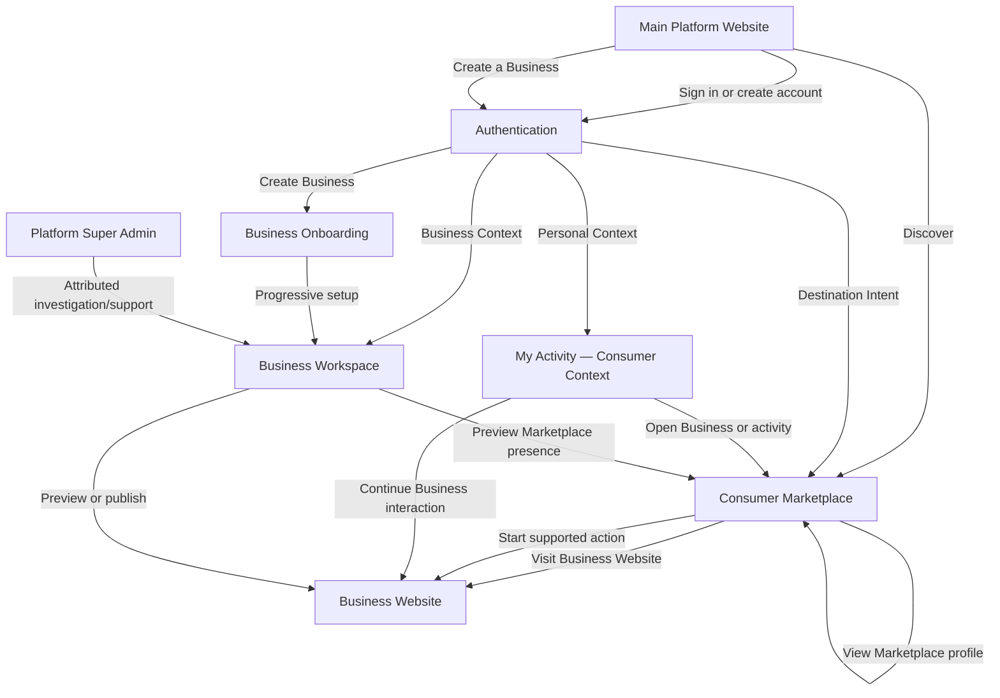

# Complete Page-by-Page Product Experience

**Document:** 09  
**Document Status:** Canonical experience inventory  
**Version:** 1.2  
**Date:** July 2026 (Version 1.2 amendment: September 1, 2026)  
**Authority:** Practical page and page-family experience across public, consumer, Business, and Platform Super Admin surfaces  
**Depends On:** `01-vision-document.md` · `02-product-experience-bible.md` · `03-business-kernel-specification.md` · `04-master-product-specification.md` · `05-user-context-journey-navigation-architecture-specification.md` · `06-role-permission-access-experience-matrix.md` · `07-business-type-configuration-profile-specification.md` · `08-plans-modules-entitlement-model.md`

**Document Control**

| Version | Date | Change |
|---|---|---|
| 1.1 | July 2026 | Canonical experience inventory. |
| 1.2 | September 1, 2026 | Additive amendment (Website Generation Overhaul & Workspace Cleanup work order), recorded per Document 08 §25.3 — decisions made now, not retroactively. Sharpens §5.1 and §5.4 with the AI content-authorship boundary and the one-shot structured-intake generation model; adds §9.1.1 documenting the inline click-to-edit interaction pattern for `CORE-005`/`CORE-006`/`CORE-007`; extends the §19 Conflict Register entry for the Website builder model. No page added or removed; no relevance-label change. |

---

# 0. How to Read This Document

## 0.1 Purpose

This document defines what users actually see, where they go, what each page is for, what they can do there, and how the experience changes by context, enabled modules, Business type, Location, Commercial Entitlement, and permission.

It is a practical experience inventory, not another abstract architecture specification.

## 0.2 Page-family contract

Every major page or family is described through:

- name and surface/context;
- access audience;
- purpose and main content;
- primary actions;
- important loading, empty, error, restricted, configuration, and lifecycle states;
- module, Business-type, Location, Entitlement, and permission variation where material;
- navigation relationships; and
- relevance: **MVP Essential**, **Post-MVP**, or **Future Ecosystem**.

## 0.3 Relevance labels

| Label | Meaning |
|---|---|
| **MVP Essential** | Needed for the first coherent platform, Business Website, Business setup, and initial operations |
| **Post-MVP** | Important expansion after the first complete operating loop; specified now but not a launch requirement |
| **Future Ecosystem** | Depends on platform scale, network density, mature infrastructure, or later strategic horizons |

These labels express product relevance only. They are not the final implementation roadmap.

## 0.4 Governing rules

1. Document 08 canonical IDs govern over legacy names.
2. Page presence does not imply access. Documents 05–06 govern context, permission, disclosure, and route handling.
3. A Business-Type Profile changes recommendations, terminology, emphasis, and defaults—not the product architecture.
4. Pages contributed by optional modules appear only when the module is entitled, enabled, sufficiently configured, applicable, and permitted.
5. One Business normally has one Website. Locations change data and capability context; they do not automatically create separate websites.
6. Only joined Businesses appear in the Marketplace. There are no unclaimed listings.
7. Platform billing and merchant customer payment collection remain separate.
8. **My Activity** contains the person's customer-side activity across Businesses; **Business Workspace** contains operations for a Business they operate. The same Platform Identity may enter both without mixing histories.
9. Modules define capability and ownership boundaries, but related module information may be composed into one coherent workflow.

---

# 1. Experience Map

## 1.1 Complete surface map



## 1.2 Surface responsibilities

| Surface | Ownership | Primary job | Typical entry |
|---|---|---|---|
| Main Platform Website | Platform-owned | Explain one connected ecosystem to consumers and prospective Business owners | Search, campaign, direct visit |
| Authentication/onboarding entry | Platform-owned | Establish one Platform Identity and preserve Destination Intent | Sign in, transaction gate, invitation, Create Business |
| Consumer Marketplace | Platform-owned | Discover joined Businesses, offerings, and supported actions | Platform homepage, search, shared links |
| My Activity / Consumer Context | Platform-owned | Show the person's customer-side activity across Businesses | Sign in, transaction, Marketplace |
| Business Workspace | Platform-owned | Operate one active Business and Location context | Sign in, switcher, onboarding |
| Platform Super Admin | Platform-owned/internal | Operate and support the platform with attributable elevated authority | Explicit Admin entry |
| Business Website | Business-owned public presentation | Express the Business's identity and convert visitors through active capabilities | Direct domain, Marketplace, shared link |

## 1.3 Transition rules

| From | To | Experience rule |
|---|---|---|
| Platform homepage | Marketplace | Direct consumer action; no owner-oriented gate |
| Platform homepage | For Businesses / onboarding | Prospective-owner narrative remains within the same brand and navigation system |
| Public/Marketplace/Website | Authentication | Preserve original destination, Business, Location, cart, booking, or invitation intent |
| Marketplace Business Profile | Business Website | Explicit “Visit Website”; distinct surface and URL |
| Business Website | Transaction flow | Retain Business brand and selected Location |
| My Activity | Business Website/Profile | Return to the relevant Business without changing the person's identity |
| Personal Context | Create Business | Begin a new Business Context; do not reinterpret the person as a permanent “merchant user” |
| Business Workspace | Public preview | Explicit preview/new-tab handoff; never confuse preview with published state |
| Admin | Business investigation | Persistent Admin indicator and attributable action; never invisible impersonation |

## 1.4 One identity, separate activity contexts

A person may be both a customer and a Business owner/operator. The platform keeps one identity while presenting two distinct activity contexts:

| Context | Contains | Must not contain |
|---|---|---|
| **My Activity** | Orders placed as a customer, bookings/reservations, queue activity, customer memberships, reviews, customer notifications, and relevant customer interactions across Businesses | Payments received by a Business, Business-managed orders, invoices issued, team actions, Website changes, or module administration |
| **Business Workspace** | Orders managed, customer payments received, bookings handled, invoices, leads, Business operational history, team actions, Website changes, module activity, and commercial/administrative state for the active Business | The operator's unrelated purchases, bookings, memberships, or reviews as a customer |

The account/context control provides clear access to **My Activity**, each authorized **Business Workspace**, and **Create a Business** where appropriate. Switching contexts changes the product shell and activity history; it does not create another identity.

---

# 2. Main Platform Website

## 2.1 Experience direction

The Main Platform Website is a polished product/ecosystem website—not an Admin portal and not a giant feature directory.

It serves two connected intents:

- **People:** discover and interact with Businesses through the Marketplace.
- **Businesses:** establish a digital presence and operate modular capabilities from one platform.

These are two sides of one ecosystem, not two disconnected websites.

The conceptual position is:

> A place to discover Businesses. A platform to build and run one.

This is an experience direction, not necessarily final marketing copy.

## 2.2 Homepage content hierarchy

| Order | Section | Narrative purpose | Content/action guidance |
|---:|---|---|---|
| 1 | Minimal premium opening | Establish one coherent platform with immediate comprehension | Concise ecosystem position, restrained global navigation, and enough whitespace for a confident opening |
| 2 | Major phone/device hero | Make discovery and Business operation memorable | The prominent phone/device contains the major animated story: search, joined Business discovery, Business Website, and operational capability working together |
| 3 | Clear dual paths | Let both intents proceed without a user-type questionnaire | Search/Discover Businesses · Build or Run a Business · Sign In |
| 4 | Search/Marketplace discovery | Demonstrate the real consumer loop early | Prominent universal search for a Business, Business type, product, service, or need; representative joined-Business/offering results |
| 5 | Business platform explanation | Explain how a Business joins, gets a Website, and operates | Core Website, adaptive workspace, Locations, team/access, and progressive capability selection |
| 6 | Selective capability overview | Prove modular breadth without becoming a feature wall | A few outcome-oriented combinations, with a link to the full capability page |
| 7 | AI experience | Explain AI accurately | Early generation and assistance, insights, and separately entitled/configured AI employees |
| 8 | Ecosystem, trust and closing CTA | Establish confidence and complete the handoff | Joined-Business model, privacy/payment boundaries, evidence/support, then Discover Businesses and Create a Business |
| 9 | Footer | Provide governance and support | Help, company, trust/security, privacy, terms, contact |

The phone/device visual contains the main expressive motion. The entire homepage must not become an endless animation. After the hero, the page returns to a clear, minimal, professional rhythm. Comprehension, search, and primary actions must work without animation and under reduced-motion settings.

## 2.3 Page families

| ID / page | Access | Purpose and main content | Primary actions | Important states/variations/navigation | Relevance |
|---|---|---|---|---|---|
| `PLT-001` Homepage | Public | Ecosystem narrative and dual consumer/Business entry | Discover; For Businesses; Sign In; Create Business | Static hero fallback; session-aware account control; no Business-type variation | MVP Essential |
| `PLT-002` Marketplace Entry | Public | Put universal search/discovery directly into the platform experience and hand off to results | Search Businesses, types, offerings, services, or needs; set Location | Sparse-market state is honest; no unclaimed listings | MVP Essential |
| `PLT-003` For Businesses | Public | Explain Core, modular operation, progressive setup, and outcomes | Create Business; explore capabilities; view plans | Example scenarios may vary by type but remain one product | MVP Essential |
| `PLT-004` Modules & Capabilities | Public | Explain Platform Core versus optional modules and dependencies | Browse module families; begin onboarding | Uses Document 08 IDs; unavailable/future modules clearly labelled | MVP Essential |
| `PLT-005` AI Capabilities & Employees | Public | Separate assistance, generation, insights, and AI employees | Explore AI family; create Business | No implied launch availability or unrestricted autonomy | Post-MVP |
| `PLT-006` Plans & Pricing Entry | Public | Explain packaging principles and route to current offers | Compare available Plans; sign in; contact | Exact plans/prices come from commercial configuration; no invented pricing | MVP Essential |
| `PLT-007` Create a Business Entry | Public → auth | Explain what Core includes and what onboarding asks | Start; sign in | Authentication precedes Business commit; recommendations are not forced bundles | MVP Essential |
| `PLT-008` Help & Support Entry | Public | Consumer and prospective-owner help | Search help; contact support; open relevant guide | Separate consumer/Business topics without separate brands | MVP Essential |
| `PLT-009` Trust, Security & Platform Practices | Public | Explain identity, privacy, provider/payment boundaries, and platform trust | Read policies; contact | Claims must reflect implemented controls | MVP Essential |
| `PLT-010` Legal & Company Pages | Public | Terms, privacy, acceptable use, company/contact information | Read; contact; manage consent where relevant | Jurisdictional content may vary later | MVP Essential |

---

# 3. Consumer Marketplace

## 3.1 Marketplace character

The Marketplace is fundamentally a **universal search and discovery layer** for joined Businesses and their relevant offerings. It is not primarily a recommendation feed, category portal, traditional e-commerce catalog, or scraped directory.

A person may search for:

- a specific Business;
- a type of Business;
- a product;
- a service; or
- a need or intent.

Examples include a specific clinic, “dentist near me,” “homemade pickle,” “AC repair,” “birthday cake,” or “haircut.”

## 3.2 Fundamental discovery loop

```text
Search
→ Results containing relevant joined Businesses and offerings
→ Business or Offering
→ Business Website
→ Supported action
```

Supported actions—Order, Book, Join queue, Contact, or Visit Website—appear only when the Business has the relevant active capability.

The MVP establishes this real loop with useful search, results, Business/offering discovery, and Website/action handoff. Advanced feeds, sophisticated ranking, maps, mature personalization, and every filter are not MVP requirements.

## 3.3 Page families

| ID / page | Access | Purpose and main content | Primary actions | States, variations and navigation | Relevance |
|---|---|---|---|---|---|
| `MKT-001` Marketplace Home | Public; enhanced when signed in | Search-first entry with prominent universal query and Location; secondary examples/categories only where useful | Search; set Location; open result | Manual Location fallback; sparse-density state; no feed required | MVP Essential |
| `MKT-002` Search | Public | Query for Business, type, offering, service, or need; lightweight suggestions | Submit query; select suggestion | Empty suggestion; typo recovery; Location context visible | MVP Essential |
| `MKT-003` Categories | Public | Optional browse aid, not the primary architecture | Select category; refine Location | Shows only categories represented by joined Businesses | Post-MVP |
| `MKT-004` Search Results | Public | Unified relevant Business and offering results with clear source Business | Open Business/offering; use basic sort/filter | Loading, no results, partial results; back preserves position | MVP Essential |
| `MKT-005` Filters & Location Discovery | Public | Basic MVP refinement by Location and relevant type; richer filters later | Apply/clear; use device/manual Location | Basic Location/type MVP; advanced capability/trust filters Post-MVP | MVP Essential at basic level |
| `MKT-006` Map/Spatial Discovery | Public | Explore joined Businesses geographically | Pan; select marker; switch list | Optional when density/maps justify it | Future Ecosystem |
| `MKT-007` Marketplace Business Profile | Public if discoverable | Concise platform-formatted decision page for the joined Business | Visit Website; browse relevant offerings; use supported action | Distinct from Website; Location-aware; unsupported actions hidden | MVP Essential |
| `MKT-008` Offering Discovery & Transaction Handoff | Public; auth only when required | Show a relevant offering with its Business and continue to the Business Website/action | View offering; Visit Website; order/book/contact | Preserve Business, offering, intent, and Location | MVP Essential |

## 3.4 Action projection

Marketplace pages show only capability-backed actions:

| Action | Required Business capability/state |
|---|---|
| View Business | Core Marketplace presence is discoverable |
| Visit Business Website | Published `core-website` |
| Browse offerings | Active published `offerings-catalog` content |
| Order | Active `orders` flow for selected Location |
| Book | Active `bookings` flow and availability |
| Join queue | Active `queue-operations` public entry |
| Contact/enquire | Published contact or active `leads` capture |
| Review | Active `reviews` and eligibility policy |

---

# 4. Consumer Context — My Activity

## 4.1 My Activity principle

The lightweight consumer account is organized around **My Activity**: what the person has done as a customer across Businesses.

It remains closer to a discovery/e-commerce account than a Business dashboard. It progressively reveals orders, bookings, queue activity, memberships, reviews, customer interactions, and notifications only when relevant.

It does not show a permanent empty navigation area for every module.

Merchant-owned customer records remain Business-scoped; the account is the person's authorized cross-Business projection.

## 4.2 Separation from Business Workspace

My Activity never absorbs Business-side operations merely because the same identity owns or works for a Business. Business payments received, managed orders, handled bookings, invoices, team actions, Website edits, and module activity remain inside the relevant Business Workspace.

The Personal/Business context control makes both destinations clear without creating duplicate identities.

## 4.3 Page families

| ID / page | Access | Purpose and main content | Primary actions | States/variations/navigation | Relevance |
|---|---|---|---|---|---|
| `ACC-001` My Activity Home | Authenticated Personal Context | Compact active/upcoming and recent customer activity; Marketplace continuation | Open activity; Discover; manage profile | New/no activity → search/discovery orientation; only relevant activity cards appear | MVP Essential |
| `ACC-002` Profile | Authenticated | Identity, verified contacts, personal details | Edit; verify; manage identity | Verification and recovery states | MVP Essential |
| `ACC-003` Account Settings | Authenticated | Privacy, communication, security, consent | Update preferences; sign out sessions | Transactional notices remain separate from marketing opt-out | MVP Essential |
| `ACC-004` Orders | Authenticated; guest-linked when verified | Orders the person placed as a customer, with detail/timeline | Track; contact; reorder; review | Hidden from primary navigation until relevant; active/completed/cancelled/linking states | MVP when Orders launches |
| `ACC-005` Bookings | Authenticated | Reservations/bookings made by the person as a customer | Cancel/reschedule when allowed; add calendar | Progressively visible; requested/confirmed/completed/policy-blocked | Follows Bookings launch |
| `ACC-006` Queue Activity | Authenticated or bounded token | The person's current/recent queue participation | View; cancel/leave where allowed; contact | Progressively visible; waiting/called/in-service/completed/expired | Follows Queue launch |
| `ACC-007` Memberships | Authenticated | Customer plans/packages the person holds across Businesses | View benefits/usage; manage renewal where supported | Progressively visible; active/paused/expired/payment action required | Follows Memberships launch |
| `ACC-008` Payments & Receipts | Authenticated | Receipts and merchant-transaction payment status for the person's purchases | View/download receipt; resolve failed payment | No Business settlement data; no stored methods assumed | Follows Payments launch |
| `ACC-009` Reviews | Authenticated | Eligible prompts and reviews submitted as a customer | Write/edit within policy; view response | Progressively visible; eligibility/moderation/published/removed | Follows Reviews launch |
| `ACC-010` Saved/Followed Businesses | Authenticated | Favourites/follows | Open; unfollow; discover similar | Empty → discovery action | Post-MVP |
| `ACC-011` Notifications & My Activity History | Authenticated | Customer-side transactional and platform activity only | Open destination; mark read; manage preference | Filter by activity type; no Business-workspace operations or cross-identity leakage | MVP for supported interactions |

---

# 5. Business Website

## 5.1 Canonical Website experience

Every Business receives a Website as Platform Core.

The Website is:

- Business-owned in presentation;
- customizable through structured platform controls;
- initially generated/configured with AI assistance where appropriate;
- extended by active modules;
- responsive and accessible;
- capable of supporting one or many Locations; and
- distinct from the Marketplace Business Profile.

The page families below are capabilities, not one forced template or section order.

## 5.2 Adaptive Website composition

The actual Website combines:

1. **Core Website foundation**—Home, Business information/About, Contact, and Locations where relevant; and
2. **module-contributed experiences**—Offerings, Orders, Bookings, Queue, Memberships, Reviews, and other active capabilities.

Examples:

```text
Restaurant
Home / Menu / Order / Locations

Consultant
Home / Services / About / Contact

Clinic
Home / Services / Doctors or Providers / Book Appointment
```

These are adaptive examples, not hard-coded templates. A page family may appear as a full page, section, flow, or navigation action depending on the Business's content, type terminology, modules, and scale.

## 5.3 Page families

| ID / page family | Access | Purpose/content | Primary actions | States and variations | Relevance |
|---|---|---|---|---|---|
| `WEB-001` Home | Public when published | Business-specific landing, value, featured content, primary actions | Browse; select Location; Order/Book/Contact where active | Draft preview, published, temporarily restricted; type affects emphasis | MVP Essential |
| `WEB-002` About / Business Information | Public when used | Business story, credentials, people, evidence | Contact; browse; view Locations | May be a page or supported Home section; claims must be truthful | MVP Essential capability |
| `WEB-003` Locations | Public when relevant | Location list/detail, hours, directions, contact, capabilities | Select Location; directions; call | Single-Location may be integrated into Contact/Home; absent for online-only Businesses | MVP Essential capability |
| `WEB-004` Contact | Public | Contact methods, hours, map/service area, enquiry entry | Call; message; submit enquiry | Location-specific details; provider/channel unavailable | MVP Essential |
| `WEB-005` Offerings Listing | Public when `offerings-catalog` active | Products/Menu/Services/Packages/Classes by Business terminology | Filter; open offering; add/order/book/enquire | Location-specific assortment, price and availability | MVP Essential |
| `WEB-006` Offering Detail | Public | Media, description, price, variants/options, service details | Add to order; book; enquire | Unavailable/hidden/out-of-stock; Location mismatch | MVP Essential |
| `WEB-007` Cart, Checkout & Confirmation | Public; auth when policy requires | Selected items, contact, fulfilment mode, payment, confirmation | Edit cart; place order; pay/handoff | Empty, invalid item, auth return, payment failed, order pending | MVP Essential for order handoff; full checkout Post-MVP |
| `WEB-008` Order Tracking & Fulfilment | Bounded link or auth | Order and pickup/delivery/shipping status | View status; contact Business | Invalid/expired token; delayed/failed/returned | MVP Essential for simple tracking; advanced Post-MVP |
| `WEB-009` Booking Flow | Public; auth when required | Location, service, provider, slot, details, confirmation | Select; book; pay deposit | Slot conflict, closed Location, policy restriction | Post-MVP |
| `WEB-010` Booking Management | Bounded link or auth | Booking detail and permitted changes | Cancel/reschedule; contact | Expired link; cancellation window closed | Post-MVP |
| `WEB-011` Queue Join & Status | Public/bounded token | Check-in, token, estimated wait, live status | Join; leave; view status | Queue closed/full; Location unavailable | Post-MVP |
| `WEB-012` Memberships | Public browse; auth to join/manage | Plans/packages, benefits, terms, enrollment | Join; choose payment; manage | Not offered at Location; payment failure; paused | Post-MVP |
| `WEB-013` Reviews | Public; auth/eligibility to contribute | Reviews, ratings evidence, Business responses | Write review; filter | Empty, moderation, eligibility restriction | Post-MVP |
| `WEB-014` Lead/Enquiry | Public | Enquiry form, service/project context, response expectation | Submit; contact | Validation, submitted, channel unavailable | Post-MVP |
| `WEB-015` Invoice/Payment Link | Bounded link or auth | Invoice, amount/status, optional online collection | Pay; download; contact | Paid, overdue, expired link, provider unavailable | Post-MVP |
| `WEB-016` Supported Content Pages & Sections | Public | Gallery, FAQ, policies, and supported editorial content | Navigate; share; contact | Built from structured supported sections/variants; no fixed template | MVP Essential |

## 5.4 Structured Website system

The standard self-service Website system is:

```text
AI-assisted generation
+ structured sections
+ configurable layout variants
+ editable content
+ branding controls
+ navigation controls
+ module-powered functionality
```

A Business may:

- edit text and content;
- change images/media;
- adjust supported branding controls;
- add, remove, and reorder supported sections;
- choose supported section/layout variants;
- manage supported pages and navigation;
- preview responsive output; and
- publish/update.

The default experience does **not** provide arbitrary X/Y positioning, an unrestricted free-form canvas, or a requirement to construct every element manually. It is not a default Wix/Webflow-style professional design tool.

This keeps generation practical, costs controlled, responsiveness reliable, module integration coherent, and maintenance scalable.

Platform Super Admin may currently make deeper attributable custom modifications when required. This remains a support capability—not an agency/reseller system. Self-service may expand later without abandoning structured, reliable output.

> **Amendment — 2026-09-01 (Website Generation Overhaul work order; additive, dated per Document 08 §25.3). The following was decided now.**
>
> **AI authors content, never platform mechanics.** AI-assisted generation produces
> copy, chooses images from supplied/curated assets, picks a layout variant from a
> section type's existing allowed variants, and orders sections — all within the
> structured system above. It never authors cart/checkout behaviour, stock or
> availability display, navigation/route semantics, or order/booking confirmation.
> Those are fixed, tested code, identical for every Business. (Document 12 §12.6.)
>
> **Generation is a questionnaire, not a chat.** A thorough, skippable,
> business-type-aware questionnaire feeds exactly one generation call per Business.
> There is no multi-turn conversation with the end user. Every optional field is
> shown as a concrete suggestion with an example, and any field left blank is filled
> by the deterministic fallback — never a second AI call. This was a deliberate
> decision to keep cost bounded and output safe. (Document 12 §12.7.)
>
> **Prebuilt templates are design references, not imported code.** Where an external
> design reference is used, its palette, type, spacing, and section composition are
> translated into a theme definition and new layout variants for the existing
> section types. Raw external HTML/CSS/JS is never rendered. (Document 12 §12.8.)

## 5.5 Multi-Location behavior

One Business normally has one Website.

| Concern | Website behavior |
|---|---|
| Location selection | Ask only when it materially changes availability, price, hours, provider, or fulfilment |
| Offerings | Business-wide master may have Location-specific assortment, price, or availability |
| Bookings | Select Location before provider/slot where availability differs |
| Workforce | Show only providers/services available at selected Location |
| Hours/contact | Display selected Location; retain easy change control |
| Inventory | Reflect Location stock without exposing internal quantities unless intended |
| Fulfilment | Resolve eligible pickup/delivery/shipping options from Location/address |
| URL | Use Location route/query where meaningful; preserve it through transaction |
| Change during flow | Explain and reset only incompatible cart, slot, provider, or fulfilment selections |
| Online-only/service area | Use service area; never invent a fake branch |

---

# 6. Business Onboarding Experience

## 6.1 Progressive onboarding sequence

The Business sees something useful early. It is not forced through a large setup wizard before seeing the product.

```text
1. Create account / sign in
2. Create Business
3. Provide essential Business information and specifications
4. Understand Business type, characteristics and operating model
5. AI generates the initial Business setup and Website
6. Business previews something real and useful
7. Platform recommends relevant optional capabilities
8. Business chooses what it wants
9. Configure only what is necessary for selected capabilities
10. Enter Business Workspace and publish when ready
11. Continue progressive setup later
```

The governing principle is:

> Understand the Business  
> → generate something useful  
> → let the owner refine it.

Location/service-area information is collected only to the degree needed to generate a coherent first result. Additional Locations and enrichment can continue later.

## 6.2 Page families

| ID / page | Access | Purpose/main content | Actions | States/variations/navigation | Relevance |
|---|---|---|---|---|---|
| `AUTH-001` Sign In | Public/pre-auth | Establish Platform Identity in originating context | Phone/auth flow; continue | Contextual copy; preserve Destination Intent | MVP Essential |
| `AUTH-002` Sign Up | Public/pre-auth | Create Platform Identity, not automatically a Business | Verify identity; continue | First-time Personal Context unless Create Business intent | MVP Essential |
| `AUTH-003` Verify & Recover | Public/pre-auth | OTP/link verification and recovery | Verify; resend; restart | Expired/invalid/network states | MVP Essential |
| `ONB-001` Create Business | Authenticated | Commit Business draft and Primary Owner relation | Create; cancel | New Business only; no claim flow | MVP Essential |
| `ONB-002` Business Basics | Primary Owner/setup-authorized | Name, identity, contact, initial category | Save; continue | Draft, validation, save/resume | MVP Essential |
| `ONB-003` Type & Characteristics | Primary Owner | Recommendation seed and operating facts | Select/skip; answer characteristics | Hybrid/mixed profiles; no forced bundle | MVP Essential |
| `ONB-004` Operating Model & Initial Location | Primary Owner | Minimum Location, online-only, service-area, fulfilment and operating facts needed for generation | Add/edit essentials; defer enrichment | Single/multi/online-only variants; do not require every branch upfront | MVP Essential |
| `ONB-005` Generated Setup & Website Preview | Primary Owner | A real AI-generated Website/setup based on Business information, type/characteristics and preferences | Preview; refine content/media/brand; continue | AI proposal only; structured output; never silent publish | MVP Essential |
| `ONB-006` Recommended Modules | Primary Owner | Recommendations, reasons, Core/optional distinction | Select/dismiss; view dependency | Type advises; Business chooses | MVP Essential |
| `ONB-007` Commercial/Trial Choice | Commercially authorized user | Plan/Add-on/trial requirement for selected modules | Start trial; purchase/upgrade; defer | Core needs no purchase; exact pricing configured | MVP Essential where paid capability selected |
| `ONB-008` Module Configuration | Setup-authorized user | Immediate setup for chosen modules/providers | Configure; validate; defer | Entitled, enabled, setup required, ready | MVP Essential for selected launch modules |
| `ONB-009` Workspace Arrival, Publish & Checklist | Authorized Business member | Adaptive Home, publish readiness, immediate operations, and remaining progressive setup | Publish when ready; resume task; dismiss optional item | Useful preview already exists; checklist persists; navigation grows progressively | MVP Essential |

---

# 7. Business Workspace — Global Shell

## 7.1 Shell elements

| Element | Purpose | Variation |
|---|---|---|
| Business identity/switcher | Make active tenant explicit and switch among authorized Businesses | Hidden when only one Business if clarity remains |
| Location context selector | Scope operational views | Shows only allowed Locations; labels Business-wide clearly |
| Adaptive global navigation | Reach Core and active module pages | Generated from Entitlement, activation, readiness, Location, permission, and progressive complexity |
| Home | Return to current Business priorities | Dashboard composition varies |
| Search/command access | Find pages, records, and actions efficiently | Optional; results honor access and active context |
| Notifications | Operational/platform alerts | Business/Location scoped; channel preferences elsewhere |
| Help | Contextual guidance and support | May link page/module context |
| Profile/account control | Personal settings, context switch, sign out | Separates Personal from Business Context |
| Settings | Business and module configuration | Permission-sensitive |
| Commercial recovery | Plan/trial/Entitlement actions | Primary Owner or authorized commercial actor only |

## 7.2 Navigation groups

The workspace does **not** use a fixed 21-module sidebar.

Its visible destinations are generated from:

- Business type and terminology;
- enabled/configured modules;
- user permission and Location scope;
- active Location;
- setup/readiness state; and
- progressive complexity.

Stable concepts include Home, Website, relevant operations, Customers/relationships where relevant, AI where relevant, Modules, and Settings. Capability labels may adapt—Menu instead of Offerings, Patients instead of Customers—without changing the underlying architecture.

Example presentations:

```text
Restaurant
Home / Website / Menu / Orders / Payments / Customers / Analytics / Modules / Settings

Clinic
Home / Website / Services / Bookings / Queue / Patients / Workforce / Analytics / Modules / Settings
```

These are examples, not separate navigation architectures. A destination appears only when useful and accessible. A Primary Owner's broad authority does not require permanently showing every possible module.

## 7.3 Context switching

- Business switching changes the entire tenant scope.
- Location switching narrows applicable data and actions; it never expands membership scope.
- A Business-wide view must be clearly labelled.
- Switching to Personal Context exits Business navigation.
- Stale tabs re-evaluate access before save/action.

---

# 8. Business Dashboard

## 8.1 Governing questions

The adaptive dashboard answers:

1. What is happening?
2. What needs attention?
3. What should I do next?

## 8.2 Potential blocks

| Block | Appears when | Examples |
|---|---|---|
| Setup progress | Business/module configuration incomplete | Publish Website, add first offering, connect provider |
| Operational summary | Relevant active modules/data exist | Orders, bookings, queue, fulfilment |
| Pending actions | User may act | Accept order, confirm booking, follow up lead |
| Revenue/payment summary | Data and permission permit | Collected amount, outstanding invoice |
| Customer/lead activity | Relationship modules active | New customer, overdue follow-up |
| Inventory alerts | Inventory active and scoped | Low/out of stock |
| Website/Marketplace health | Core/public state needs attention | Unpublished change, closed Location, incomplete profile |
| Trust/Business health | Shared statistics available | Evidence-based coaching, not a raw vanity score |
| Module recommendation | Relevant unmet need | Dismissible; explains why; never auto-enables |
| AI suggestion | Embedded insight or employee output | Review, approve, dismiss, escalate |

## 8.3 Composition variations

| Context | Emphasis |
|---|---|
| New Primary Owner | Setup and first value |
| Active Primary Owner | Cross-module health, attention, commercial recovery |
| Manager | Operational exceptions and team work |
| Member | Assigned/permitted tasks only |
| Receptionist template | Bookings, queue, customer arrivals |
| Accountant template | Payments, invoices, authorized analytics |
| Selected Location | Location-specific operations and alerts |
| Business-wide | Cross-Location summary where authorized |

The dashboard is `CORE-001` in the inventory and is **MVP Essential**.

---

# 9. Core Business Workspace Pages

## 9.1 Core page families

| ID / page family | Access/purpose/main content | Primary actions | Important states and variations | Navigation | Relevance |
|---|---|---|---|---|---|
| `CORE-001` Workspace Home | Authorized Business members; adaptive priorities | Open action; resume setup; navigate | New, quiet, active, partial/restricted, commercial recovery | Home | MVP Essential |
| `CORE-002` Business Profile | Profile-authorized users; canonical public facts | Edit description/contact/category; preview | Draft, incomplete, published projection | Business Presence | MVP Essential |
| `CORE-003` Brand & Media | Authorized editors; logos, covers, assets | Upload, organize, select | Empty, processing, invalid asset, storage limit | Business Presence | MVP Essential |
| `CORE-004` Website Overview | Website editors; publish status, domain, health, recent changes | Preview; edit; publish/update | Draft, published, changes pending, restricted | Business Presence | MVP Essential |
| `CORE-005` Website Pages & Structured Content | Website editors; supported pages, sections, content and layout variants | Add/edit/reorder/hide supported sections; choose variant | AI draft, unpublished, validation, unsupported custom request | Website Management | MVP Essential |
| `CORE-006` Website Theme, Navigation & Branding | Website editors; supported brand controls and site navigation | Configure supported controls; preview | Advanced entitlement where applicable; responsive preview | Website Management | MVP Essential |
| `CORE-007` Website Preview & Publish | Authorized publisher; preview public output | Publish/update; discard draft | Readiness gaps, publish error, Business restriction | Website Management → public Website | MVP Essential |
| `CORE-008` Locations | Location managers; Location list and status | Add/edit/archive; open detail | Single/multi/online-only; allowance limit | Business Presence/Settings | MVP Essential |
| `CORE-009` Location Detail & Hours | Scoped managers; address/service area/hours/closures | Edit; set override; preview | Temporary closure, invalid geo, limited permission | Locations | MVP Essential |
| `CORE-010` Team Members | Team-access managers; membership list, roles, Locations | Invite; open member; revoke | Invited, active, expired, removed | Team | MVP Essential |
| `CORE-011` Invitation & Member Access | Authorized access managers; invite/member detail | Resend, change role/template/scope, revoke | Pending, accepted, expired, access changed | Team Members | MVP Essential |
| `CORE-012` Permission Templates | Primary Owner/authorized Manager; reusable job templates | Create/edit/assign | Built-in suggestion vs Business-defined; propagation state deferred | Team & Access | Post-MVP |
| `CORE-013` Module Catalog | Authorized users; browse available/recommended modules | View; dismiss recommendation; start commercial path | Available, recommended, trial available, future/unavailable | Modules | MVP Essential |
| `CORE-014` Module Detail & Management | Authorized users; benefit, dependency, Entitlement, activation, setup | Trial/purchase if authorized; enable; configure; deactivate | Not entitled, setup required, active, suspended, deprecated | Modules → module pages | MVP Essential |
| `CORE-015` Notifications | Authorized users; essential Business/platform activity and notification preferences | Read; open destination; mark read; update permitted preferences | Empty/quiet, delivery degradation, restricted destination | Notifications | MVP Essential |
| `CORE-016` Business Settings | Authorized users; Business-wide configuration and links to module/commercial settings | Open/edit permitted group; review status | Restricted groups, save error, changed-access state | Settings | MVP Essential |

## 9.1.1 Inline click-to-edit in preview (`CORE-005` / `CORE-006` / `CORE-007`)

> **Amendment — 2026-09-01 (Website Generation Overhaul work order; additive, dated per Document 08 §25.3). This interaction pattern was decided now and is part of the `CORE-005`/`CORE-006`/`CORE-007` specification.**

In the Workspace website preview (the template-based rendering path), authorized editors can edit in place without leaving the preview:

| Gesture | Target | Behaviour |
|---|---|---|
| Single click | An image in a section | Opens the existing image-replace/upload flow; the new asset replaces the current one in place via the existing section content-update API (Asset ID, not a URL). |
| Double click | Editable text in a section | Opens inline text editing bound to the existing section content-update API; on commit, the same schema validation and content-safety checks as Workspace editing apply. |

Rules:

- This is **additive UI on top of the existing content-update endpoints** — it introduces no new backend logic. If something genuinely required is missing at the API layer, it is flagged as a decision, not silently built.
- Edits apply to the **draft** version only. Nothing here changes the published site until `CORE-007` publish.
- The gesture layer respects the same permission checks as the corresponding Workspace editors; a viewer without edit permission sees the preview without edit affordances.
- Structural changes (adding/removing/reordering sections, changing variants, navigation, theme) remain in the `CORE-005`/`CORE-006` structured editors — click-to-edit covers content within an existing section, not composition.

## 9.2 Website-management boundary

Website management defines:

- overview and health;
- structured page/section/content editing;
- supported section and layout variants;
- theme, branding, and navigation controls;
- Location-aware content;
- module-contributed public experiences;
- preview; and
- publish/update.

It does not define arbitrary element positioning or a full unconstrained visual design canvas. Super Admin may currently assist with deeper attributable custom modifications, while the long-term direction increases structured Business self-service.

---

# 10. Optional Module Workspace Pages

The following **21** modules use Document 08 canonical IDs.

Each entry applies access rules from Document 06 and the availability stack from Document 08. A module's listed pages are absent or replaced by the appropriate discovery/setup/restricted state when the module is unavailable.

## 10.0 Module experience principles

Modules define capability, state, Entitlement, configuration, and architectural ownership boundaries. They do not require the user experience to fragment one task across separate screens.

> Modules define capability boundaries, but the UX may combine related information into coherent workflows.

For example, an Order detail may naturally show:

- customer information from Customer Relationships;
- payment state and permitted refund action from Payments; and
- fulfilment mode, assignment, and status from Fulfilment.

The user remains in the order workflow while each contributing module retains its own authority and state. Cross-module composition must respect permission, Location, Entitlement, and disclosure rules.

### Access and navigation index

“Typical audience” describes the experience audience, not a permission grant. Actual access follows the member's role, permission template, Location scope, and explicit grants.

| Module | Typical audience | Workspace navigation relationship |
|---|---|---|
| `offerings-catalog` | Catalog/content operators | Offerings |
| `orders` | Order operators and managers | Sell / Operate |
| `bookings` | Booking/reception operators | Serve |
| `queue-operations` | Reception/queue operators | Serve / Operate |
| `customer-relationships` | Authorized relationship operators | Customers |
| `leads` | Sales/service follow-up operators | Customers / Reach |
| `inventory` | Stock operators | Offerings / Operate |
| `payments` | Owner and delegated finance/payment operators | Money |
| `invoicing` | Owner and delegated finance/sales operators | Money |
| `fulfilment` | Fulfilment operators and assigned partners | Operate |
| `memberships` | Membership/customer operators | Customers |
| `loyalty` | Authorized growth/customer operators | Customers / Reach |
| `workforce` | Workforce/service managers | Team / Serve |
| `payroll` | Owner and delegated payroll/finance users | Team / Money |
| `messaging` | Authorized communication operators | Reach |
| `marketing` | Marketing operators | Reach |
| `reviews` | Reputation operators | Reach / Insights |
| `analytics` | Users authorized for relevant Business metrics | Insights |
| `business-passport` | Owner/compliance users | Business Presence |
| `business-community` | Authorized Business participants | Community |
| `b2b-network` | Authorized B2B operators | Network |

## 10.1 `offerings-catalog` — Offerings Catalog

| Field | Definition |
|---|---|
| Primary pages (5) | Offerings list · Offering editor/detail · Categories/collections · Variants/options · Import/export |
| Main information | Typed offerings, price, media, status, categories, variants, service/package/class details, Location availability |
| Primary actions | Create, edit, publish/hide, duplicate, organize, import/export |
| Major states | Draft, published, hidden, archived, unavailable at Location |
| Location | Business-wide master with optional Location assortment/price/availability |
| Public contribution | Website and Marketplace offering listings/details |
| Integrations | Orders, Bookings, Inventory, Website, AI Content Creator |
| Relevance | **MVP Essential**; advanced bulk/catalog operations Post-MVP |

## 10.2 `orders` — Orders

| Field | Definition |
|---|---|
| Primary pages (4) | Operations board/list · Order detail · History/search · Cancellations/refunds |
| Main information | Customer, items, totals, fulfilment mode, payment, Location, timeline |
| Primary actions | Accept/reject, advance state, note, print, cancel, coordinate refund/fulfilment |
| Major states | Pending, accepted, preparing, ready, completed, cancelled, refunded |
| Location | Order belongs to fulfilling Location; board follows active scope |
| Public contribution | Cart, checkout/handoff, confirmation, tracking |
| Integrations | Offerings Catalog, Payments, Fulfilment, Customer Relationships, Messaging, Inventory |
| Relevance | **Conditional MVP** if Orders is selected for the initial operational loop; full online operations Post-MVP |

## 10.3 `bookings` — Bookings

| Field | Definition |
|---|---|
| Primary pages (5) | Calendar · Booking list · Booking detail · Availability/services · Policies |
| Main information | Service, Location, provider, slot, customer, status, deposit |
| Primary actions | Create, confirm, reschedule, cancel, complete, configure availability |
| Major states | Requested, confirmed, rescheduled, completed, cancelled, no-show |
| Location | Location precedes provider/slot where availability differs |
| Public contribution | Book and manage-booking flows |
| Integrations | Offerings Catalog, Workforce, Payments, Messaging |
| Relevance | **Post-MVP** |

## 10.4 `queue-operations` — Queue Operations

| Field | Definition |
|---|---|
| Primary pages (4) | Live queue board · Queue history · Waiting-area display · Token/configuration |
| Main information | Token, position, wait estimate, provider, state |
| Primary actions | Check in, call next, reassign, complete, cancel |
| Major states | Waiting, called, in service, completed, cancelled, no-show |
| Location | Separate live queue per participating Location |
| Public contribution | Join/status page or QR entry |
| Integrations | Bookings, Workforce, Messaging |
| Relevance | **Post-MVP** |

## 10.5 `customer-relationships` — Customer Relationships

| Field | Definition |
|---|---|
| Primary pages (4) | Customer list · Customer detail/timeline · Segments · Import/merge |
| Main information | Identity, notes, tags, communication preference, authorized interaction history |
| Primary actions | Search, note, tag, segment, block, export, merge |
| Major states | Active, blocked, opted out, duplicate candidate |
| Location | Business-wide relationship; interactions show Location |
| Public contribution | None directly; powers recognition and continuity |
| Integrations | Orders, Bookings, Payments, Memberships, Loyalty, Marketing, Reviews |
| Relevance | **Conditional MVP** at basic level when required by the selected initial operational loop |

## 10.6 `leads` — Leads

| Field | Definition |
|---|---|
| Primary pages (4) | Pipeline · Lead list/detail · Capture-source settings · Conversion workspace |
| Main information | Prospect, source, enquiry, stage, owner, follow-up, linked customer |
| Primary actions | Assign, advance, follow up, convert, mark won/lost, archive |
| Major states | New, contacted, qualified, proposal, won, lost, archived |
| Location | Optional Location/service-area attribution |
| Public contribution | Website/Marketplace enquiry capture |
| Integrations | Customer Relationships, Invoicing, Messaging, AI Sales Executive |
| Relevance | **Post-MVP**; basic contact form may exist in Core Website |

## 10.7 `inventory` — Inventory

| Field | Definition |
|---|---|
| Primary pages (4) | Stock overview · Offering/variant stock · Adjustment history · Alerts |
| Main information | Quantity, threshold, reserved/available, Location, adjustment provenance |
| Primary actions | Adjust, count/import, set threshold, investigate |
| Major states | In stock, low, out, unavailable, stale count |
| Location | Stock may be maintained per Location |
| Public contribution | Availability/out-of-stock projection |
| Integrations | Product-type Offerings, Orders, AI Inventory Manager |
| Relevance | **Post-MVP** |

## 10.8 `payments` — Payments

| Field | Definition |
|---|---|
| Primary pages (5) | Payments overview/readiness · Transactions · Transaction/refund detail · Payouts/settlements · Payment links/settings |
| Main information | Entitlement, provider onboarding, methods, payment status, refund, settlement |
| Primary actions | Enable, connect provider, collect, create link, refund, inspect settlement |
| Major states | Not entitled, setup required, KYC pending, ready, provider restricted/disconnected; payment initiated/succeeded/failed/refunded |
| Location | Usually Business-wide provider relationship; transaction may be Location-attributed |
| Public contribution | Checkout, deposits, invoice links, membership collection |
| Integrations | Provider service; conditional Orders, Bookings, Invoicing, Memberships |
| Relevance | **Post-MVP** for in-platform collection |

## 10.9 `invoicing` — Invoicing

| Field | Definition |
|---|---|
| Primary pages (4) | Invoice list · Create/edit invoice · Templates/settings · Receivables/report |
| Main information | Customer, line items, tax, terms, status, amount due/paid |
| Primary actions | Create, send, record payment, credit/cancel, export |
| Major states | Draft, sent, paid, overdue, cancelled |
| Location | Place-of-supply/issuing details may be Location-aware |
| Public contribution | Bounded invoice view/payment link |
| Integrations | Payments only for online collection; optional Leads/Orders |
| Relevance | **Post-MVP** |

## 10.10 `fulfilment` — Fulfilment

| Field | Definition |
|---|---|
| Primary pages (5) | Fulfilment board · Job/detail · Zones/fees/modes · Partners/carriers · Performance/exceptions |
| Main information | Pickup, local delivery, shipping/courier mode, assignment, ETA, proof, exception |
| Primary actions | Configure mode, assign, update status, resolve exception, confirm handoff |
| Major states | Unassigned, assigned, ready, picked up, in transit, delivered, failed, returned |
| Location | Modes, zones, fees, carriers/partners per Location |
| Public contribution | Mode selection and order tracking |
| Integrations | Normally Orders; partner workspace and future carrier integrations |
| Relevance | **Post-MVP**; simple pickup/handoff may be MVP Essential |

## 10.11 `memberships` — Memberships

| Field | Definition |
|---|---|
| Primary pages (4) | Plans/packages · Members/subscribers · Membership detail · Renewals/exceptions |
| Main information | Customer plan, benefits, dates, usage, renewal/payment state |
| Primary actions | Create plan, enroll, pause, renew, migrate, cancel |
| Major states | Active, paused, expired, cancelled, payment action required |
| Location | Plan may be Business-wide or Location-specific |
| Public contribution | Membership browse/join and My Activity status |
| Integrations | Customer Relationships; Payments for automatic collection |
| Relevance | **Post-MVP** |

## 10.12 `loyalty` — Loyalty

| Field | Definition |
|---|---|
| Primary pages (4) | Program overview · Members · Rewards · Activity/rules |
| Main information | Points, tiers, earn/redeem rules, liability, activity |
| Primary actions | Configure, enroll, adjust, publish reward, redeem |
| Major states | Program inactive/active, tier state, points expired |
| Location | Earn/redeem activity may be Location-tagged |
| Public contribution | Consumer loyalty card/reward availability |
| Integrations | Customer Relationships and eligible event sources |
| Relevance | **Future Ecosystem** |

## 10.13 `workforce` — Workforce

| Field | Definition |
|---|---|
| Primary pages (4) | Operational people list · Provider profile · Schedules/availability · Service/Location assignments |
| Main information | Provider identity, specialization, schedule, assigned offerings/Locations |
| Primary actions | Create/link profile, schedule, assign, deactivate operational profile |
| Major states | Active, unavailable, off-schedule, deactivated |
| Location | Schedules and assignments may differ by Location |
| Public contribution | Team/provider sections and booking choices |
| Integrations | Core Team & Access, Bookings, Queue, Payroll |
| Relevance | **Post-MVP** |

## 10.14 `payroll` — Payroll

| Field | Definition |
|---|---|
| Primary pages (3) | Pay periods · Payroll run/detail · Payout/reporting |
| Main information | Earnings, deductions, rules, approval, payout status |
| Primary actions | Prepare, review, approve, mark paid, export |
| Major states | Draft, awaiting approval, approved, paid, failed |
| Location | Costs may be attributed by Location |
| Public contribution | None |
| Integrations | Workforce; Payments only for integrated payout |
| Relevance | **Future Ecosystem** |

## 10.15 `messaging` — Messaging

| Field | Definition |
|---|---|
| Primary pages (4) | Channel connections · Templates · Delivery/activity log · Compliance/preferences |
| Main information | Channel readiness, templates, send status, failures, opt-outs |
| Primary actions | Connect, configure, send permitted message, retry/review |
| Major states | Disconnected, pending, ready, degraded; queued/sent/failed |
| Location | Templates may include Location facts; channel is usually Business-wide |
| Public contribution | Transactional confirmations and contact handoffs |
| Integrations | Core Notifications, communication provider service, Orders, Bookings, Marketing, AI employees |
| Relevance | **Conditional MVP** for the selected handoff/notification flow; full channels Post-MVP |

## 10.16 `marketing` — Marketing

| Field | Definition |
|---|---|
| Primary pages (5) | Campaigns · Campaign builder · Offers/coupons · Performance · Templates/automation |
| Main information | Audience, content, channel, schedule, delivery, conversion |
| Primary actions | Create, target, schedule, pause, publish offer, analyze |
| Major states | Draft, scheduled, sending, paused, completed, cancelled |
| Location | Audience/offers may target Location activity |
| Public contribution | Website/checkout offers and permitted Marketplace promotion |
| Integrations | Customer Relationships; Messaging for selected channels; Analytics |
| Relevance | **Post-MVP** |

## 10.17 `reviews` — Reviews

| Field | Definition |
|---|---|
| Primary pages (3) | Review inbox · Review detail/response · Review metrics |
| Main information | Rating, text/media, eligibility evidence, response, moderation |
| Primary actions | Respond, request review, flag, inspect trend |
| Major states | Pending, published, flagged, removed |
| Location | Review may reference transaction Location |
| Public contribution | Website and Marketplace review presentations |
| Integrations | Eligible completed interaction; shared trust/statistics |
| Relevance | **Post-MVP** |

## 10.18 `analytics` — Analytics

| Field | Definition |
|---|---|
| Primary pages (4) | Overview · Revenue/operations · Offering/customer performance · Advanced insights |
| Main information | Trends, comparisons, top items, funnels, cohorts/LTV/attribution where entitled |
| Primary actions | Filter, compare, export, schedule digest where available |
| Major states | Insufficient data, standard tier, advanced tier, stale computation |
| Location | Business-wide with Location breakdown where permitted/entitled |
| Public contribution | None directly |
| Integrations | Event/statistics/trust services and all contributing modules |
| Relevance | Basic dashboard insight **MVP Essential**; module Post-MVP; advanced Future Ecosystem |

## 10.19 `business-passport` — Business Passport

| Field | Definition |
|---|---|
| Primary pages (3) | Passport overview · Credential/document management · Public preview/share |
| Main information | Verification status, credentials, expiry, provenance |
| Primary actions | Submit, renew, request verification, share |
| Major states | Pending, verified, expired, rejected |
| Location | Primarily Business-wide; may reference licensed Locations |
| Public contribution | Credential evidence/badges and passport view |
| Integrations | Core Profile, Admin verification, B2B Network |
| Relevance | **Future Ecosystem** |

## 10.20 `business-community` — Business Community

| Field | Definition |
|---|---|
| Primary pages (4) | Community feed · My posts · Create/edit post · Messages/interactions |
| Main information | Posts, follows, comments, events/opportunities |
| Primary actions | Post, follow, comment, message, report |
| Major states | Draft, published, moderated, removed |
| Location | Posts/events may be Location-tagged |
| Public contribution | Marketplace/community profile/feed where appropriate |
| Integrations | Marketplace participation, moderation, trust policy |
| Relevance | **Future Ecosystem** |

## 10.21 `b2b-network` — B2B Network

| Field | Definition |
|---|---|
| Primary pages (4) | Discover partners/suppliers · Connections · RFQs/quotes · B2B orders/relationships |
| Main information | Verified Business profile, capabilities, quote terms, connection and transaction state |
| Primary actions | Search, connect, issue/respond to RFQ, compare, transact |
| Major states | Requested, connected, RFQ open, quoted, awarded, in progress |
| Location | Geography and service coverage influence discovery |
| Public contribution | Limited public Business evidence; primarily platform/workspace |
| Integrations | Passport/trust, Invoicing, Payments, Business Graph where applicable |
| Relevance | **Future Ecosystem** |

---

# 11. AI Experience

## 11.1 Four distinct layers

| Layer | Where it appears | Experience rule |
|---|---|---|
| Embedded AI assistance | Onboarding, editors, setup, search/help | Suggests; user reviews and accepts |
| AI generation/configuration | Website/content/configuration flows | Generated output is a draft until reviewed/published |
| AI insights | Dashboard and Analytics | Read-mostly recommendations with evidence and dismissal |
| AI employees | Dedicated module experiences | Entitlement, activation, configuration, tools, permission, activity, and escalation remain separate |

## 11.2 Shared AI page families

| ID / family | Purpose/content/actions | States | Relevance |
|---|---|---|---|
| `AI-001` AI Discovery/Roster | Available, trial, entitled, active employees; explore and open detail | Not entitled, trial, setup required, active, paused | Post-MVP |
| `AI-002` AI Activity & History | Attributable suggestions/actions/escalations across employees | Empty, running, completed, failed, escalated | Post-MVP |
| `AI-003` AI Global Preferences | Shared language, tone, hours, escalation defaults where appropriate | Incomplete, saved, restricted | Post-MVP |
| `AI-004` AI Generation Review | Review/accept/edit/reject generated content/configuration | Generating, draft, validation, approved, rejected | Initial Website generation MVP Essential; advanced Post-MVP |

## 11.3 AI employee detail families

Each employee has one canonical detail/setup family with overview, Entitlement, configuration, tool grants, activity, suggestions, and escalation.

| ID | AI employee | Main workspace experience | Important boundary | Relevance |
|---|---|---|---|---|
| `AI-005` | `ai-whatsapp-manager` | Conversations, intents, FAQ, handoffs, escalations | Messaging and operational tools separately granted | Post-MVP |
| `AI-006` | `ai-content-creator` | Draft queue, content briefs, review/publish handoff | No silent publish | Post-MVP |
| `AI-007` | `ai-marketing-manager` | Opportunities, campaign drafts, approvals, results | Marketing/channel authority separate | Future Ecosystem |
| `AI-008` | `ai-business-analyst` | Digests, anomalies, explanations, recommendations | Read-mostly unless separate action granted | Future Ecosystem |
| `AI-009` | `ai-inventory-manager` | Stock alerts, reorder suggestions, accepted/dismissed history | No purchasing authority by Entitlement alone | Future Ecosystem |
| `AI-010` | `ai-sales-executive` | Lead/customer suggestions, outreach drafts, outcomes | Consent/channel/tool rules | Future Ecosystem |
| `AI-011` | `ai-appointment-manager` | Scheduling suggestions, confirmations, conflicts, escalations | Reschedule/cancel authority explicit | Future Ecosystem |
| `AI-012` | `ai-follow-up-manager` | Retention queue, message drafts/sends, outcomes | Communication preference and permission | Future Ecosystem |
| `AI-013` | `ai-customer-support` | Cases/conversations, proposed resolutions, escalations | Refund/change authority separate | Future Ecosystem |
| `AI-014` | `ai-finance-assistant` | Reconciliation suggestions, report drafts, exceptions | No payout/refund authority by default | Future Ecosystem |
| `AI-015` | `ai-delivery-coordinator` | Fulfilment exceptions, assignment suggestions, outcomes | Dispatch authority explicit | Future Ecosystem |
| `AI-016` | `ai-seo-manager` | Audits, proposed changes, impact | Website change/publish approval | Future Ecosystem |
| `AI-017` | `ai-receptionist` | Calls/interactions, configuration, bookings/leads, escalations | Voice, consent, action scope deferred | Future Ecosystem |

Purchasing an AI employee never grants every action. Exact autonomy and safety architecture remains outside this document.

---

# 12. Commercial Experience

Commercial pages live under Business settings/commerce authority and remain separate from the merchant `payments` module.

| ID / page | Access | Purpose/content | Primary actions | Important states | Relevance |
|---|---|---|---|---|---|
| `COM-001` Current Plan | Primary Owner/commercially authorized | Current Plan, included Entitlements, renewal/billing state | View details; manage | Active, trialing, past due, cancelled/scheduled | MVP Essential |
| `COM-002` Available Plans | Commercially authorized | Configured Plan comparison | Select/upgrade/contact | No invented names/prices; custom path where configured | MVP Essential |
| `COM-003` Add-ons & Modules | Commercially authorized | Eligible module, AI, tier, and allowance Add-ons | Purchase/remove/start trial | Included, available, active Add-on, scheduled removal | MVP Essential |
| `COM-004` Trials | Commercially authorized | Eligibility, active trials, expiry/conversion | Start, cancel, convert, request extension | Eligible, active, expiring, expired, converted | Post-MVP |
| `COM-005` Usage & Allowances | Authorized commercial/operational users | Measured allowance, warnings, reset/validity | Review; upgrade/add allowance | Normal, warning, exhausted; measured ≠ billable | Post-MVP |
| `COM-006` Platform Billing History | Primary Owner/finance-authorized | Platform invoices/charges/credits | View/download; contact support | Paid, open, failed, credited | MVP Essential |
| `COM-007` Platform Payment Method | Primary Owner | Method used to pay the platform | Add/update; retry charge | Valid, expiring, failed, action required | MVP Essential |
| `COM-008` Upgrade/Downgrade Review | Primary Owner | Effective-time, Entitlement/limit impact, retained-data explanation | Confirm/cancel | Immediate/scheduled; above-limit recovery | MVP Essential |
| `COM-009` Commercial Recovery | Primary Owner | Past-due, suspended, expired trial/Add-on recovery | Retry; update method; reactivate; contact | Grace, suspended, restored | MVP Essential |

Members without commercial authority receive a neutral unavailable state or escalation path, not a purchase flow.

---

# 13. Business Payment Setup Experience

This section describes customer-to-Business collection through `payments`. It does not describe the Business paying the platform.

The page families are counted under `payments` in Section 10 and are not duplicated in the final inventory.

## 13.1 Setup sequence

```text
Discover Payments
→ Confirm Entitlement
→ Enable module
→ Select supported payment mode/provider path
→ Start merchant/linked-account onboarding
→ Complete KYC/verification
→ Confirm Business settlement destination
→ Validate readiness
→ Activate supported collection modes
→ Operate transactions/refunds/settlements
```

## 13.2 Experience by page

| Payments page | Main experience |
|---|---|
| Overview/readiness | Separately show Entitlement, activation, provider onboarding, mode readiness, and restrictions |
| Transactions | Search/filter payment attempts and open details |
| Transaction/refund detail | Status history, provider reference, related order/booking/invoice/membership, permitted refund |
| Payouts/settlements | Business settlement destination and provider-reported payout/settlement status |
| Payment links/settings | Create bounded links; configure supported methods/modes; reconnect provider |

## 13.3 Provider-neutral states

```text
not_started
in_progress
pending_verification
action_required
approved
restricted
disconnected
```

These canonical states may map to Razorpay or future providers. The UI must not permanently encode one provider's object model.

Customer funds normally settle through the appropriate Business merchant/linked account to the Business settlement destination—not the founder's bank account for manual redistribution.

---

# 14. Platform Super Admin Experience

## 14.1 Admin operating model

The current Admin experience supports a founder and a possible small internal team.

It prioritizes practical operation without casual invisible impersonation.

Every Admin page:

- shows a persistent elevated-context indicator;
- records attributable actions;
- distinguishes inspection from mutation;
- requires confirmation/reason for sensitive changes;
- updates the correct commercial, module, permission, provider, or enforcement layer; and
- limits access to private data necessary for the task.

## 14.2 Central operating flow

```text
Admin Dashboard
→ Businesses
→ Open Business
→ Inspect and support the Business
```

The Business Detail is the founder/operator's primary support hub. It brings together appropriate views of:

- Business overview and status;
- owner/account context;
- Website and configuration;
- Locations;
- enabled modules and module state;
- Plan, Entitlements, trials, and allowances;
- merchant payment-provider onboarding/readiness;
- integration and operational issues; and
- attributable activity/history.

From this hub, controlled support actions may open the correct specialist page for Website customization, module troubleshooting, temporary Entitlement adjustment, trial extension, provider/integration troubleshooting, or platform-state correction.

## 14.3 Page families

| ID / page | Purpose/main content | Primary actions | Important states/access | Relevance |
|---|---|---|---|---|
| `ADM-001` Admin Dashboard | Operational attention: Businesses needing help, trials, provider issues, support, system health | Open queue/item | Empty/quiet, incident, stale data | MVP Essential |
| `ADM-002` Businesses | Search/filter all joined Businesses | Open; filter; create support context | Active, onboarding, restricted, closed | MVP Essential |
| `ADM-003` Business Detail | Central support hub: overview, owner/account context, Website/configuration, Locations, modules/state, Plan/Entitlements/trials, provider readiness, issues, history | Inspect; open the correct support work area | Privacy-sensitive sections; read-first; layer causes visible | MVP Essential |
| `ADM-004` Business Investigation Work Mode | Attributed Business-scoped diagnostic/support view | Inspect; troubleshoot module/integration; make authorized correction with reason | Persistent Admin banner; never Owner attribution; least necessary access | MVP Essential |
| `ADM-005` Website Customization Assistance | Preview and provide deeper structured/custom Website changes unavailable in standard self-service | Draft/edit/help publish when authorized | Attribution; Business-owned presentation retained; no agency workflow | MVP Essential |
| `ADM-006` Users & Accounts | Find Platform identities and access/support facts | Inspect; recover/support; restrict under policy | No cross-Business data leakage | Post-MVP |
| `ADM-007` Plans Catalog | Configure available Plans and packaging | Create/edit/retire Plan configuration | Draft, active, deprecated | MVP Essential |
| `ADM-008` Business Entitlements | Inspect effective sources, allowances, and commercial state | Correct/grant/revoke scoped entitlement | Attributed; does not activate module or grant permission | MVP Essential |
| `ADM-009` Trials & Manual Grants | Trial eligibility/history and temporary grants | Extend, create bounded grant, expire | Reason/effective/expiry required | MVP Essential |
| `ADM-010` Module Registry | Canonical modules, availability, dependencies, lifecycle | Configure availability/deprecation | No casual new module creation | MVP Essential |
| `ADM-011` Business-Type Profiles | Recommendation profiles, terminology, version | Edit/version/publish profile | Never grants Entitlement or activation | MVP Essential |
| `ADM-012` Provider/Integration Status | Shared provider and integration health | Inspect incident/status; open affected Businesses | Degraded/disconnected/provider outage | MVP Essential |
| `ADM-013` Merchant Onboarding Investigation | KYC/readiness status for Business payment providers | Inspect; request action; correct platform mapping | No provider approval fabrication; no impersonation | Post-MVP |
| `ADM-014` Marketplace Operations | Joined Business discoverability, categories, featured configuration, search quality | Configure; investigate listing | No unclaimed listing creation | Post-MVP |
| `ADM-015` Marketplace Moderation | Reviews/content/reports and policy actions | Approve/remove/escalate under policy | Evidence, reason, appeal status | Post-MVP |
| `ADM-016` Platform Configuration | Feature flags, defaults, operational configuration | Change with attribution | Scope and rollout visible | MVP Essential |
| `ADM-017` Support & Issues | Tickets, Business/user context, status, history | Assign, respond, resolve, open investigation | Small-team queue initially | MVP Essential |
| `ADM-018` Audit & Activity | Admin and significant platform actions | Search/filter/export where allowed | Append-only evidence view | MVP Essential |
| `ADM-019` System Health & Events | Worker/event/provider health, failed processing | Inspect; retry/recover under operational policy | Incident/degraded/recovered | MVP Essential |
| `ADM-020` AI Monitoring | AI employee activity quality, errors, escalations | Inspect, pause/escalate under policy | No hidden cross-Business access | Future Ecosystem |
| `ADM-021` Trust & Safety | Verification, fraud/anomaly, restrictions, evidence | Review; restrict/restore with reason | Distinct from commercial suspension | Future Ecosystem |

No agency/reseller management is introduced.

---

# 15. Empty, Loading, Error and Restricted States

## 15.1 Shared state taxonomy

| State | What the user should understand | Recovery/action |
|---|---|---|
| First use | What this area does and the smallest valuable first action | Create/configure/import or return |
| Empty data | Whether no records is expected, filtered, or a setup gap | Add first item, clear filter, or complete setup |
| Quiet success | No pending work is a positive state | Continue elsewhere; avoid alarming blankness |
| Loading | Content is being retrieved | Shape-matched skeleton/progress; do not show fake values |
| Recoverable error | What failed without exposing internals | Retry; preserve unsaved input where safe |
| Validation error | Which input needs correction | Field-level explanation |
| Offline/degraded | Which functions remain available | Read-only/cached view, retry, reconnect |
| No permission | The person cannot perform/view this action | Neutral explanation; request access if supported |
| Wrong Location | Capability exists but not for current/allowed Location | Change to an allowed Location; never silently substitute |
| Module not enabled | Business has not enabled it | Authorized user can enable; others receive neutral state |
| Not entitled | Business lacks commercial right | Primary Owner sees Plan/Add-on/trial path; others do not receive upsell authority |
| Trial expired | Temporary Entitlement ended | Retained data, conversion/recovery path, no new gated operations |
| Configuration incomplete | Module enabled but not ready | Resume exact missing setup |
| Provider disconnected/restricted | External readiness prevents a mode | Reconnect/complete action; explain affected modes only |
| Business suspended/restricted | Wider platform policy blocks operation | Appropriate status and appeal/recovery without exposing sensitive policy internals |
| Access changed mid-session | Membership/permission/scope changed | Stop unsafe save/action; refresh and route safely |

## 15.2 Cause accuracy

Do not say “permission denied” when the actual cause is:

- no Entitlement;
- module deactivated;
- wrong Location;
- incomplete setup;
- exhausted allowance;
- provider restriction; or
- Business enforcement status.

When multiple causes apply, use Document 06 disclosure precedence and show the safest useful cause for that actor.

---

# 16. Responsive Experience

## 16.1 General rules

- Consumer, Website, Business, and essential Admin experiences must remain usable on mobile.
- Responsive design changes hierarchy and interaction—not merely width.
- No separate mobile product is created unless a later workflow proves it necessary.
- Core action labels and state meaning remain consistent across devices.
- Reduced motion, keyboard navigation, screen readers, touch targets, and performance are baseline quality.

## 16.2 Surface behavior

| Surface | Desktop | Tablet | Mobile |
|---|---|---|---|
| Platform Website | Spacious narrative, prominent contained hero | Simplified hero composition | Static/contained hero fallback; primary CTAs remain above fold |
| Marketplace | List/map and filter panels | Collapsible filters/map | Search-first; filters in sheet; sticky supported actions |
| My Activity | Lightweight activity summary and contextual navigation | Two-column only when useful | Activity-first stack; only relevant customer-side sections |
| Business Website | Business-controlled responsive composition | Flexible section grid | Sticky primary Business action when appropriate |
| Business Workspace | Persistent sidebar and multi-panel operations | Collapsible sidebar | Limited primary destinations + stable More; context always visible |
| Calendars/queues/orders | List + detail/calendar split | Adaptive split | Day/list-first, cards, realtime banners, detail route/sheet |
| Website editor/settings | Preview + editor where space allows | Mode switch | Single-column edit/review; explicit preview |
| Platform Admin | Dense tables and filters permitted | Collapsible panels | Cards/list summaries; sensitive actions remain deliberate |

---

# 17. Consolidated Page Inventory

## 17.1 Counting method

A **page family** is one stable destination or a group of closely related routes sharing one purpose, access contract, major state model, and navigation relationship.

Tabs, drawers, confirmation dialogs, responsive variants, and repeated record-detail instances are not counted separately unless they materially change the access/state contract.

## 17.2 Inventory

| Surface | Page/page family | Count | Primary user | Core or contributing module | Public/authenticated | Location-aware | Main purpose | Relevance |
|---|---|---:|---|---|---|---|---|---|
| Main Platform Website | Homepage; Marketplace Entry; For Businesses; Modules; AI; Plans; Create Business Entry; Help; Trust; Legal/Company | 10 | Visitor/prospective owner | Platform surface | Public | No | Explain ecosystem and route intent | 9 MVP, 1 Post-MVP |
| Authentication | Sign In; Sign Up; Verify/Recover | 3 | Any identity | Identity/Auth service | Public/pre-auth | No | Establish identity and preserve intent | MVP Essential |
| Consumer Marketplace | Search-first Home; Search; Categories; Results; Filters/Location; Map; Business Profile; Offering/Handoff | 8 | Consumer/visitor | Core Marketplace presence + active modules | Public | Yes | Search joined Businesses/offerings and reach a supported action | 5 MVP, 1 mixed MVP/Post, 1 Post-MVP, 1 Future |
| My Activity / Consumer Context | My Activity Home; Profile; Settings; Orders; Bookings; Queue; Memberships; Payments/Receipts; Reviews; Saved Businesses; Notifications/History | 11 | Consumer | Consumer surface + actual customer activity | Authenticated | Yes where activity requires | Manage customer-side activity without Business operations | 3 Core MVP; activity families follow launched capabilities; Saved Post-MVP |
| Business Website | Home; About/Information; Locations; Contact; Offerings; Offering Detail; Cart/Checkout; Tracking; Booking; Booking Management; Queue; Memberships; Reviews; Leads; Invoice Link; Supported Content | 16 | Consumer/visitor | Core Website + public module contributions | Public/bounded/auth mixed | Yes | Express and interact with one Business through adaptive structure | 7 MVP, 2 mixed MVP/Post, 7 Post-MVP |
| Business Onboarding | Create Business; Basics; Type/Characteristics; Operating Model/Location; Generated Website Preview; Recommendations; Commercial Choice; Module Setup; Workspace Arrival | 9 | Primary Owner/setup user | Core + selected modules | Authenticated | Yes | Generate value early, then refine progressively | MVP Essential |
| Business Workspace Core | Home; Profile; Brand/Media; Website Overview; Structured Website Content; Theme/Nav; Preview/Publish; Locations; Location Detail; Team; Member Access; Templates; Module Catalog; Module Detail; Notifications; Business Settings | 16 | Business members | 10 Platform Core groups | Authenticated | Mixed | Operate foundation and access | 15 MVP, 1 Post-MVP |
| Optional Module — Offerings Catalog | List; Editor; Categories; Variants; Import/Export | 5 | Catalog operators | `offerings-catalog` | Authenticated | Yes | Manage typed offerings | MVP Essential/advanced Post |
| Optional Module — Orders | Board; Detail; History; Cancellation/Refund | 4 | Order operators | `orders` | Authenticated | Yes | Operate purchase lifecycle | Conditional MVP if selected for initial operational loop; advanced Post |
| Optional Module — Bookings | Calendar; List; Detail; Availability; Policies | 5 | Booking operators | `bookings` | Authenticated | Yes | Operate advance scheduling | Post-MVP |
| Optional Module — Queue | Live Board; History; Display; Configuration | 4 | Reception/queue operators | `queue-operations` | Authenticated/display mixed | Yes | Operate walk-in/token flow | Post-MVP |
| Optional Module — Customer Relationships | List; Detail; Segments; Import/Merge | 4 | Relationship operators | `customer-relationships` | Authenticated | Interaction-aware | Manage customer relationships | Conditional MVP at basic level; roadmap decides launch scope |
| Optional Module — Leads | Pipeline; Lead Detail; Capture Sources; Conversion | 4 | Sales/service operators | `leads` | Authenticated | Optional | Manage enquiries/prospects | Post-MVP |
| Optional Module — Inventory | Overview; Stock Detail; Adjustments; Alerts | 4 | Inventory operators | `inventory` | Authenticated | Yes | Manage stock | Post-MVP |
| Optional Module — Payments | Overview; Transactions; Transaction/Refund; Payouts; Links/Settings | 5 | Owner/finance operators | `payments` | Authenticated | Transaction-aware | Collect customer money | Post-MVP |
| Optional Module — Invoicing | List; Create/Edit; Templates; Receivables | 4 | Finance/sales operators | `invoicing` | Authenticated | Optional | Manage billing documents | Post-MVP |
| Optional Module — Fulfilment | Board; Job Detail; Modes/Zones; Partners; Performance | 5 | Fulfilment operators | `fulfilment` | Authenticated | Yes | Operate pickup/delivery/shipping | Post-MVP/simple pickup MVP |
| Optional Module — Memberships | Plans; Members; Detail; Renewals | 4 | Membership operators | `memberships` | Authenticated | Optional | Manage customer plans | Post-MVP |
| Optional Module — Loyalty | Overview; Members; Rewards; Activity/Rules | 4 | Growth operators | `loyalty` | Authenticated | Activity-aware | Manage points/rewards | Future Ecosystem |
| Optional Module — Workforce | People; Profile; Schedules; Assignments | 4 | Workforce managers | `workforce` | Authenticated | Yes | Manage operational people | Post-MVP |
| Optional Module — Payroll | Periods; Run; Payout/Report | 3 | Payroll/finance users | `payroll` | Authenticated | Optional | Manage compensation | Future Ecosystem |
| Optional Module — Messaging | Channels; Templates; Delivery Log; Compliance | 4 | Communication operators | `messaging` | Authenticated | Optional | Manage external channels | Conditional MVP for selected handoff/notification flow; Post full |
| Optional Module — Marketing | Campaigns; Builder; Offers; Performance; Templates | 5 | Marketing operators | `marketing` | Authenticated | Optional | Run campaigns | Post-MVP |
| Optional Module — Reviews | Inbox; Detail/Response; Metrics | 3 | Reputation operators | `reviews` | Authenticated | Interaction-aware | Manage feedback | Post-MVP |
| Optional Module — Analytics | Overview; Revenue/Ops; Performance; Advanced Insights | 4 | Authorized analysts/operators | `analytics` | Authenticated | Yes | Understand Business performance | MVP summary/Post module/Future advanced |
| Optional Module — Business Passport | Overview; Credentials; Public Preview | 3 | Owner/compliance users | `business-passport` | Authenticated/public preview | Optional | Manage verified credentials | Future Ecosystem |
| Optional Module — Business Community | Feed; My Posts; Create Post; Messages | 4 | Participating Businesses | `business-community` | Authenticated | Optional | Participate in Business community | Future Ecosystem |
| Optional Module — B2B Network | Discover; Connections; RFQs; B2B Orders | 4 | B2B operators | `b2b-network` | Authenticated | Geography-aware | Build supplier/partner relationships | Future Ecosystem |
| AI Experience | Discovery; Activity; Global Preferences; Generation Review; 13 Employee Detail families | 17 | Authorized Business users | AI layers/employee modules | Authenticated | Tool-dependent | Discover, configure, review, govern AI | 1 MVP assist, 5 Post-MVP, 11 Future |
| Commercial Experience | Current Plan; Available Plans; Add-ons; Trials; Usage; Billing History; Payment Method; Upgrade/Downgrade; Recovery | 9 | Primary Owner/commercial users | Entitlement/Billing service | Authenticated | No | Manage platform commercial relationship | 7 MVP, 2 Post |
| Platform Super Admin | Dashboard; Businesses; Business Detail; Work Mode; Website Assist; Users; Plans; Entitlements; Trials; Module Registry; Type Profiles; Provider Status; Merchant Onboarding; Marketplace Ops; Moderation; Config; Support; Audit; System Health; AI Monitoring; Trust/Safety | 21 | Platform Super Admin | Platform Administration | Authenticated/elevated | Business/Location-aware where investigating | Operate and support platform | 15 MVP, 4 Post-MVP, 2 Future |
| **Total** | **All counted page families** | **206** | | | | | | |

## 17.3 Totals by major surface

| Major surface/group | Count |
|---|---:|
| Main Platform Website | 10 |
| Authentication | 3 |
| Consumer Marketplace | 8 |
| My Activity / Consumer Context | 11 |
| Business Website | 16 |
| Business Onboarding | 9 |
| Business Workspace Core | 16 |
| Optional Business Modules | 86 |
| AI Experience | 17 |
| Commercial Experience | 9 |
| Platform Super Admin | 21 |
| **Total** | **206** |

---

# 18. MVP Relevance

## 18.1 MVP product slice

MVP Essential focuses on a complete, credible first loop:

```text
Platform Website
→ search-first Marketplace
→ joined Business or Offering result
→ Business Website and supported action
→ shared authentication
→ Create Business
→ understand Business and generate an initial Website/setup
→ preview and refine structured Website
→ choose and configure relevant capabilities
→ adaptive Business Workspace
→ practical founder Admin/support
```

Module-level relevance in this document is a planning baseline, not the final launch selection. The implementation roadmap may promote a currently Post-MVP operational module when it is required for the chosen first vertical/loop, or defer a conditional MVP module that is not required.

## 18.2 MVP Essential

- Main Platform Website core narrative, For Businesses, capabilities, plans entry, help/trust/legal.
- Search-first Marketplace home, search, useful results, Business/offering discovery, and Website/action handoff.
- Shared authentication and Destination Intent.
- Lightweight My Activity shell for customer-side activity produced by supported MVP interactions.
- Business creation and generation-first progressive onboarding.
- All 10 Platform Core groups at functional foundation level.
- Structured Website management and a useful generated Business Website.
- Essential module discovery, selection, and configuration.
- At least one coherent operational capability loop selected by the implementation roadmap; Document 09 does not choose the final launch module set.
- Basic dashboard insights without requiring the full Analytics module.
- Platform commercial account/recovery essentials.
- Founder Admin: Businesses, detail/work mode, Website assistance, Plans/Entitlements, module/type configuration, support, audit, and system/provider health.

## 18.3 Post-MVP

- Advanced Marketplace feeds, ranking, filters, maps, and personalization.
- Richer My Activity families as corresponding customer capabilities launch.
- In-platform Payments/provider onboarding.
- Bookings, Queue Operations, Inventory, Invoicing, Memberships, Workforce.
- Full Fulfilment, Marketing, Reviews, and Analytics module pages.
- Leads pipeline beyond a basic Website enquiry.
- AI discovery, activity, Content Creator/WhatsApp Manager and other selected employees as approved.
- Marketplace operations/moderation and richer Admin provider support.

## 18.4 Future Ecosystem

- Loyalty at network scale.
- Payroll.
- Advanced Analytics tiers.
- Business Passport.
- Business Community.
- B2B Network.
- Map/ranking depth dependent on Marketplace density.
- Mature AI employee family and Admin AI monitoring.
- Trust & Safety system depth and Developer ecosystem surfaces.

No statement in this section requires all 21 modules or all 13 AI employees at launch.

---

# 19. Conflict Register

Document 08 normalization governs. The following are genuine older-document conflicts requiring later amendment; they do not block this page inventory.

| Conflict | Older assumption | Governing page experience | Affected documents |
|---|---|---|---|
| Marketing surface omission | Document 04 six-portal map omits the Main Platform Website | Main Platform Website is a first-class platform-owned surface | Document 04; recorded as Document 05 `GAP-001` |
| Marketplace MVP horizon | Documents 01 and 04 defer meaningful Marketplace discovery beyond the first horizon | Approved revision makes the minimal search-first discovery loop MVP Essential; advanced Marketplace features remain later | Documents 01 and 04 require focused horizon amendment |
| Authentication destination | Authentication commonly routes to merchant dashboard/Business creation | Destination Intent and active context determine return | Document 04; Document 05 `CONFLICT-001` governs |
| Marketplace/Website conflation | Marketplace profile and storefront routes/surfaces overlap | Distinct Marketplace Business Profile and Business Website pages | Document 04; Document 05 `CONFLICT-009` |
| Type-driven bundles | Business type auto-provisions required/default modules | Onboarding recommends; Business explicitly selects | Documents 01, 03, 04; Documents 05/07/08 govern |
| Legacy module inventory | `catalog-orders`, `booking-calendar`, `crm`, `delivery`, and other legacy IDs | Document 08 canonical 21-module registry is used | Documents 03–07 where legacy IDs remain |
| Team/workforce overlap | Staff roles and operational staff are mixed | Core Team & Access pages are separate from Workforce | Documents 03–06 |
| Owner navigation | Owner sees all navigation permanently | Owner retains authority, but navigation is progressive and relevant | Document 04; Document 06 `RPA-CONFLICT-002` |
| Fixed workspace tree | Document 04 presents a broad stable module navigation tree | Workspace navigation adapts to type terminology, enabled modules, permission, and Location | Document 04; Documents 05–06 and this revision govern |
| Website builder model | Document 04 can imply broad page-builder/template implementation | Standard self-service is AI-generated, structured-section editing with supported variants and controls. **(2026-09-01 amendment)** AI authors content only — copy, image selection, variant choice, section ordering — never platform mechanics (cart, checkout, stock display, navigation semantics, order confirmation); generation is a one-shot questionnaire, not a chat; prebuilt templates are translated into the theme/section-type system, never rendered as raw HTML/JS. See §5.4 and §9.1.1; Document 12 §12.6–§12.8. | Document 04 requires focused experience amendment |
| Module uninstall | Uninstall may hard-delete module data after a period | Deactivation retains history; deletion is separate | Documents 03–04; Document 05 `KIR-003`/`CONFLICT-005` |
| Admin impersonation | Admin can impersonate Business owner casually | Attributed Admin investigation/work mode | Document 04; Documents 05–06 govern |
| Payments/billing boundary | Merchant gateway and platform billing settings can appear conceptually combined | Separate `payments` workspace from Commercial Experience | Document 04; Document 08 §§17–18 |
| Static dependencies | Invoicing, Payments, subscriptions, trust and others use coarse module edges | Pages explain hard, conditional, integration, data, commercial, and recommendation relationships | Documents 03–04; Document 08 §9 |
| Trust as module | Trust Score appears as installable module | Shared trust/statistics presentations only | Documents 03–04; Document 08 governs |

## 19.1 Deferred details that are not page blockers

- exact Plan names/prices and trial/grace periods;
- stable low-level permission identifiers;
- detailed AI autonomy, tools, approval, and safety rules;
- provider-specific onboarding steps;
- exact platform tax/billing implementation;
- detailed Trust/Marketplace ranking algorithms; and
- exact module release sequencing.

These affect implementation or specialized behavior, not the validity of the page map.

## 19.2 Document 10 readiness

Nothing blocks creation of Document 10 if it consumes the surfaces, page families, canonical module IDs, and deferred boundaries established here.

If Document 10 defines technical implementation, individual areas still require the focused Kernel amendments, permission identifiers, provider contracts, billing/tax decisions, and AI governance already recorded in Documents 05–08.

---

# 20. Final Validation

| Requirement | Result |
|---|---|
| Homepage coherently serves consumers and Businesses | Confirmed |
| Marketplace is fundamentally search-first | Confirmed |
| Core Marketplace discovery is MVP Essential | Confirmed |
| My Activity contains customer-side activity | Confirmed |
| Business Workspace contains Business-side operations/activity | Confirmed |
| Consumer and Business histories remain separate under one identity | Confirmed |
| Business Websites use structurally adaptive Core/module composition | Confirmed |
| Website editing is structured rather than unrestricted free-form | Confirmed |
| AI generates a useful Website/setup early in onboarding | Confirmed |
| Module recommendations remain optional | Confirmed |
| Workspace navigation adapts to type terminology, modules, permission and Location | Confirmed |
| Module boundaries permit coherent cross-module workflows | Confirmed |
| Super Admin can practically inspect and support Businesses | Confirmed |
| Super Admin access and mutations remain attributable | Confirmed |
| No agency/reseller system is introduced | Confirmed |
| All 21 optional modules have compact page/workflow definitions | Confirmed |
| Consolidated inventory reflects the revised experience | Confirmed: 206 page families |
| Document remains compact and practical as a build reference | Confirmed |

---

**End of Document 09 — Complete Page-by-Page Product Experience**
